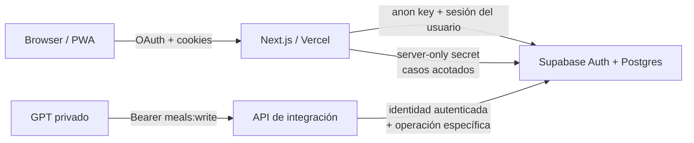
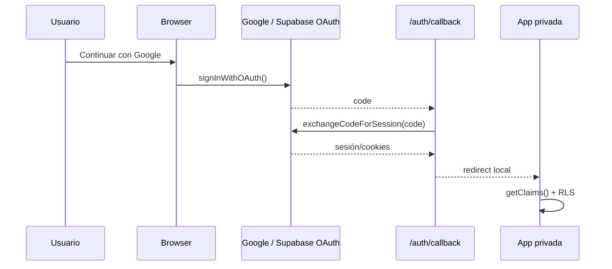
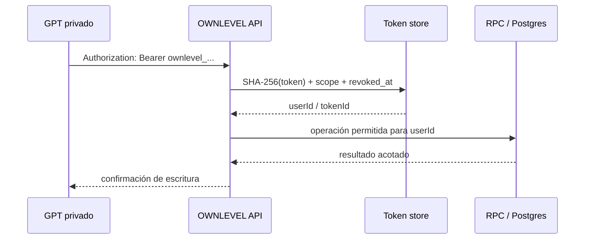

# OWNLEVEL — Autenticación y seguridad

Documento técnico canónico de autenticación, autorización y protección de datos de OWNLEVEL.

> **Alcance:** login Web y Expo nativo, sesión, OAuth, proxy, clientes Supabase, RLS, ownership, credenciales server-only, API privada de integraciones, hardening HTTP/PWA y reglas para extender el sistema sin debilitar sus límites de confianza.
>
> **Estado:** contrato vigente basado en `main` al 14 de septiembre de 2026.
>
> Para arquitectura global consultar [`../ownlevel-architecture.md`](../ownlevel-architecture.md). Para la integración ChatGPT a nivel funcional consultar [`../integrations/chatgpt-nutrition.md`](../integrations/chatgpt-nutrition.md).
> Para el contrato Auth del cliente Expo consultar [`../mobile/native-auth.md`](../mobile/native-auth.md). El documento [`mobile-native.md`](mobile-native.md) conserva únicamente el cliente Capacitor legacy.

## Fuente de verdad

Ante una contradicción, usar este orden:

1. código y tests actuales;
2. migraciones y schema vigente de Supabase;
3. este documento y [`../development/engineering-guidelines.md`](../development/engineering-guidelines.md);
4. arquitectura general y documentación de dominio;
5. historial de decisiones y documentos archivados.

Este documento describe el modelo de seguridad implementado. No reemplaza una auditoría de seguridad, el Security Advisor de Supabase ni la configuración real del proveedor.

---

## Índice

1. [Modelo de seguridad](#modelo-de-seguridad)
2. [Límites de confianza](#límites-de-confianza)
3. [Autenticación web](#autenticación-web)
4. [Google OAuth](#google-oauth)
5. [Callback y redirecciones](#callback-y-redirecciones)
6. [Proxy y protección de rutas](#proxy-y-protección-de-rutas)
7. [Verificación dentro del App Router](#verificación-dentro-del-app-router)
8. [Sesiones y cookies](#sesiones-y-cookies)
9. [Clasificación de errores de autenticación](#clasificación-de-errores-de-autenticación)
10. [Clientes Supabase](#clientes-supabase)
11. [Variables de entorno y secretos](#variables-de-entorno-y-secretos)
12. [Autorización y ownership](#autorización-y-ownership)
13. [RLS](#rls)
14. [Relaciones padre-hijo](#relaciones-padre-hijo)
15. [RPCs y funciones PostgreSQL](#rpcs-y-funciones-postgresql)
16. [Service role y operaciones administrativas](#service-role-y-operaciones-administrativas)
17. [API privada de ChatGPT](#api-privada-de-chatgpt)
18. [Credenciales de integración](#credenciales-de-integración)
19. [Validación de requests externos](#validación-de-requests-externos)
20. [Headers de seguridad](#headers-de-seguridad)
21. [PWA y datos privados](#pwa-y-datos-privados)
22. [Logging y manejo de errores](#logging-y-manejo-de-errores)
23. [Logout y cuenta](#logout-y-cuenta)
24. [Resiliencia y seguridad](#resiliencia-y-seguridad)
25. [Testing y verificaciones](#testing-y-verificaciones)
26. [Cómo agregar una ruta privada](#cómo-agregar-una-ruta-privada)
27. [Cómo agregar una tabla de usuario](#cómo-agregar-una-tabla-de-usuario)
28. [Cómo agregar una RPC sensible](#cómo-agregar-una-rpc-sensible)
29. [Cómo agregar una integración externa](#cómo-agregar-una-integración-externa)
30. [Antipatrones](#antipatrones)
31. [Limitaciones y no-objetivos actuales](#limitaciones-y-no-objetivos-actuales)
32. [Code map](#code-map)
33. [Documentos relacionados](#documentos-relacionados)

---

# Modelo de seguridad

OWNLEVEL utiliza defensa en profundidad. Ninguna capa aislada debe tratarse como la única barrera de seguridad.

El modelo actual combina:

```text
IDENTIDAD
Supabase Auth
        ↓
SESIÓN WEB
cookies + SSR client + getClaims()
        ↓
PROTECCIÓN DE RUTA
proxy + layout autenticado
        ↓
AUTORIZACIÓN DE DATOS
RLS + ownership + relaciones
        ↓
OPERACIONES DE DOMINIO
Server Actions / loaders / RPCs
        ↓
HARDENING
headers + redirects seguros + límites de body + PWA NetworkOnly
```

Para integraciones externas existe un carril separado:

```text
GPT privado
   ↓ Bearer token
Route Handler de OWNLEVEL
   ↓ identidad derivada del token
server-only + service role controlado
   ↓ RPC específica
Supabase
```

La API externa **no reutiliza la cookie web** y el navegador **no recibe la credencial administrativa**.

## Principios estables

- La autenticación prueba identidad; no reemplaza la autorización.
- RLS es obligatoria para datos de usuario expuestos por Supabase.
- `user_id` enviado por el navegador nunca es autoridad de ownership.
- El cliente normal usa la clave pública/anon y queda sujeto a RLS.
- Las credenciales administrativas son `server-only`.
- Una integración externa recibe el mínimo scope necesario.
- Un secreto raw no se persiste cuando puede almacenarse una verificación irreversible.
- Los errores públicos no deben filtrar detalles internos ni credenciales.
- Las páginas privadas no deben quedar persistidas en un cache compartido del service worker.

---

# Límites de confianza



## Browser / PWA

Se considera un entorno no confiable para:

- decidir ownership;
- guardar service-role/secret keys;
- elevar permisos;
- validar por sí solo autorización;
- decidir qué fila de otro usuario puede leer/escribir.

Puede contener:

- URL pública de Supabase;
- anon/publishable key;
- cookie/sesión gestionada por Supabase SSR;
- estado efímero de UI;
- los drafts locales de entrenamiento ya definidos por ese subsistema.

## Next.js / Vercel

Es el límite server donde viven:

- Server Components;
- Server Actions;
- Route Handlers;
- verificación request-scoped de sesión;
- credenciales `server-only` cuando una integración realmente las necesita;
- validación de inputs antes de llegar a operaciones privilegiadas.

## Supabase Auth / Postgres

Es autoridad para:

- identidad autenticada;
- `auth.uid()`;
- RLS;
- constraints;
- foreign keys;
- triggers;
- RPCs y transacciones;
- persistencia de datos.

## Integraciones externas

No reciben una sesión web. Cada integración debe tener un contrato de autenticación propio, explícito y con alcance mínimo.

Actualmente el único caso implementado de este tipo es la integración privada con ChatGPT para registrar comidas.

---

# Autenticación web

OWNLEVEL usa **Supabase Auth con Google OAuth** como flujo de entrada actual.

No existe en el producto vigente un sistema propio de:

- signup con email/password;
- login con contraseña;
- reset de contraseña;
- cambio de contraseña.

En Production, el provider Google está habilitado y los providers Email y
Phone están deshabilitados. Por eso el warning de Leaked Password Protection
no es aplicable mientras OWNLEVEL conserve esta arquitectura OAuth-only.

El punto de entrada visual es `/login`.

Flujo:



`src/app/(auth)/login/login-form.tsx` inicia OAuth mediante el cliente browser de Supabase.

La solicitud está centralizada en `src/lib/security/google-oauth.ts`, evitando que un cambio visual en Login altere accidentalmente el contrato de autenticación.

---

# Google OAuth

`googleOAuthRequest(origin)` define el flujo vigente:

- provider: `google`;
- `redirectTo`: `${origin}/auth/callback`;
- `prompt=select_account`.

La UI pública no muestra mensajes técnicos de Supabase. Usa un mensaje genérico:

```text
No pudimos iniciar sesión. Intentá nuevamente.
```

Esto evita convertir errores internos del proveedor en información innecesaria para el cliente.

## Regla de mantenimiento

Si se agrega otro proveedor:

1. debe definirse explícitamente su flujo;
2. debe conservar el mismo modelo de callback seguro;
3. no debe introducir un sistema paralelo de sesiones;
4. debe actualizar este documento y los tests de auth.

---

# Callback y redirecciones

El callback vive en:

```text
src/app/auth/callback/route.ts
```

Responsabilidades:

1. validar que existan URL/key pública y `code`;
2. crear cliente Supabase SSR con acceso a cookies;
3. ejecutar `exchangeCodeForSession(code)`;
4. redirigir a Login con error genérico si falla;
5. redirigir sólo a un path local permitido si funciona.

## Protección contra open redirect

`safeAuthRedirectPath()` acepta sólo rutas absolutas internas de la aplicación.

Rechaza, entre otros:

- URL externa;
- ruta sin `/` inicial;
- URL protocol-relative `//host`;
- backslashes;
- caracteres de control.

Ante un valor inseguro vuelve a:

```text
/home
```

Contrato:

> Un parámetro de retorno de autenticación nunca puede convertirse directamente en una URL externa controlada por el caller.

---

# Proxy y protección de rutas

El proxy está definido en:

```text
src/proxy.ts
```

y delega la sesión a:

```text
src/lib/supabase/middleware.ts
```

## Prefijos privados actuales

```text
/home
/today
/history
/settings
/train
/progress
/calendar
```

También se procesa `/` y `/login` para resolver correctamente el flujo de entrada/redirección.

## Comportamiento

Para rutas privadas:

- sesión válida → continúa;
- sin sesión → `/login`;
- sesión local explícitamente inválida/revocada → limpia cookies auth y vuelve al login;
- error real de infraestructura/auth que no representa sesión inválida → se propaga en lugar de ocultarse como logout.

Para `/login`:

- usuario autenticado → `/home`;
- usuario no autenticado → se muestra Login.

## API de integración

`/api/integrations/chatgpt/*` queda deliberadamente fuera del proxy de sesión web.

No es una excepción sin autenticación: usa un esquema **Bearer independiente** documentado más adelante.

---

# Verificación dentro del App Router

El proxy no es la única protección.

`src/app/(app)/layout.tsx` vuelve a verificar la identidad mediante:

```text
getVerifiedRequestContext()
```

Si no existe contexto autenticado:

```text
redirect("/login")
```

Esto mantiene una segunda barrera cerca de las páginas privadas.

## Contexto autenticado request-scoped

`src/lib/supabase/server.ts` expone:

```text
AuthenticatedRequestContext
  supabase
  userId
```

`getVerifiedRequestContext()` utiliza `React.cache()` para compartir esa verificación **dentro del mismo render/request**.

No es un cache global de usuario ni un cache de datos privados entre visitantes.

`requireAuthenticatedRequestContext()` es la variante estricta para loaders/actions que necesitan identidad obligatoria.

---

# Sesiones y cookies

OWNLEVEL usa el manejo SSR de `@supabase/ssr`.

## Proxy

El proxy:

1. lee cookies del request;
2. ejecuta `getClaims()` como primera operación auth relevante;
3. permite que Supabase actualice cookies cuando corresponde;
4. copia cookies de respuesta en redirects;
5. limpia cookies de auth cuando la sesión se clasifica como inválida.

## Server Components

El cliente server usa `cookies()` de Next.js.

Puede leer todas las cookies y, cuando el contexto lo permite, escribir las actualizaciones de sesión. Si un Server Component no permite setearlas, el código tolera ese contexto sin convertirlo en un fallo de dominio.

## Regla

No crear cookies de sesión propias en paralelo a Supabase salvo una decisión arquitectónica explícita.

---

# Clasificación de errores de autenticación

`src/lib/supabase/auth-errors.ts` separa dos familias que no deben confundirse.

## Sesión inválida

Ejemplos reconocidos:

- `AuthSessionMissingError`;
- `refresh_token_not_found`;
- `session_not_found`;
- refresh token inválido/usado/ausente.

Estos casos significan que la sesión local ya no es utilizable y pueden llevar al login/limpieza de cookies.

## JWT recién emitido rechazado transitoriamente

Existe una clasificación muy específica:

```text
HTTP 401
PGRST303
"JWT issued at future"
```

Este caso **no se trata como logout**.

El fetch resiliente puede reintentar de forma corta y acotada el rechazo transitorio observado en Data API.

Contrato:

> Un 401 no implica automáticamente “sesión inválida”. La clasificación debe preservar la diferencia entre una sesión realmente vencida y un error transitorio del Data API.

---

# Clientes Supabase

OWNLEVEL tiene clientes distintos para límites de confianza distintos.

| Cliente | Archivo | Credencial | Uso |
| --- | --- | --- | --- |
| Browser | `src/lib/supabase/client.ts` | anon/publishable | OAuth e interacción cliente permitida por RLS |
| Server user-scoped | `src/lib/supabase/server.ts` | anon/publishable + cookies | Server Components, loaders y actions con identidad del usuario |
| Proxy | `src/lib/supabase/middleware.ts` | anon/publishable + cookies del request | Validación/refresco de sesión |
| Admin | `src/lib/supabase/admin.ts` | secret/service-role | Operaciones privilegiadas estrictamente server-only |

## Browser client

Nunca debe recibir:

- `SUPABASE_SECRET_KEY`;
- `SUPABASE_SERVICE_ROLE_KEY`;
- hashes de tokens privados;
- cualquier credencial administrativa equivalente.

## Server user-scoped client

Es la opción normal para datos privados de la aplicación.

Mantiene identidad de usuario y por lo tanto trabaja con RLS.

## Admin client

No tiene sesión persistida ni auto-refresh.

Su existencia no convierte al service role en mecanismo por defecto de acceso a datos.

---

# Variables de entorno y secretos

## Variables públicas permitidas

```text
NEXT_PUBLIC_SUPABASE_URL
NEXT_PUBLIC_SUPABASE_ANON_KEY
```

El prefijo `NEXT_PUBLIC_` significa que el valor puede formar parte del bundle cliente.

## Variables server-only

El admin client acepta:

```text
SUPABASE_SECRET_KEY
```

y, por compatibilidad:

```text
SUPABASE_SERVICE_ROLE_KEY
```

Estas credenciales:

- no usan `NEXT_PUBLIC_`;
- no se importan en componentes cliente;
- no se registran;
- no se documentan con su valor;
- no deben enviarse en responses.

## Deploy

`next.config.ts` falla tempranamente en Vercel si falta la credencial server necesaria para la API privada.

Eso evita desplegar una integración que dependa de un secreto inexistente y falle silenciosamente en runtime.

---

# Autorización y ownership

La regla central es:

> El dueño de una fila se deriva de la identidad autenticada o de una relación padre ya verificada; no de un `user_id` arbitrario recibido desde UI.

## Defensa en profundidad

Las capas habituales son:

1. request autenticado;
2. `userId` derivado de Auth;
3. query filtrada explícitamente por `user_id` cuando corresponde;
4. RLS en Postgres;
5. FK/check/trigger para coherencia entre entidades relacionadas;
6. RPC que valida `auth.uid()` o recibe identidad sólo desde server privilegiado controlado.

El filtro explícito en TypeScript mejora claridad y reduce errores, pero **no reemplaza RLS**.

## Mutaciones

Una Server Action no debe aceptar algo como:

```text
user_id = valor del formulario
```

como prueba de propiedad.

Debe resolver el usuario autenticado en server/base y limitar la mutación a filas de ese owner.

---

# RLS

Row Level Security es parte del contrato de datos de OWNLEVEL.

Las tablas de usuario expuestas en `public` deben:

- tener RLS habilitado;
- definir policies explícitas para las operaciones necesarias;
- limitar acceso al owner autenticado;
- evitar `USING (true)` / `WITH CHECK (true)` para datos privados;
- evitar grants amplios a `anon` o `PUBLIC` cuando no correspondan.

El esquema original ya aplicó este patrón a `profiles`, `day_logs` y `meal_entries`, y las migraciones posteriores lo extendieron a nuevos dominios.

## Patrón owner-only

Conceptualmente:

```sql
using ((select auth.uid()) = user_id)
with check ((select auth.uid()) = user_id)
```

Las migrations de performance actuales preservan la misma semántica y evalúan `auth.uid()` una vez por statement cuando corresponde.

## RLS no es lógica de producto

RLS decide **quién puede acceder**.

No debe usarse para esconder reglas de negocio complejas que pertenecen a:

- constraints;
- triggers;
- RPCs;
- domain code.

---

# Relaciones padre-hijo

Tener `user_id` en dos tablas no alcanza si ambas pueden divergir.

OWNLEVEL usa, según el dominio:

- foreign keys compuestas;
- constraints;
- triggers;
- RPCs que derivan ownership del padre.

Ejemplo histórico del patrón:

```text
meal_entries.user_id
    debe coincidir con
 day_logs.user_id
```

Contrato:

> Una entidad hija nunca puede mezclarse silenciosamente con un padre de otro usuario.

Al agregar nuevas relaciones revisar tanto RLS como integridad referencial.

---

# RPCs y funciones PostgreSQL

Las RPCs son parte del límite de seguridad cuando concentran operaciones transaccionales o privilegiadas.

## SECURITY INVOKER

Preferir semántica de caller cuando la operación puede funcionar correctamente bajo los permisos/RLS del usuario.

## SECURITY DEFINER

Usar sólo cuando exista una necesidad concreta.

El contrato de ingeniería exige:

- `search_path` restringido;
- objetos de aplicación schema-qualified;
- grants explícitos y mínimos;
- no depender de resolución de nombres controlable por caller;
- validar identidad/ownership dentro del flujo cuando la función eleva privilegios.

Migraciones como:

```text
20260827131846_security_hardening_search_paths.sql
```

endurecen funciones existentes fijando `search_path = ''` sin cambiar su semántica.

## Execute grants

No asumir que crear una función define automáticamente quién debe ejecutarla.

Revisar y declarar de forma explícita:

- `PUBLIC`;
- `anon`;
- `authenticated`;
- `service_role`.

El rol habilitado depende del caso de uso; el principio es **mínimo privilegio**.

---

# Service role y operaciones administrativas

`src/lib/supabase/admin.ts` está marcado:

```ts
import "server-only";
```

El service role/secret bypassa RLS y por eso se considera una credencial administrativa.

## Uso permitido actual

El caso verificado es la API privada de integración, donde:

1. se autentica primero el Bearer token;
2. el token resuelve una identidad de usuario;
3. server code controlado usa admin para buscar credencial y/o ejecutar la operación específica;
4. la RPC recibe esa identidad derivada del token, no un owner elegido libremente por un cliente web.

## No usar admin para

- simplificar una query normal del usuario;
- evitar escribir una policy RLS;
- solucionar temporalmente un error de ownership;
- ejecutar directamente desde componentes cliente;
- leer datos privados “porque estamos en server” sin contrato explícito.

---

# API privada de ChatGPT

La integración ChatGPT tiene autenticación independiente de la web.

Rutas actuales:

```text
/api/integrations/chatgpt/meals
/api/integrations/chatgpt/status
/api/integrations/chatgpt/openapi
```

El detalle funcional vive en:

[`../integrations/chatgpt-nutrition.md`](../integrations/chatgpt-nutrition.md)

## Modelo



## Separación de auth

Esta API queda fuera del session proxy porque no usa cookies de navegador.

La ausencia de cookie **no significa endpoint público sin control**: el request debe superar autenticación Bearer propia.

---

# Credenciales de integración

## Generación

Las claves usan entropía criptográfica de `randomBytes(32)` y formato:

```text
ownlevel_<base64url>
```

## Persistencia

El token raw:

- se muestra al crearlo;
- no se vuelve a recuperar de la base;
- no se persiste raw.

Se persiste:

- SHA-256 del token;
- prefijo visual;
- label;
- scope;
- timestamps de creación/uso/revocación.

## Scope

El scope actual es:

```text
meals:write
```

No habilita lectura general del historial ni permisos globales del usuario.

## Revocación

Una credencial revocada deja de autenticar.

La policy y privilegios de columna impiden que un usuario autenticado modifique arbitrariamente campos protegidos del token: la operación de update permitida desde web se limita a `revoked_at`.

## Una clave activa

El flujo de producto trata una segunda creación mientras existe una clave activa como conflicto y exige revocar antes.

---

# Validación de requests externos

La API de comidas no confía solamente en headers declarativos del caller.

## Límite real del body

El Route Handler:

1. puede rechazar anticipadamente un `Content-Length` excesivo;
2. igualmente lee el stream y cuenta bytes reales;
3. cancela la lectura si supera el límite;
4. parsea JSON sólo dentro del límite permitido.

Esto evita depender exclusivamente de un `Content-Length` manipulable o ausente.

## Respuestas

Casos públicos esperables:

- JSON inválido → `400`;
- body demasiado grande → `413`;
- token inválido → `401`;
- duplicado que requiere confirmación → contrato específico de la integración;
- error interno → respuesta genérica, sin exponer stack/secrets.

## Idempotencia

La integración de comidas usa `idempotency_key` para distinguir retry de una nueva escritura.

La idempotencia es una protección de consistencia; no reemplaza autenticación ni autorización.

---

# Headers de seguridad

`src/lib/security/headers.ts` define actualmente:

| Header | Valor |
| --- | --- |
| `X-Content-Type-Options` | `nosniff` |
| `Referrer-Policy` | `strict-origin-when-cross-origin` |
| `X-Frame-Options` | `DENY` |
| `Permissions-Policy` | `camera=(), microphone=(), geolocation=()` |

`next.config.ts` los aplica globalmente mediante `headers()`.

## Regla documental

No asumir que OWNLEVEL tiene un header sólo porque sería una buena práctica general.

Por ejemplo, una política CSP o HSTS debe documentarse como implementada únicamente cuando exista realmente en configuración/deploy verificable.

---

# PWA y datos privados

OWNLEVEL es PWA, pero sus datos principales son privados y autenticados.

Por eso el service worker no debe convertir contenido privado en un cache reutilizable.

La configuración actual usa `NetworkOnly` para:

- APIs same-origin GET;
- RSC prefetch;
- RSC normal;
- navegaciones de páginas.

Además:

```text
cacheOnFrontEndNav: false
```

Contrato:

> Las pantallas y respuestas privadas autenticadas deben venir de red/sesión vigente, no de un cache compartido del service worker.

Los assets estáticos/PWA pueden seguir su estrategia correspondiente; esta regla se refiere a contenido privado de producto.

---

# Logging y manejo de errores

## Nunca registrar

- service-role/secret key;
- raw integration token;
- token hash;
- Authorization header completo;
- cookies de sesión;
- material de refresh/access token.

## Eventos seguros

La integración registra categorías como:

```text
missing_authorization
malformed_bearer
invalid_token_shape
token_hash_not_found
token_authenticated
```

Son útiles para diagnóstico sin revelar la credencial.

## Errores públicos

Login y API prefieren mensajes genéricos cuando el detalle no ayuda al usuario.

Los logs internos pueden identificar categoría/operación, pero no deben convertir una excepción en fuga de secreto o datos sensibles.

## Performance logs

`[perf]` es el contrato canónico para observabilidad de requests. Proxy y server
auth conservan `proxy-auth` / `server-auth` y registran duración, estado lógico,
`layer`, categoría técnica y `errorCode` estable. Cuando el request lo expone,
el contexto request-scoped añade `requestKind` y `vercelId` desde `x-vercel-id`.

El payload es allowlisted: puede incluir `httpStatus` y `providerCode` acotados,
pero nunca serializa el mensaje raw, headers, cookies, tokens, bodies ni datos de
usuario. Una sesión inválida continúa como `invalid_session`; un timeout de Auth
se clasifica como `AUTH_TIMEOUT` y no se confunde con `DATABASE_TIMEOUT`.

---

# Logout y cuenta

La superficie actual está en:

```text
/settings/account
```

Muestra la cuenta conectada y permite cerrar sesión en el dispositivo actual.

`signOut()`:

1. crea cliente server con la sesión actual;
2. llama `supabase.auth.signOut()`;
3. revalida el layout;
4. redirige a `/login`.

No crear logout puramente visual que deje intacta la sesión real de Supabase.

---

# Resiliencia y seguridad

Resiliencia no debe convertir mutaciones en escrituras duplicadas ni esconder errores de auth.

`src/lib/supabase/resilient-fetch.ts` mantiene reglas acotadas:

- timeout server para requests Supabase;
- retry de transporte/HTTP transitorio sólo donde es seguro;
- lecturas `GET`/`HEAD` pueden tener retry controlado;
- mutaciones no se reintentan genéricamente por fallos de transporte;
- el rechazo específico `JWT issued at future` se trata como transitorio, no como sesión inválida.

Contrato:

> Un mecanismo de retry debe conocer si una operación es segura de repetir.

---

# Testing y verificaciones

La seguridad tiene tests en varias capas.

## Aplicación

Archivos relevantes:

```text
src/lib/security/security-hardening.test.ts
src/lib/security/google-oauth.test.ts
src/lib/supabase/middleware.test.ts
src/lib/supabase/auth-errors.test.ts
src/lib/supabase/request-performance.test.ts
src/proxy.test.ts
src/lib/integrations/chatgpt-meals.test.ts
src/lib/integrations/chatgpt-openapi.test.ts
```

Contratos protegidos incluyen:

- redirects internos seguros;
- headers vigentes;
- límite real de body;
- NetworkOnly para datos privados PWA;
- credencial admin server-only;
- routing del proxy;
- clasificación de errores de sesión;
- auth/contrato de integración.

## Supabase

`supabase/tests` y las migraciones protegen:

- RLS;
- ownership;
- grants;
- integridad referencial;
- RPCs sensibles;
- restricciones de tokens;
- invariantes de dominios.

## Después de cambios DDL

La guía de ingeniería exige ejecutar Supabase Security Advisor y revisar findings relevantes.

Un finding dependiente del plan/proveedor debe documentarse; no debe ocultarse con una protección casera que cambie semántica sin necesidad.

---

# Cómo agregar una ruta privada

Checklist:

1. Crear la ruta dentro del grupo `(app)` cuando pertenezca a la app autenticada.
2. Verificar si su prefijo ya queda cubierto por `SESSION_PROXY_PATH_PREFIXES`.
3. Si es un nuevo top-level privado, agregarlo coherentemente a:
   - `src/proxy.ts`;
   - `isProtectedPath()` de `src/lib/supabase/middleware.ts`.
4. Mantener el guard del layout `(app)` como segunda protección.
5. En loaders/actions usar `getVerifiedRequestContext()` o `requireAuthenticatedRequestContext()`.
6. No depender de un check client-side para autorización.
7. Agregar/actualizar tests del proxy cuando cambia el mapa protegido.

---

# Cómo agregar una tabla de usuario

Antes de exponer una nueva tabla `public`:

1. definir `user_id` o una relación equivalente de ownership;
2. agregar FK coherente hacia `auth.users` o padre canónico;
3. habilitar RLS;
4. agregar sólo policies necesarias;
5. evitar acceso `anon`/`PUBLIC` amplio;
6. definir `WITH CHECK` para inserts/updates;
7. impedir mezcla padre-hijo entre usuarios con FK/check/trigger si aplica;
8. revisar grants de tabla/columnas;
9. agregar tests SQL de aislamiento entre usuarios;
10. ejecutar Security Advisor.

Si la tabla no necesita acceso directo desde un cliente user-scoped, considerar si realmente debe exponerse con grants de aplicación.

---

# Cómo agregar una RPC sensible

Checklist:

1. decidir si realmente necesita RPC;
2. preferir caller/RLS si no hace falta elevar privilegios;
3. si usa `SECURITY DEFINER`, justificarlo;
4. fijar `search_path` de forma segura;
5. schema-qualify objetos;
6. derivar o validar owner;
7. revocar grants implícitos no deseados;
8. otorgar `EXECUTE` sólo a roles necesarios;
9. limitar inputs;
10. probar usuario correcto, usuario incorrecto y no autenticado;
11. verificar atomicidad si toca varias tablas.

---

# Cómo agregar una integración externa

No reutilizar automáticamente el diseño de ChatGPT sin revisar requerimientos, pero conservar estos principios:

1. definir identidad y scope propios;
2. no depender de cookies del navegador si el caller no es browser;
3. generar credenciales con entropía criptográfica cuando sean necesarias;
4. persistir hash, no secreto raw, cuando el esquema lo permita;
5. mostrar el raw una sola vez;
6. permitir revocación;
7. nunca loggear credenciales;
8. validar tamaño y forma de requests;
9. aplicar idempotencia en escrituras reintentables;
10. minimizar respuesta y permisos;
11. aislar cualquier uso de admin client en módulos `server-only`;
12. documentar endpoint, auth, scope y revocación;
13. agregar tests de 401/403/inputs inválidos/replay según contrato.

---

# Antipatrones

## No hacer

- Guardar `SUPABASE_SERVICE_ROLE_KEY` en una variable `NEXT_PUBLIC_*`.
- Importar `createAdminClient()` desde código cliente.
- Reemplazar RLS por `.eq("user_id", ...)` en TypeScript.
- Confiar en un `user_id` enviado desde un form/API como prueba de owner.
- Crear tablas privadas sin RLS porque “sólo las usa el server”.
- Usar service role como solución rápida a una policy incorrecta.
- Habilitar `USING (true)` / `WITH CHECK (true)` para datos personales.
- Dejar `SECURITY DEFINER` con resolución de objetos controlable por `search_path`.
- Conceder `EXECUTE` o grants de tabla más amplios de lo necesario.
- Loggear tokens, hashes, Authorization o cookies.
- Persistir raw integration tokens.
- Aceptar redirects externos desde `next`/`returnTo` sin saneamiento.
- Proteger una pantalla sólo con lógica de React/client-side.
- Tratar cualquier 401 como motivo automático para borrar sesión.
- Reintentar ciegamente una mutación no idempotente.
- Cachear páginas/RSC/APIs privadas en el service worker.
- Convertir una API Bearer en “pública” sólo porque bypassa el proxy web.
- Inventar en documentación controles que no existen en código/deploy.

---

# Limitaciones y no-objetivos actuales

## Google OAuth únicamente

La autenticación de producto actualmente está diseñada alrededor de Google OAuth.

No hay un lifecycle propio de password que este documento deba describir.

## Cuenta

La superficie actual de cuenta muestra identidad conectada y permite cerrar la sesión actual. No debe asumirse la existencia de un gestor completo de sesiones/dispositivos sólo por usar Supabase Auth.

## Headers

El set canónico implementado es el listado en [Headers de seguridad](#headers-de-seguridad).

No se declara CSP/HSTS como control de aplicación en este documento porque no forma parte del set verificado en `SECURITY_HEADERS` actual.

## Rate limiting

No se define aquí un rate limiter de aplicación como contrato vigente porque no fue identificado como una capa canónica en el código revisado. Si se incorpora uno, debe documentarse junto con sus límites, scope y comportamiento ante proxies/retries.

## Seguridad administrada por proveedor

Parte de la postura depende de Supabase/Vercel/Google y de su configuración externa. Este repo documenta sus contratos de aplicación, pero no sustituye controles del proveedor.

---

# Code map

| Responsabilidad | Archivo / carpeta | Notas |
| --- | --- | --- |
| Proxy de sesión | `src/proxy.ts` | matcher, prefijos privados y bypass de integración |
| Sesión en proxy | `src/lib/supabase/middleware.ts` | `getClaims()`, cookies y redirects |
| Cliente Supabase server | `src/lib/supabase/server.ts` | contexto autenticado request-scoped |
| Cliente Supabase browser | `src/lib/supabase/client.ts` | public/anon únicamente |
| Cliente admin | `src/lib/supabase/admin.ts` | secret/service-role, `server-only` |
| Clasificación auth | `src/lib/supabase/auth-errors.ts` | sesión inválida vs JWT transitorio |
| Fetch resiliente | `src/lib/supabase/resilient-fetch.ts` | timeouts y retries seguros |
| Login | `src/app/(auth)/login` | UI e inicio de Google OAuth |
| Contrato Google OAuth | `src/lib/security/google-oauth.ts` | provider, callback y error público |
| Callback OAuth | `src/app/auth/callback/route.ts` | exchange code → session |
| Redirect seguro | `src/lib/security/auth-redirect.ts` | sólo paths locales |
| Layout privado | `src/app/(app)/layout.tsx` | segunda verificación de sesión |
| Logout | `src/app/(app)/settings/actions.ts` | `auth.signOut()` + redirect |
| Cuenta | `src/app/(app)/settings/account` | identidad y logout |
| Headers | `src/lib/security/headers.ts` | hardening HTTP global |
| Límite de body | `src/lib/security/request-body.ts` | cuenta bytes reales del stream |
| Config Next/PWA | `next.config.ts` | headers, secret requerida, NetworkOnly privado |
| Auth integración | `src/lib/integrations/chatgpt-auth.ts` | Bearer y errores públicos |
| Tokens integración | `src/lib/integrations/chatgpt-tokens.ts` | generación, hash, scope, revoke |
| Persistencia integración | `src/lib/integrations/chatgpt-server.ts` | admin + RPC controlada |
| Routes integración | `src/app/api/integrations/chatgpt` | meals/status/openapi |
| RLS/schema | `supabase/migrations` | policies, grants, triggers, RPCs |
| Tests SQL | `supabase/tests` | contratos de seguridad en Postgres |
| Tests seguridad app | `src/lib/security/*.test.ts`, `src/lib/supabase/*.test.ts`, `src/proxy.test.ts` | auth/hardening/runtime contracts |

---

# Documentos relacionados

| Documento | Cuándo consultarlo |
| --- | --- |
| [`../ownlevel-architecture.md`](../ownlevel-architecture.md) | Arquitectura global y límites entre dominios |
| [`./data-flow.md`](./data-flow.md) | Fuentes de verdad, snapshots y ownership de datos |
| [`./training-system.md`](./training-system.md) | Invariantes operativas de Entrenamiento |
| [`./nutrition-system.md`](./nutrition-system.md) | Invariantes operativas de Nutrición |
| [`../progress-v2.md`](../progress-v2.md) | Seguridad semántica/contratos de datos de analytics, no auth |
| [`../development/engineering-guidelines.md`](../development/engineering-guidelines.md) | Checklist de ingeniería y reglas de Supabase |
| [`../integrations/chatgpt-nutrition.md`](../integrations/chatgpt-nutrition.md) | Configuración y uso de la integración privada |

---

## Resumen de invariantes

Un cambio de autenticación o seguridad en OWNLEVEL debe preservar como mínimo:

1. Google OAuth continúa siendo el flujo de entrada mientras no se decida otro proveedor.
2. Las rutas privadas tienen verificación server-side.
3. El contexto de usuario se deriva de Auth, no de inputs del browser.
4. RLS permanece habilitada para datos privados expuestos.
5. Relaciones entre entidades no pueden cruzar owners.
6. `SECURITY DEFINER` y grants se mantienen bajo mínimo privilegio.
7. Service-role/secret keys permanecen `server-only`.
8. La API ChatGPT usa Bearer independiente y scope `meals:write`.
9. Los tokens raw no se persisten ni se registran.
10. Redirects post-auth sólo pueden permanecer dentro de la aplicación.
11. Datos privados PWA no se sirven desde cache persistente del service worker.
12. Errores de sesión inválida se distinguen de fallos transitorios de infraestructura/JWT.
13. Los logs de diagnóstico nunca contienen secretos de autenticación.
14. Un nuevo control de seguridad debe documentarse como real sólo después de existir en código/configuración verificable.
