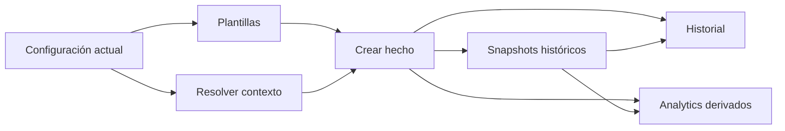
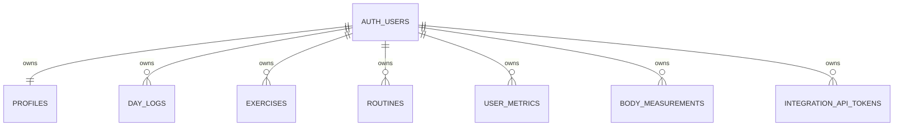
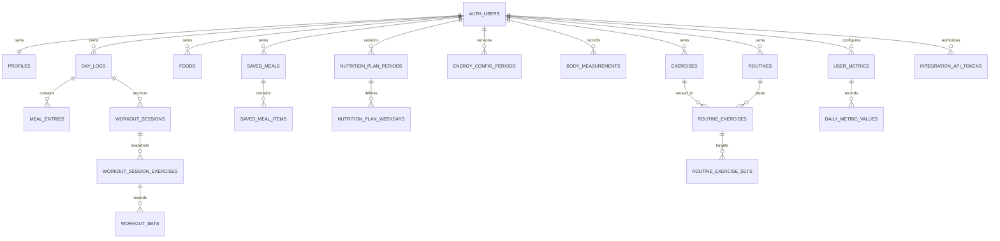
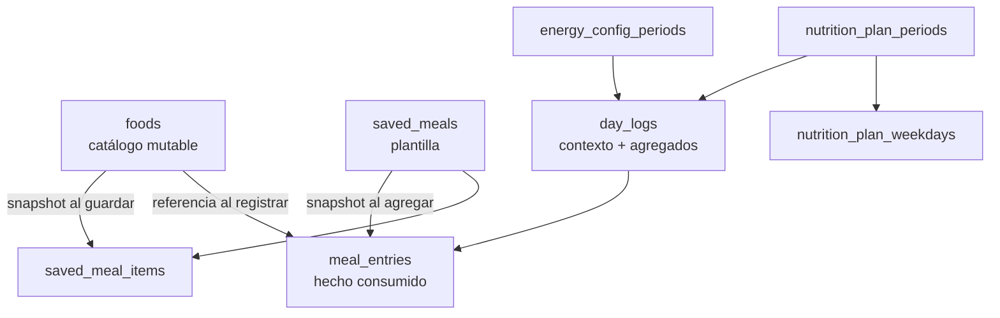
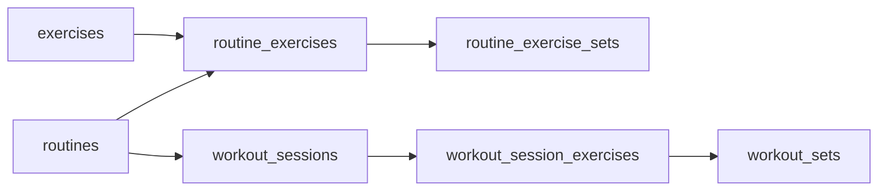

# OWNLEVEL — Modelo de datos

> **Estado:** documento canónico del modelo de datos operativo
>
> **Base verificada:** `origin/main` en `2686864a6efceb82d7157e0824615be27edc33c5`
>
> **Última revisión:** 2026-09-13

## Propósito y alcance

Este documento explica **qué representa cada entidad persistida importante de OWNLEVEL, cuál es su fuente de verdad, cómo se relaciona con las demás y qué invariantes históricas deben preservarse**.

No es un dump del schema ni reemplaza las migraciones. Para conocer una columna, constraint, índice, policy o firma exacta, la autoridad final sigue siendo `supabase/migrations/`, los tests SQL y el código actual.

Tampoco reemplaza los documentos especializados:

- [`training-system.md`](./training-system.md): lifecycle operativo de Entrenamiento;
- [`nutrition-system.md`](./nutrition-system.md): lifecycle operativo de Nutrición;
- [`auth-security.md`](./auth-security.md): Auth, RLS, ownership, service role y límites de confianza;
- [`../progress-v2.md`](../progress-v2.md): analytics derivados, períodos, coverage, comparaciones y relaciones;
- [`data-flow.md`](./data-flow.md): sincronizaciones, snapshots y flujos históricos específicos.

Ante contradicciones, usar este orden:

1. código y tests actuales;
2. migraciones y schema vigente de Supabase;
3. este documento y los documentos especializados vigentes;
4. documentación histórica y archivos de `archive/`.

Las etiquetas usadas aquí significan:

- **Implementado:** comportamiento verificable en el estado actual.
- **Contrato vigente:** regla que una modificación debe preservar.
- **Compatibilidad / legacy:** estructura todavía presente por historia o transición, pero que no debe convertirse en el modelo nuevo por defecto.
- **Derivado:** dato calculable desde fuentes canónicas, no una fuente de verdad independiente.

---

## Índice

1. [Modelo mental](#modelo-mental)
2. [Clases de datos](#clases-de-datos)
3. [Identidad y ownership](#identidad-y-ownership)
4. [Mapa conceptual global](#mapa-conceptual-global)
5. [`profiles`: estado actual de la persona](#profiles-estado-actual-de-la-persona)
6. [`day_logs`: ancla del día](#day_logs-ancla-del-día)
7. [Cuerpo](#cuerpo)
8. [Nutrición](#nutrición)
9. [Entrenamiento](#entrenamiento)
10. [Métricas diarias configurables](#métricas-diarias-configurables)
11. [Integraciones y credenciales](#integraciones-y-credenciales)
12. [Snapshots y preservación histórica](#snapshots-y-preservación-histórica)
13. [Fechas y tiempo](#fechas-y-tiempo)
14. [Missing, cero y ausencia de fila](#missing-cero-y-ausencia-de-fila)
15. [Lifecycle, archivo y borrado](#lifecycle-archivo-y-borrado)
16. [Relaciones e integridad](#relaciones-e-integridad)
17. [Datos derivados y read models](#datos-derivados-y-read-models)
18. [Límite con Progress](#límite-con-progress)
19. [Compatibilidad y legado](#compatibilidad-y-legado)
20. [Cómo extender el modelo](#cómo-extender-el-modelo)
21. [Antipatrones](#antipatrones)
22. [Code map](#code-map)
23. [Documentos relacionados](#documentos-relacionados)

---

# Modelo mental

OWNLEVEL separa deliberadamente **configuración actual**, **plantillas**, **hechos históricos**, **snapshots** y **datos derivados**.



La regla central es:

> **Un cambio en la definición actual no debe reescribir silenciosamente un hecho histórico.**

Ejemplos:

- editar un ejercicio no cambia una sesión ya realizada;
- editar una rutina no cambia sus snapshots históricos;
- cambiar un objetivo nutricional no recalcula el objetivo de julio;
- editar un Food no cambia una comida ya consumida;
- archivar una métrica no borra sus valores históricos;
- cambiar el peso actual no inventa una nueva medición histórica salvo que el flujo correspondiente registre realmente ese hecho.

## Fuente de verdad no significa “una sola tabla”

OWNLEVEL evita sistemas paralelos, pero cada dominio conserva su propia fuente canónica.

`day_logs` es importante, pero no es una tabla universal donde deba copiarse todo:

- comidas → `meal_entries`;
- sesiones → `workout_sessions`;
- series → `workout_sets`;
- métricas personales → `daily_metric_values`;
- medidas corporales → `body_measurements`.

**Contrato vigente:** centralizar no significa duplicar hechos. Significa saber con precisión qué entidad es dueña de cada dato.

---

# Clases de datos

| Clase | Significado | Ejemplos |
| --- | --- | --- |
| Identidad / estado actual | Configuración vigente o proyección del último hecho | `profiles` |
| Catálogo mutable | Definiciones reutilizables que pueden cambiar | `exercises`, `foods`, `user_metrics` |
| Plantilla | Plan para crear hechos futuros | `routines`, `saved_meals` |
| Configuración versionada | Reglas vigentes desde una fecha | `nutrition_plan_periods`, `energy_config_periods` |
| Hecho | Algo que ocurrió y debe conservar historia | `meal_entries`, `workout_sessions`, `workout_sets`, `daily_metric_values` |
| Snapshot | Copia del contexto existente al ocurrir un hecho | campos snapshot de `day_logs`, `workout_session_exercises`, `workout_sets` |
| Agregado persistido | Resumen recalculable mantenido por el sistema | totales de `day_logs` |
| Auditoría / provenance | Origen, importación, calidad o lifecycle | `nutrition_import_runs`, metadata de importación, timestamps |
| Credencial | Acceso externo controlado | `integration_api_tokens` |
| Read model / analytics | Composición derivada para UI o análisis | Home, History, Progress |

## Qué no debe confundirse

```text
CURRENT STATE != HISTORY
TEMPLATE      != FACT
SNAPSHOT      != CURRENT DEFINITION
AGGREGATE     != SECOND SOURCE OF TRUTH
READ MODEL    != PERSISTED DOMAIN MODEL
MISSING       != ZERO
```

---

# Identidad y ownership

La identidad raíz vive en Supabase Auth:

```text
auth.users.id
```

Las entidades de producto pertenecientes a una persona guardan `user_id` o quedan vinculadas a un padre cuyo ownership está verificado.

## Relación raíz



## Contratos de ownership

**Contrato vigente:**

- `user_id` no es un campo de confianza proveniente libremente del navegador;
- RLS restringe acceso al owner autenticado;
- queries de dominio suelen filtrar explícitamente por `user_id` además de RLS;
- hijos que contienen también `user_id` usan FKs compuestas, triggers o checks cuando hace falta impedir relaciones cruzadas entre usuarios;
- RPCs sensibles derivan `auth.uid()` o validan explícitamente el contexto autorizado;
- `service_role` sólo se usa server-side en flujos restringidos documentados.

Para detalles de seguridad, ver [`auth-security.md`](./auth-security.md).

---

# Mapa conceptual global

El siguiente diagrama muestra las relaciones principales. Omite columnas de auditoría, índices, algunas estructuras legacy y detalles de analytics para mantener legibilidad.



No todas las flechas implican que una FK deba usarse para reconstruir historia. En varios casos el vínculo conserva procedencia mientras el dato histórico correcto vive en un snapshot.

---

# `profiles`: estado actual de la persona

`profiles` representa el **estado/configuración actual** asociado 1:1 al usuario.

Entre sus responsabilidades se encuentran:

- identidad visible y datos de perfil;
- fecha de nacimiento, sexo y altura cuando están configurados;
- estado antropométrico actual;
- `current_weight_kg` como proyección del último peso conocido;
- BMR actual derivado;
- columnas de energía legacy que siguen presentes por compatibilidad.

## Lo que `profiles` no es

`profiles` no es una tabla histórica.

No debe usarse para responder preguntas como:

- “¿cuánto pesaba el 3 de agosto?”;
- “¿qué objetivo nutricional tenía en julio?”;
- “¿qué altura/peso se usó en un cálculo histórico?” cuando existe un snapshot específico.

Para eso se usan hechos y snapshots por fecha.

## Peso actual como proyección

La serie histórica de peso vive en `day_logs.weight_kg`. `profiles.current_weight_kg` existe porque otras operaciones necesitan conocer el último peso de forma directa.

**Contrato vigente:** la proyección actual puede actualizarse desde el último hecho, pero no reemplaza la historia.

---

# `day_logs`: ancla del día

`day_logs` tiene una fila única por:

```text
user_id + log_date
```

Es el ancla de un día lógico de OWNLEVEL y uno de los nodos más importantes del modelo.

## Responsabilidades

Actualmente puede conservar:

- `weight_kg` como observación histórica de peso;
- agregados nutricionales;
- snapshots de objetivo, gasto, BMR y contexto nutricional;
- referencias a períodos de configuración;
- overrides/contexto materializado del día;
- columnas legacy o de compatibilidad;
- proyecciones legacy de algunas métricas del sistema.

## Agregados nutricionales

Los totales diarios de calorías y macros se mantienen desde `meal_entries` activas mediante la lógica canónica de recálculo.

Por lo tanto:

```text
meal_entries = detalle consumido

day_logs = agregado persistido + contexto del día
```

**Contrato vigente:** los totales no son una segunda entrada editable independiente.

## `day_logs` no demuestra por sí solo que hubo un hecho

Un row puede existir porque alguna superficie necesitó materializar el contexto de la fecha.

Para saber si hubo:

- comida registrada → revisar `meal_entries`;
- métrica registrada → revisar `daily_metric_values`;
- entrenamiento → revisar `workout_sessions`;
- medida corporal → revisar `body_measurements`.

Esta distinción es especialmente importante para History y Progress.

---

# Cuerpo

OWNLEVEL separa **peso** de **otras medidas corporales**.

## Peso

### Fuente histórica

```text
day_logs.weight_kg
```

Cada valor representa una medición asociada a `log_date`.

### Estado actual

```text
profiles.current_weight_kg
```

Es una proyección del último hecho cronológico.

La sincronización vigente conserva reglas para que editar o eliminar puntos antiguos no reescriba incorrectamente el estado actual.

## `body_measurements`

Guarda medidas corporales por:

```text
user_id + measured_on
```

El modelo permite conservar medidas como cintura, pecho, brazos, muslos, cadera y extensiones incorporadas posteriormente, además de metadata de provenance/calidad cuando una medición proviene de importación.

**Contrato vigente:** no existe una copia paralela de “medidas actuales” en `profiles`. La última medida se obtiene desde la serie histórica.

## Grain temporal

Peso y medidas no deben mezclarse sólo porque ambos pertenezcan a Cuerpo:

- peso → grain `day` mediante `day_logs`;
- medidas → grain `measurement` mediante `body_measurements.measured_on`.

Progress conserva esa diferencia.

---

# Nutrición

La arquitectura nutricional combina hechos consumidos, catálogos, plantillas y configuración versionada.

## Diagrama del dominio



## `meal_entries`

Es la fuente canónica de cada consumo real.

Puede conservar:

- fecha/hora de consumo;
- título y descripción;
- calorías;
- proteína, carbohidratos y grasas;
- origen;
- tipo de entrada;
- precision/provenance;
- identidad de importación o idempotencia;
- `deleted_at` para soft delete.

### Historia autosuficiente

Una comida consumida conserva su nutrición propia. No depende del valor actual de un Food o Saved Meal para reconstruirse.

**Contrato vigente:** editar una definición de biblioteca no cambia una `meal_entry` existente.

## `foods`

Catálogo personal mutable para registrar alimentos por cantidad.

Un Food describe una definición reutilizable actual. Puede archivarse o modificarse sin alterar consumos históricos.

## `saved_meals`

Plantillas de comidas habituales.

Pueden representar una comida manual o una composición de componentes persistidos en `saved_meal_items`.

## `saved_meal_items`

Los componentes de una comida habitual guardan snapshots de la información necesaria para recalcular esa plantilla.

`source_food_id` conserva procedencia cuando corresponde, pero el modelo actual evita que una edición posterior del Food reescriba silenciosamente la plantilla histórica de componentes.

## Configuración nutricional versionada

### `nutrition_plan_periods`

Una versión de plan efectiva desde una fecha.

Conserva configuración general del plan, incluyendo agua base y extras asociados a entrenamiento.

### `nutrition_plan_weekdays`

Define objetivos para cada día de semana dentro de un plan, actualmente calorías y proteína entre los valores principales.

La relación plan + owner está protegida para evitar mezclar datos de usuarios distintos.

### `energy_config_periods`

Versiona la configuración usada para estimar gasto, incluyendo nivel/factor de actividad y delta de entrenamiento.

## Snapshots en `day_logs`

Cuando un día queda materializado, guarda el contexto efectivo necesario para preservar historia.

La UI histórica debe preferir esos snapshots sobre recalcular el pasado con configuración nueva.

## Modelos anteriores todavía presentes

Por compatibilidad histórica existen estructuras anteriores como:

- `nutrition_goal_periods`;
- `expenditure_rule_periods`;
- `work_schedule_periods`.

No deben convertirse en el punto de partida de nuevas features si el flujo vigente ya usa Plan/Energy V2.

## Eventos e importaciones

`nutrition_events` conserva contexto histórico que no representa comida consumida.

`nutrition_import_runs` permite auditar importaciones históricas reproducibles y su provenance.

Para el lifecycle completo consultar [`nutrition-system.md`](./nutrition-system.md).

---

# Entrenamiento

Training usa una separación fuerte entre **definición actual**, **planificación** y **ejecución**.

## Diagrama del dominio



## `exercises`

Biblioteca personal actual.

Define identidad y configuración reutilizable como:

- nombre;
- músculo/detalle anatómico;
- implemento;
- `weight_mode`;
- defaults de entrenamiento;
- descanso sugerido;
- notas y estado activo.

Los valores actuales sirven para planificación futura, no para reconstruir una sesión pasada.

## `routines`

Plantilla de entrenamiento.

Conserva identidad, orden, estado y presentación de la rutina actual.

Archivar una rutina no elimina las sesiones ya realizadas.

## `routine_exercises`

Relación contextual entre rutina y ejercicio.

Una misma definición de ejercicio puede pertenecer a varias rutinas con:

- orden distinto;
- descanso distinto;
- nota distinta;
- configuración de progresión distinta.

## `routine_exercise_sets`

Una fila por serie objetivo de la rutina.

**Contrato vigente:** no colapsar conceptualmente el objetivo a un único bloque si cada serie puede tener reps, peso o RIR distintos.

## `workout_sessions`

Hecho de sesión.

Representa una ejecución concreta y su lifecycle. Las sesiones completadas son la base histórica principal; las descartadas no deben aparecer como entrenamiento realizado en analytics.

La sesión queda vinculada a un día mediante `day_log_id` y puede conservar referencia a la rutina de origen junto con snapshots de contexto.

## `workout_session_exercises`

Snapshot de cada ejercicio dentro de una sesión.

Conserva la información histórica necesaria para que renombrar, archivar o editar el ejercicio/rutina actual no cambie la sesión pasada.

Entre los contextos importantes se encuentran:

- nombre;
- músculo y detalle anatómico;
- implemento;
- `weight_mode`;
- descanso;
- procedencia dentro de la sesión;
- notas y decisiones de progresión.

## `workout_sets`

Fuente canónica por serie de:

- targets copiados;
- reps reales;
- peso real;
- RIR/estado cuando corresponda;
- completitud;
- timestamps/notas.

**Contrato vigente:** la serie histórica se interpreta desde el snapshot y los valores reales de la sesión, no desde la rutina actual.

Para lifecycle, autosave, correcciones y finalización consultar [`training-system.md`](./training-system.md).

---

# Métricas diarias configurables

El sistema dinámico de métricas tiene dos capas canónicas.

## `user_metrics`

Define la métrica.

Campos semánticos principales:

- UUID estable;
- owner;
- `system_key` opcional;
- nombre;
- unidad;
- tipo de valor;
- objetivo/referencia actual;
- orden;
- estado active/archived.

Las métricas del sistema actuales incluyen identidades para:

```text
steps
water
mate
sleep
```

Además pueden existir métricas personalizadas sin `system_key`.

## `daily_metric_values`

Guarda una observación por:

```text
user_id + metric_date + metric_id
```

La relación `(metric_id, user_id)` impide asociar el valor a una métrica de otro owner.

## Semántica de ausencia

En este dominio:

```text
sin fila = no registrado
fila con value = observación real
fila con value 0 = cero real
```

No se crea un row con cero para representar missing.

## Identidad estable

Una métrica no se identifica por su label visible.

El UUID conserva identidad aunque el nombre cambie. Las métricas del sistema tienen además `system_key` estable.

Una definición con historial no puede cambiar libremente unidad o tipo porque eso reinterpretaría observaciones existentes.

## Archivo

Archivar una métrica preserva `daily_metric_values`.

Las métricas del sistema no se eliminan como si fueran custom descartables. Una custom metric sin historia puede tener reglas de eliminación distintas.

## Proyección legacy a `day_logs`

Actualmente `steps`, `water` y `mate` se proyectan también a columnas legacy de `day_logs` mediante trigger.

**Contrato vigente:** para el sistema dinámico, la fuente canónica sigue siendo:

```text
user_metrics + daily_metric_values
```

No se deben crear nuevas features leyendo únicamente las columnas legacy si la métrica dinámica ya existe.

---

# Integraciones y credenciales

## `integration_api_tokens`

Guarda credenciales de integraciones externas sin persistir el secreto raw.

Persistencia principal:

- owner;
- SHA-256 del token;
- prefijo seguro para identificación visual;
- label;
- scope;
- creación;
- último uso;
- revocación.

Actualmente el scope de la integración ChatGPT es:

```text
meals:write
```

Existe una restricción para una credencial activa por owner/scope.

## El token raw no es dato persistido

El secreto completo se genera con entropía criptográfica, se entrega una vez y luego sólo se autentica comparando su hash.

**Contrato vigente:** no agregar una columna para recuperar o mostrar el token raw.

## Persistencia desde ChatGPT

La integración autentica el token con un cliente administrativo server-only y luego utiliza una RPC controlada para crear una `meal_entry` canónica.

Por lo tanto, la integración **no tiene una tabla paralela de comidas de ChatGPT**.

```text
ChatGPT
→ token de integración
→ validación server-side
→ RPC controlada
→ day_logs / meal_entries canónicos
```

Para límites de confianza y grants ver [`auth-security.md`](./auth-security.md).

---

# Snapshots y preservación histórica

Los snapshots existen para congelar contexto cuya definición actual puede cambiar.

## Casos principales

| Fuente actual | Snapshot histórico | Motivo |
| --- | --- | --- |
| `profiles` / configuración nutricional | columnas snapshot de `day_logs` | objetivos, BMR y gasto cambian con el tiempo |
| `routines` / `exercises` | `workout_session_exercises` | rutina y ejercicio pueden cambiar después |
| `routine_exercise_sets` | targets de `workout_sets` | objetivos futuros no deben reescribir series pasadas |
| `saved_meals` / `foods` | nutrición copiada a `meal_entries` | biblioteca mutable, consumo histórico inmutable |
| definición de Food usada en Saved Meal | snapshot en `saved_meal_items` | cambios futuros del Food no deben alterar la plantilla materializada |

## Regla de lectura histórica

Si existe un snapshot válido para el hecho histórico, debe preferirse ese snapshot antes que reconstruir el pasado consultando la definición actual.

Mal:

```text
sesión 2026-08-01
→ exercise actual
→ nombre/músculo actual
```

Correcto:

```text
sesión 2026-08-01
→ workout_session_exercises snapshot
```

## Qué no debe snapshotearse sin necesidad

Snapshotear no significa copiar todo en todas partes.

Antes de agregar una duplicación persistida debe existir una razón histórica concreta:

- la fuente puede cambiar;
- el valor es necesario para interpretar el hecho pasado;
- recalcular desde la fuente futura sería incorrecto.

---

# Fechas y tiempo

OWNLEVEL usa `America/Argentina/Cordoba` como fecha lógica del producto.

## Fechas semánticas

Cada dominio tiene su propio campo temporal:

| Dominio | Fecha semántica |
| --- | --- |
| Día de producto / nutrición / peso | `day_logs.log_date` |
| Métrica diaria | `daily_metric_values.metric_date` |
| Medida corporal | `body_measurements.measured_on` |
| Sesión | vínculo al día + timestamps de inicio/fin |
| Plan/configuración versionada | `effective_from` |

## `created_at` no reemplaza la fecha del hecho

`created_at` responde “cuándo se insertó la fila”, no necesariamente “cuándo ocurrió el hecho”.

Ejemplo: una medición histórica importada hoy puede tener `created_at` de hoy y `measured_on` de meses atrás.

**Contrato vigente:** analytics e historial deben usar la fecha semántica del dominio.

---

# Missing, cero y ausencia de fila

Esta regla atraviesa varios dominios:

```text
missing != 0
```

## Nutrición

Un macro puede ser:

- `null`: desconocido;
- `0`: conocido y realmente igual a cero;
- positivo: conocido.

No completar automáticamente macros desconocidos con cero.

## Métricas diarias

Ausencia de row = no registrado.

`value = 0` = observación real.

## Cuerpo

No tener una medida en una fecha no significa medida igual a cero.

## Entrenamiento

No haber una sesión puede tener semántica de cero evento para algunas métricas analíticas, pero esa decisión pertenece al catálogo/analytics de Progress, no al modelo persistido.

Para coverage y excepciones analíticas ver [`../progress-v2.md`](../progress-v2.md).

---

# Lifecycle, archivo y borrado

No existe una única estrategia de borrado para todos los dominios. La semántica depende de si la entidad es definición, hecho, plantilla o credencial.

| Entidad | Lifecycle relevante | Efecto histórico |
| --- | --- | --- |
| `meal_entries` | soft delete con `deleted_at` | deja de contar como consumo activo |
| `exercises` | activo/archivado | sesiones snapshot siguen intactas |
| `routines` | activa/archivada | sesiones históricas siguen intactas |
| `workout_sessions` | `in_progress`, `completed`, `discarded` | Progress usa hechos completados |
| `user_metrics` | activa/archivada | valores existentes se conservan |
| `saved_meals` | mutable/eliminable según flujo | consumos ya copiados no cambian |
| `integration_api_tokens` | activa/revocada | una revocada deja de autenticar |
| configuración por períodos | nueva versión / edición acotada | pasado materializado conserva snapshots |

## Hard delete sólo cuando la semántica lo permite

Eliminar una definición reusable no debe provocar cascade sobre hechos históricos salvo que el modelo explícitamente considere esos hijos parte inseparable de una plantilla y no hechos independientes.

Ejemplo correcto de cascade estructural:

```text
saved_meal
→ saved_meal_items
```

Los items son parte interna de la plantilla, no consumos históricos.

---

# Relaciones e integridad

La integridad no depende sólo de TypeScript.

El schema usa combinaciones de:

- primary keys;
- unique constraints;
- foreign keys;
- foreign keys compuestas con owner;
- check constraints;
- triggers;
- RLS;
- grants de tabla/columna;
- RPCs transaccionales.

## FKs compuestas de ownership

Cuando una tabla hija guarda también `user_id`, una FK simple al ID del padre puede no ser suficiente para expresar que ambos owners deben coincidir.

Ejemplos del patrón actual:

```text
nutrition_plan_weekdays(plan_id, user_id)
→ nutrition_plan_periods(id, user_id)

daily_metric_values(metric_id, user_id)
→ user_metrics(id, user_id)
```

**Contrato vigente:** una relación padre-hijo no debe poder cruzar usuarios aunque ambos IDs sean UUID válidos.

## Unicidad semántica

Algunas identidades importantes están protegidas por constraints, por ejemplo:

- un `day_log` por usuario y fecha;
- una medición corporal por usuario y fecha;
- un valor por usuario + fecha + métrica;
- una `system_key` de métrica por usuario;
- un período de determinada familia por usuario + `effective_from` cuando aplica;
- un token activo por usuario/scope.

La UI no debe asumir que “si no lo muestro dos veces, no puede duplicarse”. Las invariantes importantes viven también en la base.

---

# Datos derivados y read models

OWNLEVEL usa datos derivados de manera deliberada sin convertirlos automáticamente en nuevas fuentes persistidas.

## Agregados persistidos justificados

`day_logs` conserva totales nutricionales porque:

- se usan frecuentemente;
- se mantienen transaccionalmente desde el detalle;
- existe una única regla canónica de recálculo.

El detalle sigue siendo `meal_entries`.

## Read models no persistidos

Ejemplos:

- resumen compacto de Home;
- `NutritionDay`;
- historial diario;
- “Comidas sugeridas” derivadas del historial;
- catálogos y series de Progress;
- comparaciones A/B;
- Relationships.

**Contrato vigente:** no crear una tabla sólo porque una pantalla necesita combinar varias fuentes.

## Materialización futura

Si algún read model se materializa por performance en el futuro, debe definirse explícitamente:

- fuente canónica;
- invalidación;
- idempotencia;
- freshness esperada;
- reconstrucción/backfill;
- qué sucede ante correcciones históricas.

Hasta entonces, el read model sigue siendo derivado.

---

# Límite con Progress

Progress no introduce un segundo modelo persistido.

Actualmente los analytics se calculan desde hechos canónicos:

```text
Nutrición
  day_logs + meal_entries

Actividad/hábitos
  user_metrics + daily_metric_values

Cuerpo
  day_logs.weight_kg + body_measurements

Entrenamiento
  workout_sessions + workout_session_exercises + workout_sets
```

`exercises`, `routines` y configuraciones actuales pueden aportar contexto, pero los snapshots históricos mandan cuando existe una definición pasada preservada.

**Contrato vigente:** no crear tablas `progress_*` para guardar copias de métricas que ya pueden derivarse de fuentes canónicas sin una decisión arquitectónica nueva.

---

# Compatibilidad y legado

OWNLEVEL evolucionó por migraciones aditivas. Por eso el schema actual incluye estructuras que siguen presentes aunque el modelo nuevo tenga una fuente preferida distinta.

## Casos principales

### Energía legacy en `profiles` / `day_logs`

Columnas anteriores de mantenimiento, target y deltas pueden seguir existiendo para historia o compatibilidad.

No deben tomarse como fuente principal de Plan/Energy V2 cuando el día tiene snapshots del modelo vigente.

### Períodos nutricionales anteriores

`nutrition_goal_periods`, `expenditure_rule_periods` y `work_schedule_periods` siguen siendo necesarios para fechas o flujos históricos previos al cutover.

### Actividad legacy en `day_logs`

`steps`, `water` y `mate` pueden seguir proyectados allí.

Para el producto configurable, usar `user_metrics` + `daily_metric_values` como modelo canónico.

### Training histórico

Existen campos y valores de compatibilidad dentro de sesiones que no deben usarse para nuevas features si hay un contrato más nuevo documentado.

## Regla para retirar legacy

No eliminar una columna o tabla sólo porque “parece vieja”. Antes hay que verificar:

1. consumidores actuales;
2. datos históricos que sólo existan allí;
3. migraciones y backfill necesarios;
4. impacto en History/Progress;
5. compatibilidad de imports/integraciones;
6. rollback.

---

# Cómo extender el modelo

Antes de crear una tabla o columna nueva, responder estas preguntas.

## 1. ¿Qué clase de dato es?

- estado actual;
- catálogo;
- plantilla;
- hecho;
- snapshot;
- configuración versionada;
- agregado;
- read model;
- credencial/auditoría.

Si no se puede explicar, probablemente el ownership semántico todavía no está claro.

## 2. ¿Cuál es la fuente de verdad?

Definir una sola fuente canónica.

No crear simultáneamente:

```text
new_feature_current
new_feature_history
new_feature_progress
new_feature_cache
```

sin necesidad explícita y contratos de sincronización.

## 3. ¿Cuál es el grain?

Ejemplos:

- por usuario;
- por día;
- por medición;
- por sesión;
- por ejercicio de sesión;
- por serie;
- por período efectivo.

El unique constraint debería expresar ese grain cuando sea posible.

## 4. ¿Cómo se preserva historia?

Si una definición mutable afecta la interpretación futura de un hecho, decidir si hace falta snapshot.

## 5. ¿Qué significa missing?

Definir si se representa como:

- ausencia de fila;
- `null`;
- estado explícito.

No usar `0` por comodidad si cero tiene significado real.

## 6. ¿Qué lifecycle necesita?

- update normal;
- archivo;
- soft delete;
- hard delete;
- estado/lifecycle;
- versionado por `effective_from`.

## 7. ¿Quién puede escribir?

Definir:

- owner;
- RLS;
- grants;
- RPC si necesita atomicidad;
- límites de service role;
- validación de relaciones padre-hijo.

## 8. ¿Qué superficies deben invalidarse?

Una mutación puede afectar:

- Home;
- Today;
- History;
- Progress;
- Settings;
- una sesión activa.

La invalidación pertenece al flujo de escritura, no a una tabla paralela.

## 9. ¿Progress necesita el dato?

Si sí, primero exponer la fuente canónica mediante adapter/read model. No crear una copia analítica persistida por defecto.

---

# Antipatrones

## Copiar hechos entre tablas para facilitar UI

Evitar:

```text
meal_entries
→ copiar todo a day_logs
→ copiar todo a history_rows
→ copiar todo a progress_rows
```

Cada copia agrega sincronización y riesgo de divergencia.

## Reconstruir historia desde configuración actual

Evitar leer `exercises`, `routines`, `foods` o configuración actual para reinterpretar hechos que ya tienen snapshots.

## Usar `created_at` como fecha de negocio

Una fila puede insertarse mucho después de la fecha que representa.

## Usar labels como identidad

No identificar métricas, ejercicios o entidades analíticas por texto visible cuando existe UUID o key estable.

## Convertir missing en cero

Rompe nutrición, métricas diarias, cuerpo y coverage.

## Confiar sólo en frontend para integridad

Un dropdown correcto no reemplaza FK, constraint, RLS o validación server-side.

## Cascades destructivos desde catálogos hacia historia

Archivar o borrar una definición actual no debe borrar hechos históricos que ya son independientes.

## Usar `service_role` como acceso normal del producto

Las pantallas autenticadas deben operar con usuario + RLS. El cliente administrativo queda restringido a casos server-only explícitos.

## Crear una tabla `progress_*` para cada gráfico

Progress es una capa analítica derivada. Una materialización futura requiere una decisión explícita de arquitectura, no una optimización local improvisada.

---

# Code map

| Área | Fuente principal |
| --- | --- |
| Schema y evolución | `supabase/migrations/` |
| Contratos SQL | `supabase/tests/` |
| Perfil / peso actual | `src/lib/phase1/` y acciones de perfil/cuerpo |
| Día nutricional | `src/lib/nutrition/day.ts` y módulos vecinos |
| Nutrición / comidas | `src/lib/nutrition/`, `src/app/(app)/today/` |
| Foods / Saved Meals | `src/lib/nutrition/` y Settings de Nutrición |
| Training | `src/lib/phase2/`, `src/app/(app)/train/` |
| Métricas diarias | módulos de métricas / Settings + `daily_metric_values` |
| Cuerpo | rutas de Cuerpo + `body_measurements` / `day_logs.weight_kg` |
| Progress adapters | `src/lib/progress/analytics/` |
| Integración ChatGPT | `src/lib/integrations/chatgpt-*`, `src/app/api/integrations/chatgpt/` |
| Auth / RLS | `src/lib/supabase/`, `src/lib/security/`, migraciones |

---

# Documentos relacionados

| Documento | Responsabilidad |
| --- | --- |
| [`../ownlevel-architecture.md`](../ownlevel-architecture.md) | Arquitectura global y ownership entre módulos |
| [`data-flow.md`](./data-flow.md) | Flujos de sincronización, snapshots y fuentes de verdad históricas |
| [`training-system.md`](./training-system.md) | Modelo operativo y lifecycle de Training |
| [`nutrition-system.md`](./nutrition-system.md) | Modelo operativo y lifecycle de Nutrición |
| [`auth-security.md`](./auth-security.md) | RLS, ownership, Auth, secrets y trust boundaries |
| [`../progress-v2.md`](../progress-v2.md) | Semántica analítica derivada desde este modelo |
| [`../development/engineering-guidelines.md`](../development/engineering-guidelines.md) | Reglas generales para modificar schema y aplicación |

## Resumen de invariantes

Al modificar el modelo de datos de OWNLEVEL, preservar como mínimo:

1. **un owner verificable por dato de usuario**;
2. **una fuente canónica por hecho**;
3. **historia independiente de definiciones actuales**;
4. **snapshots sólo donde la interpretación histórica los necesita**;
5. **`missing != 0`**;
6. **fechas semánticas del dominio, no `created_at` como reemplazo**;
7. **constraints y RLS para invariantes importantes**;
8. **catálogos/plantillas separados de hechos**;
9. **configuración versionada cuando el pasado no debe reescribirse**;
10. **Progress como lectura derivada, no como base paralela**;
11. **service role limitado a flujos server-only explícitos**;
12. **legacy preservado hasta demostrar que puede retirarse de forma segura**.
