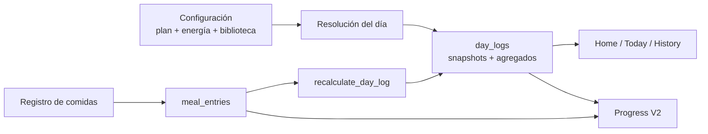
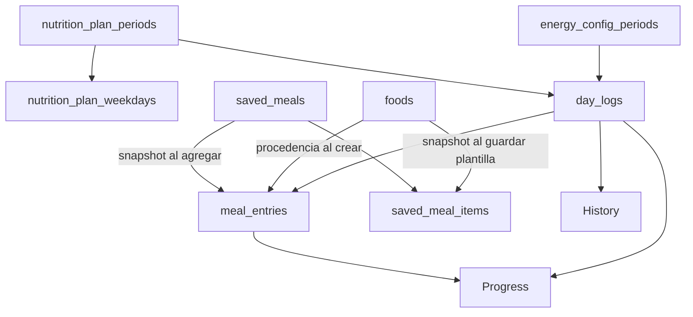

# OWNLEVEL — Sistema de nutrición

Documento técnico canónico de la lógica operativa de Nutrición de OWNLEVEL.

> **Alcance:** registro diario, comidas, alimentos, comidas habituales, objetivos, plan nutricional, gasto energético, contexto del día, overrides, historial, importación e integración con ChatGPT. Para analytics, períodos, coverage, Comparisons y Relationships, consultar [`../progress-v2.md`](../progress-v2.md).

## Estado y fuente de verdad

Este documento describe el sistema vigente en `main` al 13 de septiembre de 2026. Resume contratos de producto y arquitectura, pero no reemplaza al código ni a los tests.

Ante una contradicción, usar este orden:

1. código y tests actuales;
2. migraciones y esquema vigente de Supabase;
3. este documento, [`./data-flow.md`](./data-flow.md) y [`../ownlevel-architecture.md`](../ownlevel-architecture.md);
4. documentación histórica.

La especificación [`../MIGRAR_HISTÓRICOS_E_IMPLEMENTAR_INFONUTRI.md`](../MIGRAR_HISTÓRICOS_E_IMPLEMENTAR_INFONUTRI.md) conserva el contexto de la migración original desde Google Sheets. No debe usarse como contrato actual cuando difiera del código o de este documento.

---

## Índice

1. [Objetivo y modelo mental](#objetivo-y-modelo-mental)
2. [Mapa funcional y rutas](#mapa-funcional-y-rutas)
3. [Modelo de datos](#modelo-de-datos)
4. [El día nutricional canónico](#el-día-nutricional-canónico)
5. [Comidas y `meal_entries`](#comidas-y-meal_entries)
6. [Macros: conocido, desconocido y cero](#macros-conocido-desconocido-y-cero)
7. [Totales diarios y recálculo](#totales-diarios-y-recálculo)
8. [Alimentos](#alimentos)
9. [Comidas habituales](#comidas-habituales)
10. [Comidas sugeridas](#comidas-sugeridas)
11. [Prevención de duplicados](#prevención-de-duplicados)
12. [Plan nutricional V2](#plan-nutricional-v2)
13. [Gasto energético V2](#gasto-energético-v2)
14. [Objetivo, gasto y balance](#objetivo-gasto-y-balance)
15. [Contexto del día y overrides](#contexto-del-día-y-overrides)
16. [Métricas diarias](#métricas-diarias)
17. [Histórico y snapshots](#histórico-y-snapshots)
18. [Historial, reportes y Progress](#historial-reportes-y-progress)
19. [Integración con ChatGPT](#integración-con-chatgpt)
20. [Importación histórica](#importación-histórica)
21. [Seguridad e invariantes](#seguridad-e-invariantes)
22. [Cómo extender Nutrición](#cómo-extender-nutrición)
23. [Validación](#validación)
24. [Code map](#code-map)
25. [Antipatrones](#antipatrones)
26. [Documentos relacionados](#documentos-relacionados)

---

# Objetivo y modelo mental

Nutrición separa deliberadamente cuatro responsabilidades:

```text
CONFIGURAR
→ REGISTRAR
→ PRESERVAR HISTORIA
→ ANALIZAR
```

- **Configurar:** plan nutricional, objetivo por día, agua, gasto energético, alimentos y comidas habituales.
- **Registrar:** hechos consumidos y contexto real de una fecha.
- **Preservar historia:** cada día conserva snapshots de la configuración utilizada y cada comida conserva su nutrición propia.
- **Analizar:** History reconstruye hechos; Progress compara y analiza períodos.

La regla central es:

> **Cambiar una configuración actual no debe reescribir silenciosamente lo que se consumió ni los objetivos/gastos históricos de días anteriores.**

El flujo principal es:



`day_logs` es el ancla del día, pero no sustituye a las fuentes detalladas. Una comida existe en `meal_entries`; una métrica personal vive canónicamente en `daily_metric_values`; una sesión de entrenamiento vive en `workout_sessions`.

---

# Mapa funcional y rutas

## Registro diario

| Ruta | Responsabilidad |
| --- | --- |
| `/today` | Nutrición del día: resumen, comidas, actividad/contexto y acciones de registro |
| `/today/reports` | Reporte nutricional y navegación histórica/analítica de Nutrición |
| `/today/steps` | Superficie histórica/compatibilidad específica de pasos |
| `/history` | Reconstrucción factual de una fecha entre dominios |
| `/home` | Resumen compacto; consume read models acotados, no reimplementa Nutrición |

## Configuración

| Ruta | Responsabilidad |
| --- | --- |
| `/settings/nutrition` | Hub de configuración nutricional |
| `/settings/nutrition/energy` | Plan nutricional V2: objetivos por día, agua y extras de entrenamiento |
| `/settings/nutrition/expenditure` | Configuración de gasto / compatibilidad con reglas anteriores |
| `/settings/nutrition/goals` | Objetivos versionados anteriores / compatibilidad histórica |
| `/settings/nutrition/schedule` | Horario laboral versionado anterior / contexto histórico |
| `/settings/nutrition/foods` | Biblioteca personal de alimentos |
| `/settings/nutrition/meals` | Biblioteca de comidas habituales |
| `/settings/nutrition/integrations` | Integración privada con ChatGPT |

El código de Settings revalida estas superficies junto con Today, Home e History cuando cambia una configuración que puede afectar la lectura actual.

---

# Modelo de datos

## Entidades principales

| Entidad | Responsabilidad |
| --- | --- |
| `day_logs` | Ancla única por usuario/fecha; snapshots del contexto nutricional y agregados del día |
| `meal_entries` | Hechos consumidos; cada fila conserva nutrición, origen y metadata de esa ocurrencia |
| `foods` | Catálogo personal mutable para registrar alimentos por cantidad |
| `saved_meals` | Plantillas de comidas habituales |
| `saved_meal_items` | Componentes snapshot de una comida habitual compuesta |
| `nutrition_plan_periods` | Versiones del plan nutricional V2 |
| `nutrition_plan_weekdays` | Objetivos de calorías/proteína por día de semana para un plan |
| `energy_config_periods` | Versiones de configuración de gasto V2 |
| `nutrition_goal_periods` | Modelo anterior de objetivos por gym/no-gym; conservado por compatibilidad e historia |
| `expenditure_rule_periods` | Modelo anterior de gasto por trabajo/gym; conservado por compatibilidad e historia |
| `work_schedule_periods` | Horario laboral versionado anterior y contexto de días históricos |
| `nutrition_events` | Eventos/contexto nutricional histórico que no representan consumo |
| `nutrition_import_runs` | Auditoría de importaciones históricas reproducibles |

## Relación conceptual



## `day_logs` no es una tabla universal de hechos

`day_logs` guarda lo que tiene semántica diaria y lo que debe preservarse como snapshot o agregado. No debe absorber el detalle de otros dominios.

Ejemplos:

- consumo individual → `meal_entries`;
- definición de alimento → `foods`;
- plantilla habitual → `saved_meals`;
- valor dinámico de una métrica personal → `daily_metric_values`;
- entrenamiento → `workout_sessions`.

---

# El día nutricional canónico

La entrada server-side principal es `src/lib/nutrition/day.ts`.

## `getNutritionDay(date)`

Devuelve el read model de una fecha con:

- `dayLog`;
- comidas activas;
- contexto nutricional preservado.

Por defecto puede crear el `day_log` mediante `getOrCreateDayLog`. Para superficies puramente históricas puede usarse `createIfMissing: false`, evitando inventar un día por el simple hecho de consultarlo.

## `getNutritionDaySummary(date, context)`

Home necesita una lectura más barata. Por eso consume:

- agregados de `day_logs`;
- cantidad de comidas mediante `COUNT`;
- contexto snapshot.

No descarga todas las comidas para mostrar el resumen compacto.

## `resolveNutritionContext(date)`

Es una resolución dinámica/read-only mediante la RPC `resolve_nutrition_context`.

Sirve para previews o flujos que necesitan saber qué contexto correspondería a una fecha sin utilizar ese resultado como una nueva fuente persistida paralela.

## Snapshots frente a resolución dinámica

Cuando existe un `day_log`, la UI histórica debe preferir los valores que quedaron materializados para ese día:

- plan/período utilizado;
- objetivo calórico;
- objetivo de proteína;
- objetivo de agua;
- gasto estimado;
- contexto trabajo/gym cuando corresponde;
- consumo agregado;
- balance.

No debe recalcular julio con la configuración de septiembre.

---

# Comidas y `meal_entries`

`meal_entries` es la fuente canónica del detalle consumido.

Una entrada puede conservar, entre otros:

- `consumed_at`;
- `meal_label`;
- `title`;
- `description`;
- `final_calories`;
- `final_protein_g`;
- `final_carbs_g`;
- `final_fat_g`;
- `entry_kind`;
- `precision_level`;
- `source_type`;
- `source_note`;
- `raw_input`;
- identidad de importación/idempotencia;
- `deleted_at`.

## Tipos de hecho

`entry_kind` distingue actualmente:

```text
meal
legacy_daily_summary
```

Un resumen diario heredado no debe tratarse como una comida normal para sugerencias o UX de registro rápido.

## Origen

`source_type` puede representar fuentes como:

```text
manual
label
ai
chatgpt
sheet_import
```

El origen describe procedencia. No cambia el principio de que la fila final en `meal_entries` es el hecho canónico consumido.

## Edición y eliminación

La UI permite editar una comida real y utiliza soft delete mediante `deleted_at`.

Los agregados, History y Progress deben considerar sólo entradas activas (`deleted_at is null`) cuando la semántica requiera consumo vigente.

## Revalidación

Crear, editar o eliminar una comida revalida las superficies que dependen del hecho:

- `/today`;
- `/history`;
- `/home`.

---

# Macros: conocido, desconocido y cero

Esta distinción es un contrato importante.

## Calorías

En el flujo manual actual las calorías son obligatorias.

## Proteína, carbohidratos y grasas

Pueden ser:

- un número positivo;
- `0`, cuando se sabe que realmente es cero;
- `null`, cuando el nutriente es desconocido/no informado.

Por lo tanto:

```text
null != 0
```

No completar automáticamente un macro desconocido con cero.

Esto se conserva también en:

- Foods;
- Saved Meals;
- importaciones;
- integración ChatGPT;
- Progress V2.

## Calorías no se derivan implícitamente de macros

OWNLEVEL conserva el valor calórico informado/canónico. No debe reconstruirse automáticamente con una fórmula `4/4/9` para rellenar datos ausentes salvo que se diseñe explícitamente una nueva regla de producto.

---

# Totales diarios y recálculo

`day_logs` contiene agregados como:

- `total_calories_consumed`;
- `total_protein_g`;
- `total_carbs_g`;
- `total_fat_g`.

Estos valores **no son un segundo formulario editable**.

El patrón canónico es:

```text
meal_entries activas
→ trigger / recalculate_day_log
→ agregados de day_logs
```

La función de base `recalculate_day_log` recalcula los agregados desde los hechos activos y serializa mutaciones concurrentes del mismo día.

Por lo tanto:

> **Nunca actualizar totales diarios manualmente para “acomodar” una comida. Corregir la comida fuente y dejar que el agregado se derive.**

Los deltas y balances que dependen de snapshots sólo deben materializarse cuando el contexto necesario existe.

---

# Alimentos

`foods` es el catálogo personal de ingredientes o bases cuantificables.

Una definición conserva:

- nombre y descripción;
- cantidad base (`serving_quantity`);
- unidad (`serving_unit`);
- calorías;
- proteína;
- carbohidratos;
- grasas;
- precisión/origen;
- estado activo.

## Registrar por cantidad

El flujo de Today recibe:

- `foodId`;
- cantidad;
- fecha.

El servidor vuelve a leer el Food propio y activo, escala su nutrición y crea una `meal_entry` snapshot.

La entrada consumida ya no depende de que el Food permanezca igual después.

## Archivar y eliminar

El catálogo es mutable, pero el historial no.

Archivar o eliminar una definición no debe recalcular comidas ya registradas ni plantillas que ya materializaron su snapshot.

## Cantidades y unidades

La lógica de cantidad sólo escala dentro del contrato de unidad definido por el Food. No deben inventarse conversiones entre unidades incompatibles sin una capa explícita de conversión.

---

# Comidas habituales

`SavedMeal` es una **plantilla**, no un hecho consumido.

Existen dos clases:

```text
manual
composite
```

## Manual

La plantilla conserva directamente sus totales nutricionales.

## Compuesta

`save_meal_items` conserva una fotografía de cada componente:

- etiqueta;
- cantidad/unidad;
- porción base;
- calorías y macros base;
- posición;
- `source_food_id` como procedencia.

`source_food_id` no convierte la plantilla en una vista viva del Food. La plantilla debe permanecer estable si ese Food luego se edita, archiva o elimina.

## Snapshot intencional

El principio es:

```text
Food actual
→ guardar comida habitual
→ snapshot de componentes

Comida habitual actual
→ agregar al día
→ snapshot en meal_entries
```

Cada capa preserva la información utilizada en ese momento.

## Totales de una plantilla compuesta

Al guardar una plantilla:

1. el servidor relee los Foods nuevos y valida ownership/estado;
2. materializa snapshots de componentes;
3. Postgres reemplaza plantilla/items de forma atómica;
4. recalcula sus totales.

Si un nutriente de algún componente es desconocido, el total correspondiente puede permanecer `null`; no debe convertirse en cero.

## Agregar rápido

`quickAddSavedMeal` recibe una identidad mínima (`savedMealId` + fecha), relee la plantilla propia/activa y crea una `meal_entry` snapshot.

## Ajustar una ocurrencia

Una comida compuesta puede agregarse con cantidades ajustadas para esa ocurrencia.

Ese ajuste:

- valida que los items pertenezcan a la plantilla;
- recalcula esa ocurrencia;
- no reescribe la plantilla salvo una acción explícita de edición de la biblioteca.

---

# Comidas sugeridas

Las sugerencias son un **read model derivado**, no otra biblioteca persistida.

El sistema toma historial reciente elegible de `meal_entries`, excluyendo entradas que no representan una comida manual reutilizable.

La ventana implementada considera los **60 días completos anteriores** al día actual de Córdoba.

No se crea una tabla `suggested_meals`.

## Elegir una sugerencia

Al seleccionar una sugerencia:

1. se envía la identidad de la comida histórica;
2. el servidor vuelve a validar ownership/elegibilidad;
3. crea una nueva `meal_entry` manual para hoy.

## Guardar como habitual

Una sugerencia puede convertirse explícitamente en `saved_meal`.

Eso es una decisión del usuario; no existe backfill automático del historial a la biblioteca.

---

# Prevención de duplicados

OWNLEVEL protege contra doble envío accidental sin prohibir comidas legítimamente repetidas.

## Flujo manual

Antes de crear una comida, puede buscar una posible coincidencia reciente por:

- fecha/contexto;
- título/descripción;
- calorías;
- proteína;
- carbohidratos;
- grasas.

La comparación preserva la diferencia entre `null` y `0`.

Si se detecta una posible repetición, la UI puede pedir confirmación. El usuario puede forzar `Guardar igual` cuando realmente fueron dos consumos distintos.

## Integraciones

La integración ChatGPT agrega además idempotencia explícita mediante `idempotency_key`.

Idempotencia y heurística de duplicado son protecciones distintas:

- misma acción reintentada → misma idempotency key;
- dos comidas iguales reales → claves distintas + confirmación si corresponde.

---

# Plan nutricional V2

El plan actual se versiona mediante:

- `nutrition_plan_periods`;
- `nutrition_plan_weekdays`.

Una versión tiene `effective_from` y no debe reescribir versiones anteriores.

## Qué configura

Un plan define:

- nombre;
- agua base;
- extra de calorías cuando hubo entrenamiento completado;
- extra de agua cuando hubo entrenamiento completado;
- objetivo de calorías para cada uno de los siete días;
- objetivo de proteína para cada uno de los siete días.

## Regla semanal

Cada día de semana tiene su propio target base.

Conceptualmente:

```text
objetivo kcal del día
= target del weekday
+ extra de entrenamiento si corresponde
```

La proteína actual del plan es la del weekday y no recibe automáticamente un extra por entrenamiento.

El agua se resuelve como:

```text
agua objetivo
= agua base
+ extra de entrenamiento si corresponde
```

## Qué significa “entrenamiento”

La condición es la existencia de al menos una `workout_session` con estado `completed` para la fecha.

Una sesión `in_progress` no aplica el extra.

Dos sesiones completadas en el mismo día no multiplican el extra: es una condición booleana de día entrenado.

## Edición

Guardar Plan V2 crea una nueva versión efectiva; no debe modificar directamente días históricos ya materializados.

## Compatibilidad legacy

Si todavía no existe un plan V2 para una fecha, el editor puede adaptar el modelo anterior `nutrition_goal_periods` como fuente `legacy`.

Esto permite transición sin borrar el histórico, pero **el modelo nuevo y el modelo anterior no deben evolucionar como dos motores equivalentes en paralelo**.

---

# Gasto energético V2

La configuración vigente vive en `energy_config_periods`.

Contiene:

- `activity_level`;
- `activity_factor`;
- `base_expenditure_mode`;
- gasto base personalizado opcional;
- ajuste adicional por entrenamiento;
- versión de fórmula.

## Niveles implementados

El core actual declara:

| Nivel | Factor |
| --- | ---: |
| `low` | 1.20 |
| `moderate` | 1.25 |
| `high` | 1.35 |

## Modo automático

El gasto base automático se estima desde el BMR disponible:

```text
automaticBaseKcal = round(BMR × activityFactor)
```

El BMR canónico proviene del perfil/snapshot diario y su lógica antropométrica pertenece al subsistema de perfil/datos, no a las pantallas de Nutrición.

## Modo personalizado

`base_expenditure_mode = custom` permite utilizar un gasto base explícito en vez del automático.

El automático puede seguir calculándose como referencia, pero el valor usado es el custom configurado.

## Ajuste por entrenamiento

Si existe al menos una sesión `completed` ese día:

```text
gasto diario
= gasto base usado
+ training_expenditure_delta_kcal
```

Si no existe entrenamiento completado, el delta es cero.

## Sin BMR

Si no existe BMR utilizable, el modo automático no debe fabricar un gasto.

## Compatibilidad anterior

`expenditure_rule_periods` conserva el modelo previo basado en combinaciones trabajo/gym y puede aportar fallback/compatibilidad histórica donde corresponda.

No debe convertirse nuevamente en el motor principal de Plan V2.

---

# Objetivo, gasto y balance

Son tres conceptos diferentes.

```text
OBJETIVO DE CONSUMO
cantidad que se pretende comer

GASTO ESTIMADO
energía estimada utilizada por el cuerpo

BALANCE ENERGÉTICO
consumo - gasto
```

Ejemplo:

```text
objetivo = 2.100 kcal
gasto = 2.350 kcal
consumo = 1.900 kcal
```

Entonces:

```text
delta vs objetivo = 1.900 - 2.100 = -200 kcal
balance energético = 1.900 - 2.350 = -450 kcal
```

Contrato obligatorio:

> **Nunca calcular balance energético como `consumo - objetivo`.**

`day_logs` conserva por separado:

- `nutrition_target_kcal_snapshot`;
- `estimated_expenditure_kcal_snapshot`;
- `delta_vs_nutrition_target`;
- `energy_balance_kcal`.

También conserva referencias automáticas/overrides cuando corresponde.

---

# Contexto del día y overrides

Un día puede conservar información de contexto que modifica la resolución o explica por qué un valor fue distinto.

## Entrenamiento

La fuente fuerte es Training:

```text
workout_session completed
→ día entrenado
```

No crear una rutina/sesión falsa para modificar un objetivo nutricional.

El modelo histórico conserva campos de override de gym para casos excepcionales y compatibilidad, pero el entrenamiento real debe corregirse en Training cuando la fuente es errónea.

## Trabajo

`work_schedule_periods` y los snapshots/overrides de trabajo preservan contexto del modelo anterior y de históricos.

Plan V2 ya no necesita una matriz distinta de targets por “trabajo/no trabajo”: los objetivos base son por día de semana y el gasto V2 usa nivel de actividad + entrenamiento completado.

## Override de gasto

`expenditure_override_kcal` permite corregir explícitamente un día concreto.

No debe modificar la configuración global ni días vecinos.

## Override de objetivo nutricional

`nutrition_target_override_kcal` permite corregir el objetivo de una fecha concreta.

Tampoco reescribe el plan versionado.

## Automático vs efectivo

Cuando exista un override, conservar cuando el schema lo soporte:

- valor automático calculado;
- valor efectivo utilizado.

Eso permite explicar el día sin perder la referencia original.

---

# Métricas diarias

Nutrición convive con el sistema genérico de métricas diarias.

La fuente canónica moderna es:

```text
user_metrics
+
daily_metric_values
```

Today escribe métricas dinámicas por `metric_id` mediante `saveDailyMetricValues`.

## Columnas legacy

`day_logs.steps`, `day_logs.water_l` y `day_logs.mate_l` existen por compatibilidad y snapshots/consumidores anteriores.

Para métricas del sistema existe sincronización/puente con el modelo dinámico. Nuevas features no deben volver a hardcodear toda la lógica contra columnas legacy si el sistema genérico ya la resuelve.

## Missing vs zero

También aquí:

```text
sin row / null = no registrado
0 = valor conocido igual a cero
```

No convertir ausencia en cumplimiento cero de una métrica diaria.

Para semántica analítica de coverage y períodos, ver [`../progress-v2.md`](../progress-v2.md).

---

# Histórico y snapshots

El sistema preserva el contexto con el que se vivió cada día.

`day_logs` puede conservar:

- IDs de los períodos/configuraciones aplicados;
- objetivo nutricional automático y efectivo;
- proteína objetivo;
- agua objetivo;
- gasto automático y efectivo;
- contexto trabajo/gym;
- totales consumidos;
- balance;
- fecha de resolución.

El principio es:

> **La configuración actual gobierna el presente/futuro; el snapshot histórico explica el pasado.**

## Cambiar un Plan

Crear una nueva versión no debe recalcular días pasados.

## Cambiar un Food

No recalcula comidas consumidas.

## Cambiar una Saved Meal

No recalcula ocurrencias ya agregadas.

## Corregir una comida histórica

Sí cambia los agregados de ese día, porque se está corrigiendo el hecho histórico original.

Esa corrección puede reflejarse luego en History y Progress porque ambos leen los hechos corregidos.

---

# Historial, reportes y Progress

Estas superficies tienen responsabilidades diferentes.

## History

`/history` reconstruye qué ocurrió en una fecha.

Puede mostrar:

- comidas;
- totales;
- objetivos/snapshots;
- métricas;
- entrenamiento;
- eventos/contexto.

History es factual; no debe convertirse en otro motor estadístico.

## Reportes de Nutrición

`/today/reports` utiliza helpers bajo `src/lib/nutrition/reports*` y la Foundation compartida cuando corresponde.

No debe implementar otra definición incompatible de períodos/coverage.

## Progress V2

Progress consume hechos y snapshots canónicos para analizar:

- calorías;
- macros;
- objetivos;
- gasto;
- balance;
- cobertura;
- comparaciones;
- relaciones con otras variables.

La semántica analítica completa vive en [`../progress-v2.md`](../progress-v2.md).

Este documento no redefine esos contratos.

---

# Integración con ChatGPT

La integración actual es deliberadamente limitada.

OWNLEVEL expone una API privada para una GPT Action existente. OWNLEVEL **no llama a OpenAI** para interpretar imágenes o lenguaje natural; recibe una comida ya estructurada.

Documentación operativa completa: [`../integrations/chatgpt-nutrition.md`](../integrations/chatgpt-nutrition.md).

## Operaciones

La integración expone esencialmente:

- `checkConnection`;
- `logMeal`.

Es write-only respecto de nutrición personal. No devuelve objetivos, acumulados ni historial completo.

## Autenticación

- API key Bearer;
- el raw token se muestra una sola vez;
- OWNLEVEL persiste hash SHA-256;
- la clave puede revocarse;
- scope mínimo `meals:write`.

## Contrato de fecha

Si la integración omite fecha, OWNLEVEL resuelve el día en:

```text
America/Argentina/Cordoba
```

## Idempotencia

La misma acción reintentada debe conservar `idempotency_key`.

Un replay no debe crear una segunda comida.

## Duplicados posibles

Si una comida distinta pero idéntica en valores parece duplicada, la API puede devolver conflicto y requerir confirmación explícita antes de usar `force_duplicate`.

## Fuente de verdad

Una vez aceptada, la integración crea una `meal_entry` canónica como cualquier otro flujo. ChatGPT no mantiene una base paralela de nutrición.

---

# Importación histórica

El importador de Nutrición fue diseñado para migrar históricos desde la planilla sin convertir el importador en una segunda aplicación.

Scripts principales:

```text
npm run nutrition:dry-run
npm run nutrition:apply
```

## Principios

- dry-run no escribe;
- apply reutiliza el plan de cambios validado;
- production exige intención explícita;
- el apply completo es transaccional;
- la importación es reproducible por hash;
- un source ya importado no debe duplicarse;
- entradas heredadas conservan IDs/origen estables;
- anomalías se preservan/reportan, no se “corrigen” silenciosamente.

`nutrition_import_runs` registra auditoría de cada importación aplicada.

## Después de la migración

Google Sheets no forma parte del flujo canónico actual. El producto normal lee/escribe en Supabase.

La especificación original de migración queda como contexto histórico, no como guía de implementación vigente.

---

# Seguridad e invariantes

## Ownership

Todos los datos personales se restringen por usuario.

- RLS permanece habilitado en tablas de producto;
- server actions vuelven a validar ownership;
- IDs recibidos desde el cliente no otorgan autoridad por sí solos;
- una Food/Saved Meal ajena nunca puede copiarse sólo por conocer su UUID.

## Integración externa

- token hasheado;
- scope mínimo;
- sin lectura nutricional amplia;
- no registrar credenciales en logs;
- revocación inmediata.

## Invariantes centrales

1. `meal_entries` activas son la fuente del consumo detallado.
2. `day_logs` agrega/snapshottea; no reemplaza el detalle.
3. Los totales diarios se derivan, no se editan manualmente.
4. `null` no equivale a `0`.
5. Objetivo de consumo no equivale a gasto.
6. Balance = consumo − gasto.
7. Configuración nueva no reescribe históricos.
8. Food/Saved Meal son definiciones; MealEntry es un hecho.
9. Entrenamiento completado es la fuente preferida para aplicar extras de gym.
10. Progress analiza datos canónicos; no persiste una segunda nutrición.

---

# Cómo extender Nutrición

## Agregar un nuevo campo a una comida

Antes de agregarlo:

1. definir si pertenece al hecho consumido o a una definición reutilizable;
2. decidir si `null` tiene semántica distinta de `0`;
3. agregar schema/migración;
4. actualizar tipo `MealEntry`;
5. actualizar create/edit/import/integration cuando corresponda;
6. actualizar recálculo diario sólo si forma parte de un agregado canónico;
7. agregar tests de historial y soft delete;
8. integrar Progress por su adapter/catálogo, no con lógica inline en una página.

## Agregar una nueva propiedad de Food

Decidir explícitamente si al registrar debe copiarse como snapshot a `meal_entries` o si sólo describe la definición actual.

Nunca hacer que una edición del catálogo cambie retrospectivamente consumo previo.

## Agregar un nuevo target del plan

Seguir el patrón versionado:

```text
configuración versionada
→ resolución por fecha
→ snapshot diario
→ analytics sobre snapshot
```

No agregar un único campo mutable en `profiles` si ese valor necesita historia.

## Agregar una nueva regla de gasto

Debe quedar separada de:

- objetivo de consumo;
- macros;
- pasos/métricas de actividad;
- balance.

Si cambia la fórmula, versionar la semántica (`formula_version`) en vez de reinterpretar el pasado.

## Agregar un nuevo flujo rápido

El flujo debería terminar creando la misma `meal_entry` canónica.

Ejemplos:

```text
manual ─┐
Food ───┤
Saved ──┤→ meal_entries → recalculate_day_log
Sugerida┤
ChatGPT ┘
```

No crear una tabla de consumo distinta por cada UX.

---

# Validación

Un cambio importante en Nutrición debería cubrir según alcance:

- crear comida manual;
- editar y soft delete;
- `null` vs `0` en macros;
- recálculo de calorías/proteína/carbos/grasas;
- detección y confirmación de duplicado;
- Food por cantidad;
- Food archivado/no disponible;
- Saved Meal manual;
- Saved Meal compuesta;
- ajuste de cantidades de una ocurrencia;
- sugerencias derivadas;
- guardar sugerencia como habitual;
- Plan V2 completo con siete días;
- día con y sin entrenamiento completado;
- gasto automático y custom;
- override diario de target/gasto;
- preservación de snapshots históricos;
- Today/Home/History después de mutaciones;
- integración ChatGPT e idempotencia;
- RLS/ownership;
- mobile en superficies críticas cuando hubo cambio de UI.

Los tests viven principalmente junto a `src/lib/nutrition/` y a las superficies `today/settings` que protegen.

---

# Code map

| Responsabilidad | Archivo(s) / carpeta(s) |
| --- | --- |
| Día nutricional / read model | `src/lib/nutrition/day.ts` |
| Tipos nutricionales del día | `src/lib/nutrition/types.ts` |
| Tipos persistidos principales | `src/lib/phase1/types.ts` |
| CRUD base de day log/comidas | `src/lib/phase1/day-log.ts` |
| Registro manual / quick add / delete | `src/app/(app)/today/actions.ts` |
| Acciones de métricas/overrides | `src/app/(app)/today/nutrition-actions.ts` |
| Pantalla diaria | `src/app/(app)/today/` |
| Macros y parsing | `src/lib/nutrition/meal-macros.ts` |
| Food por cantidad | `src/lib/nutrition/food-entry.ts`, `food-quantity.ts` |
| Catálogo Food/config legacy | `src/lib/nutrition/product.ts` |
| Saved Meals | `src/lib/nutrition/saved-meals.ts`, `saved-meal-core.ts` |
| Sugerencias / quick meals | `src/lib/nutrition/quick-meals.ts`, `quick-meals-core.ts` |
| Plan V2 | `src/lib/nutrition/plan-v2.ts`, `plan-v2-core.ts` |
| Settings Nutrición | `src/app/(app)/settings/nutrition/` |
| Reportes | `src/lib/nutrition/reports.ts`, `reports-core.ts`, `report-v2.ts` |
| Métricas diarias | `src/lib/daily-metrics/` |
| ChatGPT tokens | `src/lib/integrations/chatgpt-tokens.ts` |
| API ChatGPT | `src/app/api/integrations/chatgpt/` |
| Importador histórico | `scripts/nutrition-import/`, `src/lib/nutrition/nutrition-import.test.ts` |
| Arquitectura transversal | `docs/architecture/data-flow.md` |
| Analytics | `docs/progress-v2.md`, `src/lib/progress/` |

---

# Antipatrones

No hacer:

- crear otra tabla de “totales diarios”;
- guardar consumo nutricional en `profiles`;
- editar directamente `day_logs.total_*` desde formularios;
- tratar `null` como cero;
- recalcular comidas históricas desde el Food actual;
- recalcular ocurrencias históricas desde una Saved Meal actual;
- hacer que editar el plan actual cambie objetivos históricos;
- confundir target calórico con gasto;
- calcular balance como consumo − target;
- sumar un extra de entrenamiento por cada sesión del mismo día;
- considerar `in_progress` como entrenamiento completado;
- inferir macros desconocidos;
- persistir “sugerencias” como una segunda biblioteca automática;
- permitir que ChatGPT sea fuente de verdad de objetivos/gasto;
- usar nombres visibles de métricas para decidir semántica;
- reconstruir lógica de períodos/coverage dentro de reportes de Nutrición;
- crear una capa de analytics nutricional paralela a Progress V2;
- reintroducir la matriz legacy trabajo/gym como segundo motor principal junto a Plan V2;
- usar la especificación de migración histórica como si describiera exactamente el producto actual.

---

# Documentos relacionados

- [`../ownlevel-architecture.md`](../ownlevel-architecture.md) — arquitectura general de OWNLEVEL.
- [`./data-flow.md`](./data-flow.md) — fuentes de verdad y snapshots entre dominios.
- [`../progress-v2.md`](../progress-v2.md) — analytics de Nutrición, Comparisons, coverage y Relationships.
- [`../integrations/chatgpt-nutrition.md`](../integrations/chatgpt-nutrition.md) — configuración y contrato de la integración ChatGPT.
- [`./training-system.md`](./training-system.md) — fuente de verdad operativa de Training y sesiones completadas.
- [`../MIGRAR_HISTÓRICOS_E_IMPLEMENTAR_INFONUTRI.md`](../MIGRAR_HISTÓRICOS_E_IMPLEMENTAR_INFONUTRI.md) — especificación histórica de la migración inicial; no canónica para el estado actual.

---

## Resumen de contratos

```text
Food / Saved Meal = definición mutable
MealEntry = hecho consumido snapshot
DayLog = ancla + snapshots + agregados

Plan actual != historia pasada
Target != gasto
Balance = consumo - gasto
null != 0

Training completed → condición de entrenamiento del día
Today registra
History reconstruye
Progress analiza
```
