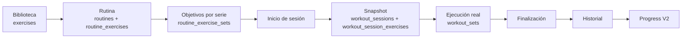
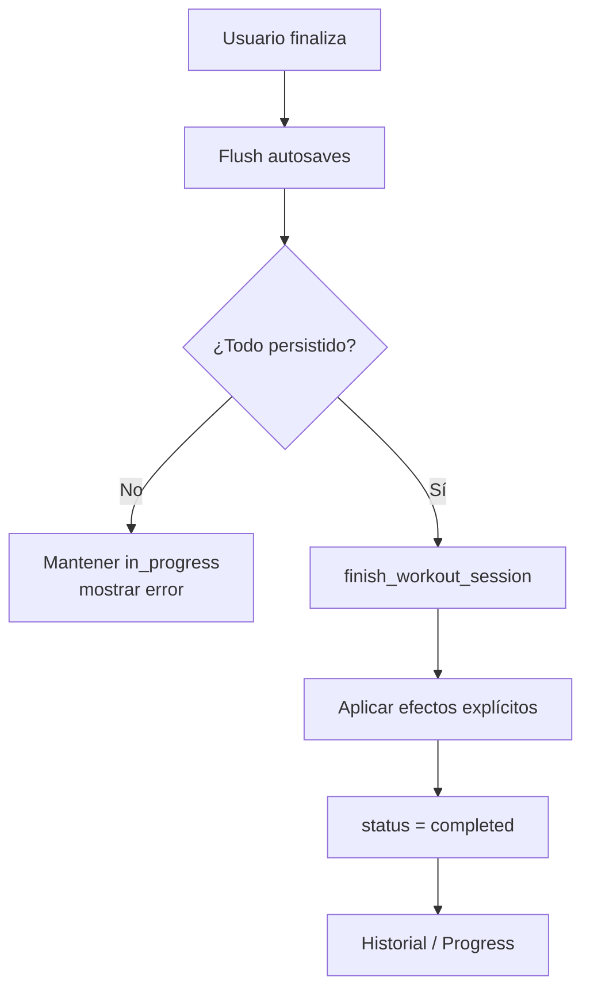

# OWNLEVEL — Sistema de entrenamiento

Documento técnico canónico de la lógica operativa de entrenamiento de OWNLEVEL.

> **Alcance:** biblioteca de ejercicios, rutinas, inicio de sesión, entrenamiento en curso, series, autosave, progresión, finalización, historial y corrección. Para analytics de entrenamiento, rendimiento, comparaciones y relaciones, consultar [`../progress-v2.md`](../progress-v2.md).

## Estado y fuente de verdad

Este documento describe el sistema vigente en `main` al 13 de septiembre de 2026. Resume contratos de producto y arquitectura, pero no reemplaza al código ni a los tests.

Ante una contradicción, usar este orden:

1. código y tests actuales;
2. migraciones y esquema vigente de Supabase;
3. este documento y [`../ownlevel-architecture.md`](../ownlevel-architecture.md);
4. documentación histórica.

El archivo [`../entrenamiento-robusto.md`](../entrenamiento-robusto.md) documenta la reconstrucción original del modelo y se conserva como contexto histórico. No debe usarse como contrato actual cuando difiera de este documento o del código.

---

## Índice

1. [Objetivo y modelo mental](#objetivo-y-modelo-mental)
2. [Mapa funcional y rutas](#mapa-funcional-y-rutas)
3. [Modelo de datos](#modelo-de-datos)
4. [Biblioteca de ejercicios](#biblioteca-de-ejercicios)
5. [Rutinas](#rutinas)
6. [Inicio de una sesión](#inicio-de-una-sesión)
7. [Entrenamiento en curso](#entrenamiento-en-curso)
8. [Series, objetivos y valores reales](#series-objetivos-y-valores-reales)
9. [Autosave, draft y concurrencia](#autosave-draft-y-concurrencia)
10. [Descanso](#descanso)
11. [Progresión y próxima sesión](#progresión-y-próxima-sesión)
12. [Notas](#notas)
13. [Agregar o quitar ejercicios durante una sesión](#agregar-o-quitar-ejercicios-durante-una-sesión)
14. [Finalización](#finalización)
15. [Sesiones completadas, corrección y descarte](#sesiones-completadas-corrección-y-descarte)
16. [Historial y calendario](#historial-y-calendario)
17. [Límite con Progress V2](#límite-con-progress-v2)
18. [Compatibilidad y legado](#compatibilidad-y-legado)
19. [Seguridad e invariantes](#seguridad-e-invariantes)
20. [Cómo extender Training](#cómo-extender-training)
21. [Validación](#validación)
22. [Code map](#code-map)
23. [Antipatrones](#antipatrones)
24. [Documentos relacionados](#documentos-relacionados)

---

# Objetivo y modelo mental

Training separa deliberadamente **planificación** de **ejecución real**.

Una rutina describe lo que se pretende hacer. Una sesión describe lo que ocurrió en un día concreto. Una vez iniciada la sesión, los cambios posteriores en la biblioteca o en la rutina no deben reescribir ese hecho histórico.



La invariante principal es:

> **Editar una definición actual nunca debe reescribir silenciosamente una sesión histórica.**

Esto permite que OWNLEVEL pueda evolucionar rutinas, ejercicios y objetivos sin perder la fidelidad de lo que realmente se entrenó.

## Capas del dominio

| Capa | Entidades principales | Responsabilidad |
| --- | --- | --- |
| Biblioteca | `exercises` | Definición reutilizable del ejercicio |
| Planificación | `routines`, `routine_exercises`, `routine_exercise_sets` | Orden, contexto y objetivos previstos |
| Sesión | `workout_sessions`, `workout_session_exercises` | Ejecución concreta y snapshots históricos |
| Series reales | `workout_sets` | Objetivos copiados + valores realizados |
| Presentación | `/train/*` | Biblioteca, rutinas, sesión activa, historial, calendario |
| Analytics | Progress V2 | Lectura derivada de sesiones y sets completados |

---

# Mapa funcional y rutas

El dominio vive principalmente bajo `src/app/(app)/train/`.

| Ruta | Responsabilidad |
| --- | --- |
| `/train` | Hub de entrenamiento y acceso al flujo principal |
| `/train/exercises` | Biblioteca de ejercicios |
| `/train/routines` | Lista, creación, archivo y restauración de rutinas |
| `/train/routines/[id]` | Configuración de una rutina y sus ejercicios |
| `/train/session/new` | Inicio de entrenamiento desde rutina o sesión libre |
| `/train/session/[id]` | Sesión activa o detalle de sesión según estado |
| `/train/session/[id]/correct` | Corrección controlada de una sesión completada |
| `/train/history` | Historial de sesiones y ejercicios |
| `/train/history/[exerciseId]` | Historial individual de un ejercicio |
| `/train/calendar` | Navegación de entrenamiento por fecha |
| `/train/day/...` | Reconstrucción diaria vinculada al entrenamiento |
| `/train/progress` | Entrada histórica al análisis de Training; la semántica analítica vive en Progress V2 |

`/train/body` comparte históricamente el área visual de Entrenar, pero el cuerpo es un dominio separado. Su semántica analítica está documentada en Progress V2.

---

# Modelo de datos

## Entidades canónicas

### `exercises`

Define el ejercicio actual del usuario. Entre sus atributos operativos se encuentran:

- `id` y `user_id`;
- `source_key` opcional;
- `nombre`;
- grupo muscular general y label anatómico más detallado;
- implemento;
- `weight_mode`;
- defaults sugeridos de series, reps, peso y RIR;
- descanso sugerido mínimo/máximo;
- notas;
- `is_active`;
- timestamps.

La definición puede cambiar con el tiempo. Por eso la sesión conserva snapshots de los atributos que necesita para historia y analytics.

### `routines`

Representa una plantilla de entrenamiento del usuario:

- nombre y color;
- orden;
- estado activo/archivado;
- notas y metadata de origen cuando corresponda.

Archivar una rutina no elimina sus sesiones históricas.

### `routine_exercises`

Une una rutina con un ejercicio y contiene configuración contextual:

- orden dentro de la rutina;
- descanso;
- recordatorio de progresión;
- nota persistente para esa combinación rutina + ejercicio.

La misma definición de `exercise` puede aparecer en más de una rutina con configuración distinta.

### `routine_exercise_sets`

Una fila por serie objetivo. Conserva:

- número de serie;
- reps objetivo;
- peso objetivo;
- RIR objetivo;
- notas.

No debe reducirse conceptualmente a un único `series × reps × peso`, porque cada serie puede tener objetivos distintos.

### `workout_sessions`

Representa una ejecución concreta y tiene lifecycle explícito:

```text
in_progress → completed
            ↘ cancelled/deleted por flujo de sesión activa

completed → discarded
```

El tipo vigente expone los estados persistidos:

```text
in_progress
completed
discarded
```

También conserva:

- `day_log_id`;
- rutina de origen cuando existe;
- snapshot del nombre de rutina;
- nombre de sesión;
- inicio y fin;
- energía, rendimiento y dolor;
- notas generales;
- campos legacy de ABS/cinta todavía presentes por compatibilidad.

### `workout_session_exercises`

Es el snapshot de un ejercicio dentro de una sesión. Conserva, entre otras cosas:

- `exercise_id`;
- `routine_exercise_id` cuando proviene de rutina;
- `source_type` (`routine`, `extra`, `manual_new`);
- nombre, músculo, detalle anatómico, implemento y `weight_mode` snapshot;
- descanso snapshot;
- cantidad de series planificadas;
- recordatorio heredado de progresión;
- decisión de la sesión actual;
- `apply_to_routine`;
- nota original de rutina y nota de la sesión;
- orden;
- timestamps y estado de completitud.

### `workout_sets`

Es la fuente del trabajo real por serie:

- `set_number`;
- `target_reps`;
- `target_weight_kg`;
- `target_rir`;
- `actual_reps`;
- `actual_weight_kg`;
- `is_completed`;
- `completed_at`;
- notas.

**Contrato:** el objetivo histórico de una serie se lee desde `workout_sets`; no se reconstruye desde la rutina actual.

---

# Biblioteca de ejercicios

La biblioteca es la fuente actual de definiciones reutilizables.

La superficie principal está en:

- `src/app/(app)/train/exercises/page.tsx`;
- `src/app/(app)/train/exercises/exercise-library.tsx`.

La lógica compartida vive principalmente en:

- `src/lib/phase2/exercise-library.ts`;
- `src/lib/phase2/exercise-mutation.ts`;
- `src/lib/phase2/exercise-form.ts`.

## Crear y editar

Las mutaciones se normalizan antes de persistir. Los campos de defaults de entrenamiento pertenecen al ejercicio como valores iniciales, pero una rutina puede definir objetivos por serie propios.

Un ejercicio puede crearse:

- desde la biblioteca;
- durante una sesión activa mediante el flujo específico de sesión.

Crear un ejercicio durante una sesión no debe saltarse la biblioteca: se crea la definición correspondiente y se agrega a la sesión con su `source_type` adecuado.

## Membresía de rutinas

El editor de ejercicio puede sincronizar su pertenencia a rutinas activas. Esa relación no convierte al ejercicio en propiedad exclusiva de una rutina.

## Archivo y restauración

Archivar cambia disponibilidad futura; no elimina hechos históricos.

Una sesión antigua mantiene los snapshots del ejercicio aunque la definición actual esté archivada o modificada.

**No hacer:** reemplazar un `exercise_id` histórico porque el ejercicio actual fue renombrado, archivado o recreado.

---

# Rutinas

La rutina es una **plantilla editable**, no una sesión.

Las operaciones de creación, edición, archivo y restauración se exponen desde `src/app/(app)/train/actions.ts` y delegan al dominio en `src/lib/phase2/`.

## Configuración

Una rutina puede definir:

- ejercicios y orden;
- una lista de series objetivo por ejercicio;
- reps, peso y RIR por serie;
- descansos;
- nota persistente;
- recordatorio de progresión.

Los cambios afectan futuros inicios de sesión. No retropropagan a sesiones ya iniciadas o finalizadas.

## Reordenamiento

El orden de rutina y ejercicios es metadata de planificación. La sesión copia el orden que corresponde al momento de iniciarse.

## Archivo

Archivar una rutina:

- la retira de los flujos normales de inicio futuro;
- no borra `workout_sessions`;
- no invalida el `routine_name_snapshot` de sesiones antiguas;
- no impide que Progress use los hechos históricos existentes.

## Importación inicial

El repo conserva una importación auditable del plan inicial mediante `src/lib/phase2/initial-plan.ts` y su flujo de importación. Es una herramienta de bootstrap/restauración de plantillas, no el modelo general de Training.

No debe usarse como precedente para hardcodear nuevas rutinas o ejercicios en código.

---

# Inicio de una sesión

Una sesión puede iniciarse:

1. desde una rutina;
2. como sesión libre.

Las acciones de entrada actuales incluyen:

- `startSessionFromRoutineAction`;
- `startFreeSessionAction`;
- `startWorkoutFromSheetAction`.

La fecha lógica por defecto se resuelve con la fecha de Córdoba (`todayInCordoba()`).

## Una sola sesión activa

**Contrato:** un usuario no puede tener dos sesiones `in_progress` simultáneamente.

La UI ayuda a conducir al usuario hacia la sesión existente, pero la garantía no depende sólo del cliente. Si el intento de inicio falla y ya existe una sesión activa, el flujo puede recuperar esa sesión y ofrecer continuarla.

## Inicio desde rutina

El inicio copia la estructura necesaria a las tablas de sesión:

```text
routine
+ routine_exercises
+ routine_exercise_sets
        ↓
workout_session
+ workout_session_exercises
+ workout_sets
```

Desde ese momento, la sesión es un hecho independiente de futuras ediciones de la plantilla.

## Sesión libre

Una sesión libre empieza sin `routine_id`. Después puede recibir ejercicios existentes o ejercicios creados desde la propia sesión.

---

# Entrenamiento en curso

La ruta principal es `/train/session/[id]`.

La implementación de interacción se concentra especialmente en:

- `session-editor.tsx`;
- `session-editor-helpers.ts`;
- `add-exercise-sheet.tsx`;
- `quick-exercise-history-sheet.tsx`;
- `workout-finished-dialog.tsx`.

El editor está diseñado para uso móvil y prioriza:

> ver objetivo → cargar serie → completar → descansar

La interfaz puede organizar visualmente estos elementos de distintas maneras, pero no debe romper los contratos de persistencia, autosave, snapshots y finalización.

## Estado local y remoto

Durante una sesión existen dos estados relevantes:

- **draft local:** lo que el usuario acaba de editar y debe verse inmediatamente;
- **estado persistido:** última versión confirmada por backend.

La experiencia no debe esperar un roundtrip remoto para reflejar cada interacción.

---

# Series, objetivos y valores reales

Cada serie separa lo **planificado** de lo **realizado**.

| Tipo | Campos |
| --- | --- |
| Objetivo | `target_weight_kg`, `target_reps`, `target_rir` |
| Ejecución | `actual_weight_kg`, `actual_reps`, `is_completed` |

El RIR actual de una serie no se almacena como campo realizado en `WorkoutSet`; el contrato vigente conserva RIR como objetivo (`target_rir`). Cualquier futura incorporación de RIR realizado debe modelarse explícitamente y no inferirse desde el target.

## Serie completada

Una serie cuenta como realizada para los flujos que exigen trabajo efectivo cuando está marcada como completada y sus valores cumplen las reglas del consumidor correspondiente.

No confundir:

- una fila de set existente;
- una serie planificada;
- una serie efectivamente completada.

## `weight_mode`

`weight_mode` forma parte de la semántica del ejercicio y se copia al snapshot de sesión.

**Contrato:** no transformar silenciosamente el peso registrado. Por ejemplo, un peso registrado "por mancuerna" se conserva como fue cargado; no se multiplica automáticamente por dos para construir historial o analytics.

Las comparaciones de rendimiento que dependen de compatibilidad de carga están documentadas en Progress V2.

---

# Autosave, draft y concurrencia

La edición activa sigue el patrón:

```text
interacción
  ↓
draft local inmediato
  ↓
UI actualizada
  ↓
autosave con debounce
  ↓
persistencia remota
```

La infraestructura específica vive en `src/lib/phase2/exercise-autosave.ts` y está cubierta por tests dedicados.

## Qué no debe bloquear un save

Un request de guardado no debe impedir:

- abrir/cerrar otro ejercicio;
- editar otra serie;
- iniciar o consultar descanso;
- recorrer la sesión;
- continuar entrenando.

## Ejercicios distintos

Pueden sincronizarse de forma independiente.

## Mismo ejercicio

Los saves se serializan para impedir que una respuesta antigua pise una edición local más nueva.

El backend conserva control optimista mediante `updated_at`/estado esperado de sincronización.

## Error de red

Un error remoto no debe descartar el draft actual.

La sesión puede seguir utilizándose mientras la UI deja visible el problema de sincronización. La barrera estricta aparece al finalizar.

**Contrato:** nunca marcar como persistido un cambio que no fue confirmado por backend.

---

# Descanso

Los ejercicios pueden tener:

- descanso mínimo;
- descanso máximo.

Al iniciar una sesión, esos valores se copian a `rest_min_seconds_snapshot` y `rest_max_seconds_snapshot`.

El temporizador es una herramienta de interacción de la sesión; no redefine por sí mismo el trabajo histórico. Si en el futuro se decide persistir tiempos reales de descanso, debe agregarse un contrato de datos explícito y no inferirse a partir de la UI del timer.

---

# Progresión y próxima sesión

Training separa dos conceptos que no deben fusionarse.

## 1. Recordatorio de ajuste

`TrainingAdjustment` admite:

```text
maintain
increase_weight
increase_reps
custom
```

Semántica vigente:

- `maintain`: neutral;
- `increase_weight`: recordatorio de aumentar carga;
- `increase_reps`: recordatorio de aumentar repeticiones;
- `custom`: compatibilidad con datos/drafts/snapshots históricos; la UI normal no crea nuevos `custom`.

El recordatorio describe una intención para la próxima vez. **No cambia números automáticamente.**

Al iniciar una sesión, el recordatorio previo se copia al snapshot (`next_adjustment_snapshot`). La nueva `decision` de esa sesión comienza de forma neutral.

## 2. Aplicar el resultado actual a la rutina

`apply_to_routine` controla si los valores realizados se utilizan para actualizar targets futuros de la rutina.

Por lo tanto:

```text
decision
= intención / recordatorio

apply_to_routine
= actualización explícita de objetivos numéricos
```

Son mecanismos independientes y pueden coexistir.

## Consumo del recordatorio

El recordatorio se consume al **finalizar correctamente** una nueva sesión, no por el mero hecho de iniciarla.

Esto evita perder la intención si la sesión se cancela o nunca llega a completarse.

---

# Notas

Existen notas con responsabilidades distintas.

## Nota de biblioteca

`exercises.notes` pertenece a la definición general del ejercicio.

## Nota de rutina

`routine_exercises.notes` pertenece a la combinación rutina + ejercicio y representa contexto persistente para futuros entrenamientos de esa rutina.

## Snapshot de nota

Al iniciar desde rutina:

- `routine_note_snapshot` conserva lo que había antes de la sesión;
- `workout_session_exercises.notes` recibe la nota vigente para la sesión.

Sólo la finalización compara la nota confirmada de sesión con el snapshot inicial. Si hubo un cambio explícito, puede propagarse hacia `routine_exercises.notes`.

Si no cambió, la rutina no se reescribe. Esto evita pisar una edición concurrente hecha fuera de la sesión.

Autosave, cancelación, descarte y corrección histórica no deben reutilizarse para propagar silenciosamente una nota hacia la rutina.

---

# Agregar o quitar ejercicios durante una sesión

Una sesión activa puede modificarse sin alterar retroactivamente la rutina de origen.

## Agregar ejercicio existente

`addExistingExerciseToSessionAction` agrega una definición existente a la ejecución actual.

El ejercicio agregado queda identificado como una incorporación de la sesión y no debe asumirse automáticamente como nuevo miembro permanente de la rutina.

## Crear ejercicio desde sesión

`createExerciseFromSessionAction` crea una nueva definición y la incorpora a la sesión.

Este flujo comparte normalización de campos con el resto del sistema para evitar que la sesión cree una variante incompatible del modelo de ejercicio.

## Quitar de la sesión

`removeSessionExerciseAction` modifica la sesión activa. No equivale a quitar el ejercicio de la rutina.

**Contrato:** modificar la composición de una sesión concreta y modificar una plantilla son operaciones diferentes.

---

# Finalización

Finalizar una sesión es la **barrera estricta de consistencia** del entrenamiento activo.

Antes de completar, el sistema debe resolver:

- saves programados;
- requests en vuelo;
- cambios locales sin persistir;
- errores pendientes relevantes.

Secuencia conceptual:



Si un guardado obligatorio falla, la sesión permanece `in_progress`.

## Metadata de cierre

El modelo actual puede conservar:

- nombre de sesión;
- energía;
- rendimiento percibido;
- dolor y nota de dolor;
- notas generales;
- metadata legacy de cinta.

Estos campos son contexto de la ejecución. No deben reconstruirse desde la rutina.

## Efectos sobre la planificación

Sólo los efectos explícitamente previstos por el contrato de finalización pueden modificar la rutina, por ejemplo:

- aplicar targets realizados cuando `apply_to_routine` está activo;
- persistir una nota de rutina realmente modificada;
- consumir/actualizar el recordatorio de progresión correspondiente.

Finalizar no debe convertir todos los datos de una sesión en nuevos defaults globales del ejercicio.

---

# Sesiones completadas, corrección y descarte

## Sesión completada

Una sesión `completed` es historia. No vuelve al estado `in_progress` para corregirse.

## Corrección controlada

El flujo `/train/session/[id]/correct` permite corregir un subconjunto explícito de datos reales.

El tipo `CompletedSessionCorrectionInput` admite actualmente correcciones de:

- metadata de sesión permitida;
- notas de ejercicios;
- reps/peso reales de sets;
- notas de sets.

La corrección usa timestamps esperados para control optimista.

No debe cambiar silenciosamente:

- fecha lógica;
- hora original de inicio/fin salvo contrato específico futuro;
- rutina de origen;
- identidad u orden históricos de ejercicios;
- targets históricos;
- snapshots;
- decisión de progresión;
- `apply_to_routine`.

Guardar una corrección:

- no llama nuevamente a la finalización como si fuera una sesión nueva;
- no reejecuta efectos de progresión;
- no actualiza la rutina actual;
- sí modifica las lecturas históricas/analytics que dependen de esos valores corregidos.

## Descartar

Una sesión completada puede pasar a `discarded`.

El descarte:

- la excluye de superficies que consumen exclusivamente sesiones `completed`;
- preserva el registro físico para trazabilidad;
- no debe reutilizar el flujo de cancelación de una sesión activa.

## Cancelar activa vs descartar completada

Son operaciones distintas:

| Operación | Estado de entrada | Intención |
| --- | --- | --- |
| Cancelar | `in_progress` | abandonar una sesión activa |
| Descartar | `completed` | retirar un hecho del historial/reportes activos preservando trazabilidad |

---

# Historial y calendario

Training ofrece dos ejes principales de lectura factual:

## Historial

`/train/history` presenta:

- sesiones;
- ejercicios;
- acceso al historial individual de un ejercicio.

Componentes principales:

- `history-session-list.tsx`;
- `history-exercise-list.tsx`.

El historial responde **qué hice y cuándo**. No debe convertirse en un segundo motor de analytics.

## Calendario

`/train/calendar` organiza sesiones por fecha y permite llegar al detalle diario.

La fecha lógica del producto usa `America/Argentina/Cordoba`. Los componentes de calendario e historial deben conservar esa semántica y no desplazar sesiones por conversiones UTC inconsistentes.

## Historial individual de ejercicio

`/train/history/[exerciseId]` permite inspeccionar ejecuciones previas del ejercicio y sirve también como base para consultas rápidas desde la sesión activa.

La superficie `quick-exercise-history-sheet.tsx` permite recuperar contexto reciente sin abandonar el entrenamiento en curso.

---

# Límite con Progress V2

Training es dueño de **registrar hechos y preservar contexto histórico**.

Progress V2 es dueño de **analizarlos**.

Training no debe implementar por su cuenta un segundo sistema de:

- períodos;
- coverage;
- comparación actual vs anterior;
- clasificación de rendimiento;
- relaciones entre variables;
- insights analíticos.

Para esas reglas consultar [`../progress-v2.md`](../progress-v2.md).

## Datos que Progress consume

La fuente analítica de Training se apoya en:

- `workout_sessions` completadas;
- `workout_session_exercises` snapshots;
- `workout_sets` completados;
- contexto actual de `exercises`/`routines` sólo cuando corresponde y sin reescribir historia.

**Contrato:** volumen de entrenamiento y rendimiento no son sinónimos. La semántica profunda está definida en Progress V2.

---

# Compatibilidad y legado

El sistema conserva algunos elementos históricos para no romper datos existentes.

## `series_reales`, `reps_reales`, `peso_real`

El modelo robusto se basa en `workout_sets`. Campos resumidos antiguos todavía aparecen en contratos/acciones por compatibilidad, pero no deben convertirse nuevamente en la fuente principal de nuevas funcionalidades por serie.

## ABS y cardio

ABS debe modelarse mediante ejercicios/sesiones reales cuando se trata de trabajo entrenado.

Los campos de sesión como `abs_completed` y metadata de cinta permanecen por compatibilidad histórica. Una UI que dependa de ellos debe hacerlo sólo donde el dato estructurado lo justifique; no por heurísticas sobre nombres de rutina.

Modelar métricas detalladas de cardio a nivel de ejercicio ejecutado sigue siendo una evolución futura posible, no un contrato actual.

## `custom` progression

`custom` se conserva para datos históricos/compatibilidad, pero la UI normal no genera nuevas decisiones de ese tipo.

## Plan inicial hardcodeado

`initial-plan.ts` existe como herramienta histórica de bootstrap. No debe crecer hasta transformarse en una base general de ejercicios o rutinas embebida en el frontend.

---

# Seguridad e invariantes

## Ownership

- RLS permanece habilitado.
- Las mutaciones validan identidad del usuario.
- No se confía en un `user_id` arbitrario enviado desde cliente.
- Funciones sensibles deben operar con el mínimo privilegio necesario.

## Invariantes críticas

1. Una sola sesión activa por usuario.
2. Rutina y sesión son entidades distintas.
3. Una sesión iniciada conserva snapshots históricos.
4. Una sesión completada no se reabre como sesión viva.
5. Corrección histórica no reejecuta efectos de finalización.
6. Archivar una definición no borra historia.
7. Un save viejo no pisa un draft local más nuevo.
8. Finalizar exige persistencia confirmada de los cambios necesarios.
9. `weight_mode` no se normaliza con multiplicadores implícitos.
10. Training registra hechos; Progress realiza analytics.

---

# Cómo extender Training

## Agregar un nuevo atributo al ejercicio

Antes de agregarlo, definir si pertenece a:

- definición actual (`exercises`);
- configuración contextual de rutina (`routine_exercises`);
- objetivo por serie (`routine_exercise_sets`);
- snapshot de sesión (`workout_session_exercises`);
- ejecución real (`workout_sets`).

Si cambiar el valor en el futuro podría alterar la interpretación de una sesión vieja, probablemente necesita snapshot.

## Agregar un nuevo dato por serie

No reutilizar un campo target para representar ejecución.

Ejemplo conceptual:

```text
target_x     = planificación
actual_x     = ejecución
```

Definir además:

- nullability;
- cuándo una serie se considera válida;
- corrección histórica;
- efecto en analytics;
- compatibilidad con autosave.

## Agregar una nueva progresión

No mezclar:

- recomendación/intención;
- mutación automática de targets.

Si aparece una nueva `decision`, actualizar tipos, persistencia, snapshots, UI, finalización y tests. Después definir por separado si puede tener efecto numérico.

## Agregar metadata de sesión

Decidir explícitamente si:

- se puede editar durante la sesión;
- se completa al finalizar;
- se puede corregir después;
- participa en Progress/Relationships.

## Agregar una nueva superficie de análisis

No implementarla en Training por comodidad. Integrarla con el catálogo y contratos de [`../progress-v2.md`](../progress-v2.md).

---

# Validación

Un cambio sustancial en Training debería cubrir según su alcance:

- creación/edición/archivo/restauración de ejercicio;
- creación/edición/archivo/restauración de rutina;
- orden de ejercicios y series;
- inicio desde rutina;
- inicio libre;
- protección de una sola sesión activa;
- refresh/reanudación;
- edición mientras existe autosave;
- dos cambios rápidos en el mismo ejercicio;
- error de red;
- conflicto de versión;
- agregar ejercicio existente;
- crear ejercicio desde la sesión;
- quitar ejercicio de sesión sin alterar rutina;
- finalización con saves pendientes;
- efectos explícitos sobre la rutina;
- cancelación de `in_progress`;
- corrección de `completed`;
- descarte de `completed`;
- historial/calendario;
- integración con Progress;
- mobile 375/390/430 px cuando haya cambios de UI.

Tests actuales relevantes incluyen, entre otros:

- `src/lib/phase2/exercise-autosave.test.ts`;
- `src/lib/phase2/exercise-library.test.ts`;
- `src/lib/phase2/exercise-mutation.test.ts`;
- `src/app/(app)/train/session/[id]/session-editor-helpers.test.ts`;
- `src/app/(app)/train/session/[id]/session-editor-interaction.test.ts`;
- `src/app/(app)/train/exercises/exercise-library-*.test.ts`;
- `src/app/(app)/train/history/history-ui.test.ts`;
- `src/app/(app)/train/training-organization-v2.test.ts`.

No todos los cambios necesitan ejecutar toda la suite; validar el contrato que realmente se modificó.

---

# Code map

| Responsabilidad | Archivo / carpeta principal |
| --- | --- |
| Hub Training | `src/app/(app)/train/page.tsx` |
| Server actions Training | `src/app/(app)/train/actions.ts` |
| Tipos operativos | `src/lib/phase2/types.ts` |
| Dominio base Training | `src/lib/phase2/training.ts` |
| Modelo robusto de sesión | `src/lib/phase2/training-robust.ts` |
| Autosave | `src/lib/phase2/exercise-autosave.ts` |
| Biblioteca — dominio | `src/lib/phase2/exercise-library.ts` |
| Normalización de ejercicio | `src/lib/phase2/exercise-mutation.ts` |
| Biblioteca — UI | `src/app/(app)/train/exercises/` |
| Rutinas — UI | `src/app/(app)/train/routines/` |
| Inicio de sesión | `src/app/(app)/train/session/new/` |
| Sesión activa/detalle | `src/app/(app)/train/session/[id]/` |
| Editor activo | `src/app/(app)/train/session/[id]/session-editor.tsx` |
| Helpers del editor | `src/app/(app)/train/session/[id]/session-editor-helpers.ts` |
| Agregar ejercicio a sesión | `src/app/(app)/train/session/[id]/add-exercise-sheet.tsx` |
| Historial rápido en sesión | `src/app/(app)/train/session/[id]/quick-exercise-history-sheet.tsx` |
| Corrección de completed | `src/app/(app)/train/session/[id]/correct/` |
| Historial | `src/app/(app)/train/history/` |
| Calendario | `src/app/(app)/train/calendar/` |
| Plan inicial histórico | `src/lib/phase2/initial-plan.ts` |
| Analytics Training | `src/lib/progress/analytics/` + [`../progress-v2.md`](../progress-v2.md) |

---

# Antipatrones

No introducir estos patrones sin una decisión arquitectónica explícita:

- reconstruir historia desde la rutina actual;
- guardar sólo `series × reps × peso` cuando la semántica es por serie;
- usar `exercises` como fuente de labels históricos cuando existe snapshot;
- reabrir una sesión `completed` para corregirla;
- ejecutar efectos de progresión durante una corrección histórica;
- borrar sesiones porque una rutina o ejercicio fue archivado;
- permitir dos sesiones activas y resolverlo sólo en frontend;
- bloquear toda la sesión durante cada autosave;
- descartar el draft local ante un error de red;
- permitir que una respuesta vieja pise una edición nueva;
- multiplicar cargas implícitamente según implemento;
- asumir que agregar un ejercicio a una sesión lo agrega a la rutina;
- usar nombres de rutina para inferir cardio/ABS;
- crear analytics paralelos dentro de `/train` que contradigan Progress V2;
- persistir récords o métricas derivadas si pueden calcularse confiablemente desde hechos canónicos sin una necesidad demostrada.

---

# Documentos relacionados

- [`../ownlevel-architecture.md`](../ownlevel-architecture.md) — arquitectura general de OWNLEVEL.
- [`../progress-v2.md`](../progress-v2.md) — analytics, Comparisons, Relationships y semántica de rendimiento/carga.
- [`data-flow.md`](./data-flow.md) — fuentes de verdad y flujo entre estado actual e historial.
- [`../design/principles.md`](../design/principles.md) — principios UX.
- [`../design/patterns.md`](../design/patterns.md) — patrones de interfaz.
- [`../development/engineering-guidelines.md`](../development/engineering-guidelines.md) — convenciones de ingeniería.
- [`../entrenamiento-robusto.md`](../entrenamiento-robusto.md) — contexto histórico de la reconstrucción original; no es la referencia vigente.
