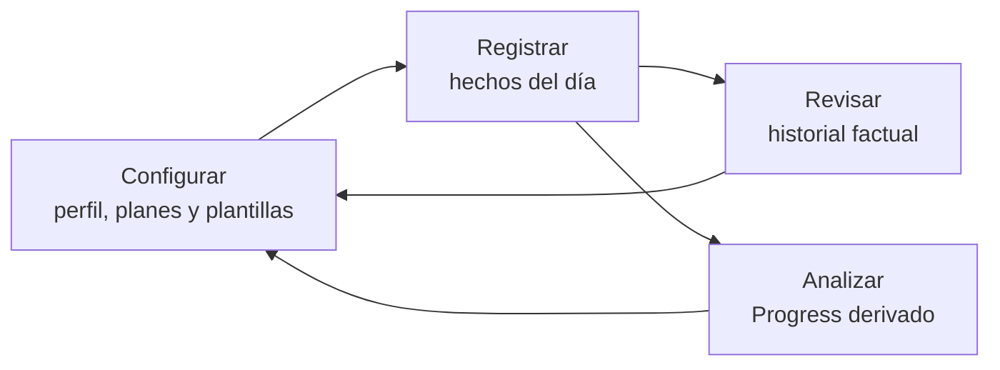
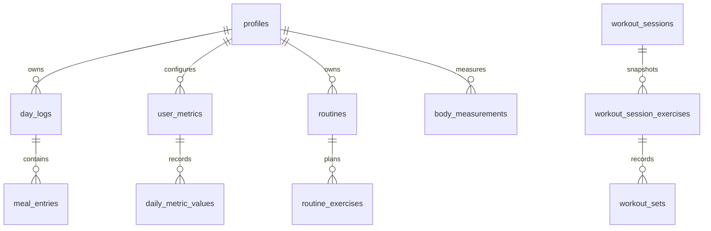
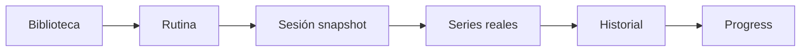

# OWNLEVEL — Arquitectura general

> **Estado:** documento canónico de arquitectura general
>
> **Base verificada:** `origin/main` en `bd4943530c3c0cfedec76c6fcda947da49984f59`
>
> **Última revisión:** 2026-09-13

## Propósito y alcance

Este documento es la puerta de entrada técnica a OWNLEVEL. Explica cómo se organiza el producto, qué módulo es dueño de cada responsabilidad, cuáles son las fuentes canónicas y qué invariantes deben preservarse al extenderlo. Está dirigido a desarrolladores y agentes que necesiten continuar el sistema sin depender del historial de conversaciones o pull requests.

No sustituye la documentación especializada. En particular, los contratos de Analytics Foundation, períodos, coverage, Comparisons, Relationships y los reportes de Progress viven en [`progress-v2.md`](./progress-v2.md). Los principios y patrones visuales viven en [`design/principles.md`](./design/principles.md) y [`design/patterns.md`](./design/patterns.md).

Orden de autoridad ante contradicciones:

1. código y tests actuales;
2. migraciones y schema de Supabase presentes en el repositorio;
3. este documento y la documentación especializada vigente;
4. documentación de producto e historial de decisiones;
5. documentos archivados o planes de implementación.

Las etiquetas usadas en este documento significan:

- **Implementado:** comportamiento comprobable en el código actual.
- **Contrato vigente:** regla que los cambios deben preservar.
- **Limitación conocida:** restricción o deuda real del estado actual.
- **Futuro:** dirección documentada, todavía no implementada.

## Contenido

1. [Modelo del producto](#modelo-del-producto)
2. [Stack y estructura del repositorio](#stack-y-estructura-del-repositorio)
3. [App shell, navegación y rutas](#app-shell-navegación-y-rutas)
4. [Autenticación, autorización y seguridad](#autenticación-autorización-y-seguridad)
5. [Modelo de datos y fuentes canónicas](#modelo-de-datos-y-fuentes-canónicas)
6. [Dominios del producto](#dominios-del-producto)
7. [Configuración nutricional y gasto](#configuración-nutricional-y-gasto)
8. [Integraciones](#integraciones)
9. [Data access y límites serverclient](#data-access-y-límites-serverclient)
10. [Navegación y preservación de contexto](#navegación-y-preservación-de-contexto)
11. [Performance, PWA y mobile](#performance-pwa-y-mobile)
12. [Diseño, estados y errores](#diseño-estados-y-errores)
13. [Testing](#testing)
14. [Extensibilidad](#extensibilidad)
15. [Antipatrones](#antipatrones)
16. [Code map](#code-map)
17. [Documentation map](#documentation-map)
18. [Decisiones arquitectónicas clave](#decisiones-arquitectónicas-clave)
19. [Limitaciones y futuro](#limitaciones-y-futuro)

# Modelo del producto

OWNLEVEL es una aplicación personal, mobile-first, que reúne entrenamiento, nutrición, evolución corporal y métricas diarias. Su arquitectura distingue cuatro actividades:



- **Configurar:** perfil, plan nutricional, gasto, biblioteca, rutinas, comidas guardadas y métricas personales.
- **Registrar:** comidas, métricas diarias, peso, medidas y sesiones con sus series reales.
- **Revisar:** reconstruir una fecha o una sesión sin añadir interpretación analítica.
- **Analizar:** derivar comparaciones, tendencias y asociaciones desde los hechos canónicos.

La separación no es sólo visual. Una plantilla describe el futuro; un snapshot o registro realizado describe el pasado; un read model organiza datos para una pantalla; un resultado analítico se calcula desde datos canónicos. Cambiar configuración actual no debe reescribir silenciosamente hechos históricos.

## Dominios y responsabilidades

| Dominio | Responsabilidad operativa | Salida histórica o analítica |
| --- | --- | --- |
| Home general | Resumen operativo del presente y próximos accesos | Delega los cálculos a cada dominio |
| Entrenamiento | Biblioteca, rutinas, sesión activa, series y finalización | Sesiones completadas e inputs de Progress |
| Nutrición | Plan, gasto, alimentos, comidas guardadas y registro diario | Día nutricional, historial e inputs de Progress |
| Cuerpo | Peso y medidas corporales por fecha | Historial corporal e inputs de Progress |
| Métricas diarias | Definiciones personales y valores por día | Historial factual e inputs dinámicos de Progress |
| Historial y calendario | Reconstrucción y navegación por hechos | No calcula tendencias ni asociaciones |
| Progress | Comparaciones, evolución y relaciones | Analytics derivado; no es fuente persistida |
| Ajustes | Configuración actual o efectiva desde una fecha | Preserva el histórico existente |

# Stack y estructura del repositorio

## Stack real

| Tecnología | Responsabilidad en OWNLEVEL |
| --- | --- |
| Next.js 16 App Router | Rutas, layouts, Server Components, Server Actions y Route Handlers |
| React 19 + TypeScript estricto | UI, estado interactivo y contratos de dominio |
| Tailwind CSS 4 | Estilos, responsive y tokens utilitarios |
| Base UI, shadcn tooling, Lucide | Primitivas accesibles, composición de controles e iconografía |
| Supabase Auth + Postgres | Identidad, persistencia, RLS, funciones y operaciones transaccionales |
| `@supabase/ssr` / `supabase-js` | Clientes server, browser, proxy y administración restringida |
| `next-pwa` | Manifest/service worker y experiencia instalable |
| Vercel Analytics y Speed Insights | Telemetría de frontend desplegado |
| Vitest + ESLint + TypeScript | Tests contractuales, calidad estática y validación |

`package.json`, `next.config.ts`, `tsconfig.json`, `postcss.config.mjs` y `eslint.config.mjs` son la autoridad sobre versiones y configuración. No debe deducirse comportamiento del framework desde documentación de otra versión.

## Estructura del repositorio

| Carpeta | Responsabilidad |
| --- | --- |
| `src/app` | Rutas App Router, layouts, páginas, Route Handlers y Server Actions cercanas al flujo |
| `src/components` | Componentes reutilizables y workspaces de presentación |
| `src/lib` | Lógica de dominio, loaders, adapters, analytics, contratos y helpers puros |
| `supabase/migrations` | Evolución aditiva del schema, RLS, triggers, índices y RPCs |
| `supabase/tests` | Contratos SQL de schema, seguridad y operaciones transaccionales |
| `docs` | Documentación canónica, especializada, histórica y de diseño |
| `public` | Assets públicos y artefactos PWA |

Convención vigente: las páginas resuelven autenticación y coordinan datos; `src/lib` concentra semántica reusable; los componentes cliente manejan interacción local. No existe una capa universal de repositorios: se reutilizan loaders y funciones de dominio ya establecidos.

# App shell, navegación y rutas

## Shell autenticado

`src/app/(app)/layout.tsx` verifica el request una sola vez y monta `AppShell`. El shell ofrece:

- superficie mobile centrada con ancho de referencia de hasta 430 px;
- sidebar en desktop;
- safe areas superior e inferior;
- bottom navigation mobile con **Inicio**, **Entrenar**, **Nutrición** y **Progreso**;
- acceso a Ajustes desde identidad/perfil, no como tab mobile principal.

El layout raíz (`src/app/layout.tsx`) define fuentes Geist, tema, viewport con `viewport-fit=cover`, metadata PWA y telemetría. Las rutas del grupo `(app)` son dinámicas y privadas.

## Mapa de rutas actual

| Área | Entry point y rutas principales | Ownership |
| --- | --- | --- |
| Público/auth | `/`, `/login`, `/auth/callback` | Entrada, OAuth y redirección segura |
| Home | `/home` | Resumen operativo general |
| Nutrición diaria | `/today`, `/today/reports`, `/today/steps` | Registro y reporte nutricional; compatibilidad de actividad |
| Entrenamiento | `/train`, `/train/routines`, `/train/routines/[id]`, `/train/exercises` | Planificación y biblioteca |
| Sesión | `/train/session/new`, `/train/session/[id]`, `/train/session/[id]/correct` | Ejecución, detalle y corrección histórica |
| Historial de training | `/train/history`, `/train/history/[exerciseId]`, `/train/calendar`, `/train/day` | Sesiones y drill-downs del dominio |
| Progress de training | `/train/progress`, `/train/body` | Reportes profundos y Cuerpo |
| Progress global | `/progress`, `/progress/metrics`, `/progress/relationships` | Síntesis, actividad/hábitos y relaciones |
| Auditoría factual | `/calendar`, `/history` | Calendario global e historial diario |
| Ajustes | `/settings`, `/settings/profile`, `/settings/application`, `/settings/account`, `/settings/library`, `/settings/metrics` | Configuración general |
| Nutrición en Ajustes | `/settings/nutrition`, `/energy`, `/foods`, `/meals`, `/integrations` | Plan, gasto y catálogos |
| Configuración compatible | `/settings/nutrition/goals`, `/expenditure`, `/schedule` | Rutas legacy todavía existentes; no son el acceso principal actual |
| API ChatGPT | `/api/integrations/chatgpt/meals`, `/status`, `/openapi` | Integración privada write-only |

Las rutas con `[id]` o `[exerciseId]` son drill-downs y deben funcionar también como deep links. Las rutas legacy no se eliminan sólo por limpieza mientras sigan ofreciendo compatibilidad.

# Autenticación, autorización y seguridad

## Flujo de sesión

OWNLEVEL usa Supabase Auth con OAuth de Google. No implementa actualmente signup, reset ni cambio de contraseña propios.

1. `src/proxy.ts` intercepta las rutas privadas y delega en `src/lib/supabase/middleware.ts`.
2. El proxy crea un cliente SSR, valida claims y sincroniza cookies de sesión.
3. Una sesión ausente redirige a `/login`; una sesión válida que entra en `/login` redirige a `/home`.
4. `/auth/callback` intercambia el código PKCE y sólo acepta un destino local saneado.
5. En Server Components, `getVerifiedRequestContext()` comparte mediante `cache()` el cliente y `userId` verificados dentro del mismo render de request.

El cache es request-scoped: no se cachean respuestas privadas entre usuarios.

## Clientes Supabase

- `src/lib/supabase/server.ts`: cliente server con cookies, public/anon key y fetch resiliente.
- `src/lib/supabase/client.ts`: cliente browser con valores públicos únicamente.
- `src/lib/supabase/admin.ts`: cliente `server-only` con secret/service role, limitado a autenticación y persistencia controlada de la integración ChatGPT.
- `src/lib/supabase/middleware.ts`: sesión y cookies en el proxy.

## Ownership y RLS

**Contrato vigente:** los datos de producto pertenecen al usuario autenticado.

- Las tablas públicas de usuario tienen RLS y policies de ownership definidas en migraciones.
- Las queries de dominio agregan explícitamente `.eq("user_id", userId)` como defensa y claridad.
- El navegador no elige el propietario mediante un `user_id` arbitrario.
- Las relaciones hijas usan foreign keys, checks o triggers para verificar ownership del padre.
- Las funciones sensibles derivan `auth.uid()` o validan el usuario autenticado.
- Las funciones `SECURITY DEFINER` endurecidas usan schema explícito, `search_path` restringido y grants acotados.
- El service role nunca se expone al cliente ni se usa como atajo para las pantallas autenticadas.

`next.config.ts` impide un deploy Vercel sin credencial server necesaria y añade headers de seguridad. Nunca deben documentarse ni registrarse tokens, hashes o secrets.

## Resiliencia del Data API

`src/lib/supabase/resilient-fetch.ts` aplica timeouts y retries acotados:

- reintenta el rechazo transitorio específico de JWT emitido en el futuro;
- permite un único retry de transporte/HTTP transitorio sólo para lecturas seguras `GET`/`HEAD` de `/rest/v1/`;
- no reintenta mutaciones por fallos genéricos de transporte, evitando duplicar escrituras.

# Modelo de datos y fuentes canónicas

## Capas de datos

| Capa | Qué es | Ejemplo |
| --- | --- | --- |
| Source of truth | Hecho o configuración persistida con identidad estable | `meal_entries`, `workout_sets`, `user_metrics` |
| Snapshot histórico | Valor copiado al ocurrir un hecho para conservar contexto | nombre/objetivos en una sesión; targets en `day_logs` |
| Derived read model | Composición temporal para una pantalla o acción | `NutritionDay`, resumen de Home, historial diario |
| UI state | Estado efímero del navegador | sheet abierto, filtros, draft de sesión |
| Analytics derivado | Métricas calculadas desde fuentes canónicas | comparación, tendencia, relación |

**Contrato vigente:** no se persiste una copia paralela sólo para simplificar una pantalla. Un read model o analytics se recalcula desde fuentes canónicas, salvo que una decisión futura explícita introduzca materialización.

## Mapa conceptual



El diagrama omite relaciones de ownership repetidas, catálogos y períodos de configuración para mantener legibilidad.

## Fuentes canónicas por área

### Identidad y perfil

- `profiles`: configuración antropométrica actual, datos personales, peso actual proyectado y BMR actual.
- El perfil describe el estado actual; no reemplaza registros históricos por fecha.

### Entrenamiento

- `exercises`: biblioteca personal actual.
- `routines`, `routine_exercises`, `routine_exercise_sets`: plantilla, orden y objetivos por serie.
- `workout_sessions`: instancia y lifecycle de una sesión.
- `workout_session_exercises`: snapshot del ejercicio/contexto dentro de esa sesión.
- `workout_sets`: objetivos copiados y valores realmente ejecutados por serie.

### Nutrición

- `day_logs`: ancla única por usuario y fecha local; guarda agregados diarios, snapshots y overrides.
- `meal_entries`: cada consumo real activo; su lifecycle incluye soft delete.
- `foods`: catálogo personal actual para registrar por cantidad.
- `saved_meals`, `saved_meal_items`: plantillas reutilizables; sus componentes son snapshots.
- `nutrition_plan_periods`, `nutrition_plan_weekdays`: plan efectivo por fecha y objetivos de cada día de semana.
- `energy_config_periods`: configuración versionada de gasto.
- `nutrition_import_runs`, `nutrition_events`: procedencia de importación y hechos contextuales que no suman consumo.

`day_logs` es ancla, no dueño de todos los detalles. Las comidas permanecen en `meal_entries`; un trigger recalcula los agregados nutricionales del día.

### Cuerpo

- `day_logs.weight_kg`: punto histórico de peso por fecha.
- `profiles.current_weight_kg`: proyección del último peso cronológico, no una medición separada.
- `body_measurements`: mediciones corporales por fecha, laterales y metadata de calidad/provenance.

### Métricas diarias

- `user_metrics`: definición canónica de cada métrica personal.
- `daily_metric_values`: valor explícito de una métrica en una fecha.

Las columnas legacy de pasos/agua/mate en `day_logs` se mantienen como proyección de compatibilidad para métricas del sistema; la escritura canónica es `daily_metric_values`.

### Configuración legacy compatible

`nutrition_goal_periods`, `expenditure_rule_periods` y `work_schedule_periods` siguen disponibles como fallback/compatibilidad. Los flujos vigentes prefieren el plan y configuración energética V2 cuando existen. No deben confundirse las fuentes legacy con el contrato actual.

### Integraciones

- `integration_api_tokens`: hash, prefijo, scope y lifecycle del token privado.
- No existe una tabla paralela de comidas importadas por ChatGPT: la integración escribe en `day_logs` y `meal_entries` mediante el contrato canónico.

### Analytics

No existen tablas genéricas de resultados de Progress, comparaciones o relaciones. Esos resultados son derivados y tipados en `src/lib/progress` y librerías de dominio.

# Dominios del producto

## Home general

`/home` responde “¿qué hago o reviso ahora?”. Es distinto del Home de Progress, que responde “¿cómo estoy cambiando?”.

La página autentica una vez y carga en paralelo:

- perfil;
- resumen nutricional de hoy;
- sesión activa;
- snapshot semanal/actual de entrenamiento;
- rutinas disponibles para iniciar.

`HomeDashboard` combina sesión activa o siguiente entrenamiento, nutrición del día, entrenamiento semanal, sesiones de hoy y accesos. Delega cálculos a loaders de dominio y no es una fuente de verdad ni un motor analítico.

**Limitación conocida:** la carga actual usa `Promise.all`; no todos los fallos de dominio están aislados individualmente en el Home general.

## Entrenamiento — overview

El sistema separa planificación de ejecución:



### Biblioteca y rutinas

`exercises` conserva identidad, nombre, grupo/subzona, implemento, `weight_mode` y defaults. `routines` organiza plantillas; las relaciones y filas de sets describen orden, descanso y objetivos de la próxima sesión.

Archivar un ejercicio o rutina lo quita de los flujos activos sin invalidar sesiones pasadas. Las referencias históricas se sostienen además con snapshots de sesión.

### Sesión activa

`workout_sessions` admite `in_progress`, `completed` y `discarded`; el backend garantiza como máximo una sesión activa por usuario. Puede partir de una rutina o ser libre.

Al iniciar, RPCs transaccionales copian ejercicios, metadata, targets y series a `workout_session_exercises` y `workout_sets`. Editar la biblioteca o la rutina después no cambia esa sesión.

El cliente conserva un draft versionado en `localStorage`. El autosave se serializa por ejercicio, usa concurrencia optimista con `updated_at` y conserva el draft cuando falla. Finalizar actúa como barrera estricta: primero deben persistirse cambios pendientes; un fallo mantiene la sesión activa. La decisión para la próxima vez y la aplicación de objetivos a la rutina son acciones separadas.

### Finalización e historia

Una sesión completada es histórica. La corrección modifica únicamente datos realizados permitidos; no reabre la sesión, no recrea snapshots ni vuelve a ejecutar progresión. `discarded` retira una sesión completada de los reportes visibles sin convertirla en activa.

Los reportes analíticos de rendimiento, carga y comparación no se detallan aquí. Consultar [`progress-v2.md`](./progress-v2.md). La arquitectura operativa existente se amplía en [`architecture/training-system.md`](./architecture/training-system.md); `docs/training.md` es un documento canónico futuro, todavía no creado.

## Nutrición — overview

La nutrición separa cuatro capas:

- **Registro:** consumos reales en `meal_entries` asociados al `day_logs` de la fecha.
- **Configuración:** plan nutricional, targets por weekday y gasto efectivo por período.
- **Historial:** día reconstruido, comidas y snapshots vigentes en ese momento.
- **Analytics:** reportes derivados documentados en Progress V2.

### Día nutricional

`/today` carga en paralelo el read model del día, métricas activas, sugerencias rápidas, alimentos y comidas guardadas. Permite crear, editar y eliminar lógicamente comidas. Una entrada puede representar una comida o agregado real; el sistema no obliga a categorías fijas de desayuno/almuerzo/cena.

Calorías y macros consumidos se agregan desde `meal_entries` activas mediante lógica de base de datos. En macros opcionales, `null` significa desconocido y `0` significa valor conocido cero.

### Alimentos y comidas guardadas

Un alimento es una definición actual. Al registrar una cantidad, el servidor lee el alimento activo, escala sus nutrientes y crea un snapshot en `meal_entries`; cambios posteriores del catálogo no recalculan historia.

Una comida guardada es una plantilla manual o compuesta. Sus items conservan snapshots y `source_food_id` como provenance, no una dependencia nutricional viva. Al usarla se crea otra entrada canónica independiente. Las sugerencias rápidas son un read model derivado de entradas históricas, no favoritos persistidos implícitos.

### Ingesta externa e importación

Los eventos de nutrición importados aportan contexto pero no suman consumo. Los `nutrition_import_runs` registran procedencia y resultado de importaciones. ChatGPT escribe comidas canónicas; no crea un almacén alternativo.

Los contratos analíticos —promedios, coverage, objetivos históricos, día en curso y comparaciones— están en [`progress-v2.md`](./progress-v2.md). `docs/nutrition.md` será el documento canónico operativo futuro y no existe todavía.

## Métricas diarias

`user_metrics` define métricas por ID estable con `system_key` opcional, nombre, unidad, tipo de valor, objetivo, orden, estado y lifecycle. `daily_metric_values` guarda como máximo un valor explícito por métrica, usuario y fecha.

El sistema instala métricas iniciales del producto, pero la arquitectura es dinámica. Una métrica custom como “Concentración” debe fluir sin lógica por label:

```text
user_metrics.id
→ editor/registro diario
→ daily_metric_values
→ Historial
→ catálogo dinámico de Progress
```

**Contrato vigente:** identidad de métrica ≠ nombre visible. Renombrar no cambia identidad. No se infiere semántica por palabras como “Agua”, “Pasos” o “Sueño”.

Un cero registrado es dato; ausencia de fila es missing. Las métricas del sistema no se eliminan. Una custom sin historia puede eliminarse; con historia se archiva. Una definición archivada conserva sus valores y puede aparecer en reconstrucciones históricas. Para una fecha histórica sólo se permite corregir una métrica archivada si ya existía un valor ese día.

Coverage, días elegibles, agregación y participación en analytics se documentan en [`progress-v2.md`](./progress-v2.md).

## Cuerpo

El peso y las medidas son hechos por fecha, no valores diarios inferidos.

- El peso histórico vive en `day_logs.weight_kg`.
- Un trigger sincroniza `profiles.current_weight_kg` con el último punto cronológico válido; editar un punto más antiguo no reemplaza el actual.
- Si se elimina el último peso, la proyección cae al punto anterior; sin puntos queda `null`.
- Editar otros campos de perfil no crea una medición de peso ficticia.
- `body_measurements` admite múltiples campos opcionales, lados izquierdo/derecho separados, notas, condiciones, provenance y calidad `verified`/`suspect`.

Si no existe ningún punto histórico pero el perfil conserva `current_weight_kg`, Body puede usarlo sólo como fallback sintético de estado actual. Ese valor no adquiere fecha, no entra en la serie y no habilita cambio, tendencia ni baseline histórico.

La UI de Cuerpo permite registro, edición e historia. Los datos sospechosos siguen visibles para auditoría, pero Progress los excluye de analytics. El perfil actual no debe confundirse con un punto histórico independiente. Las tendencias, sparse samples y reglas de comparabilidad están en [`progress-v2.md`](./progress-v2.md).

## Historial y calendario

El calendario global (`/calendar`) consulta por mes y agrupa lecturas de nutrición, métricas, entrenamiento y cuerpo. Muestra indicadores factuales y enlaza a `/history` con la fecha y el origen. Los días futuros no se presentan como historia vacía.

Historial diario (`/history`) reconstruye una fecha desde fuentes canónicas: resumen, métricas registradas, sesiones completadas, nutrición, comidas y cuerpo cuando existe. Sin fecha seleccionada ofrece historia reciente. No hay una tabla `daily_history` ni un snapshot global del día.

Historial puede:

- editar valores diarios bajo las reglas de lifecycle;
- editar comidas no legacy mediante el flujo existente;
- abrir el detalle real de una sesión;
- navegar al día anterior/siguiente sin permitir fechas futuras.

Su contrato es factual: responde “¿qué ocurrió y qué registré?”. No calcula tendencias, comparaciones ni relaciones. El calendario específico de entrenamiento (`/train/calendar`) permanece como vista filtrable del dominio y navega a `/train/day`.

## Progress

Progress consume sesiones completadas, nutrición diaria, observaciones corporales y métricas dinámicas; normaliza esos datos y produce análisis, comparaciones, relaciones y drill-downs. `/progress` es su Home de diagnóstico, separado del Home operativo `/home`.

Foundation comparte catálogo, períodos y semánticas transversales, mientras cada dominio conserva su grain y reglas de comparabilidad. Los resultados no se persisten en tablas paralelas.

Para contratos analíticos, semántica temporal, coverage, missing versus zero, Comparisons, Relationships, rendimiento de training y extensibilidad, consultar **[`docs/progress-v2.md`](./progress-v2.md)**.

## Ajustes

`/settings` agrupa:

- perfil y datos físicos actuales;
- plan nutricional y configuración energética;
- biblioteca de alimentos y comidas guardadas;
- métricas diarias;
- aplicación, tema e integración ChatGPT;
- cuenta y cierre de sesión.

Una configuración puede ser:

- **actual:** perfil, tema o definición activa;
- **efectiva desde una fecha:** plan nutricional y gasto;
- **plantilla futura:** rutina, alimento o comida guardada;
- **archivable:** rutinas, ejercicios, alimentos, comidas y métricas con historia.

**Contrato vigente:** editar configuración actual no reescribe hechos históricos. Los snapshots y las entidades realizadas conservan el contexto existente. Idioma distinto de español y notificaciones configurables aparecen como capacidades futuras/no activas, no como funcionalidades completas.

# Configuración nutricional y gasto

Estos conceptos cruzan Ajustes, Today, Home, Historial y Progress, por lo que deben permanecer separados.

## Plan de consumo

`nutrition_plan_periods` define una versión efectiva del plan y sus deltas de agua/calorías asociados a entrenamiento. `nutrition_plan_weekdays` contiene exactamente siete objetivos diarios de calorías y proteína. El plan vigente para una fecha se resuelve por `effective_from`.

## Gasto estimado

`energy_config_periods` define:

- nivel/factor de actividad;
- base automática derivada de BMR o base custom;
- extra de gasto por entrenamiento;
- versión de fórmula.

El gasto de un día usa la base resuelta y añade el extra sólo cuando existe entrenamiento completado. Un override del día puede reemplazar el valor resuelto sin modificar el plan global.

## Targets y snapshots del día

El target de consumo se obtiene del weekday del plan y puede sumar el extra nutricional por entrenamiento. El agua usa base y delta de entrenamiento. `day_logs` conserva IDs/snapshots y overrides para que la historia no dependa de configuración futura.

La regla semántica obligatoria es:

```text
objetivo de consumo ≠ gasto estimado ≠ balance energético
balance energético = consumo − gasto
```

Nunca se calcula balance como consumo menos target. Cuando no existe configuración V2, loaders/editor pueden leer períodos legacy como fallback; no debe inventarse un target histórico a partir del valor actual.

# Integraciones

## ChatGPT Nutrition

La integración implementada es una API privada **write-only** para registrar comidas interpretadas por un GPT Action. OWNLEVEL no llama a un modelo ni delega cálculos canónicos a ChatGPT.

### Superficie

- `GET /api/integrations/chatgpt/status`: verifica conexión sin exponer datos personales.
- `POST /api/integrations/chatgpt/meals`: valida y crea una comida canónica.
- `GET /api/integrations/chatgpt/openapi`: sirve el contrato OpenAPI versionado.

### Seguridad y lifecycle

- El usuario genera un token con scope `meals:write`.
- El token raw se muestra una sola vez; sólo se persiste SHA-256, prefijo y metadata.
- La revocación es inmediata y existe una sola credencial activa por scope.
- El endpoint limita tamaño, valida un schema estricto, usa fecha local de Córdoba, distingue `null` de cero y aplica idempotencia/prevención de duplicados.
- El cliente admin sólo autentica la credencial y llama a una RPC endurecida que valida scope/ownership y escribe `day_logs` + `meal_entries`.

La documentación operativa y el OpenAPI están en [`integrations/chatgpt-nutrition.md`](./integrations/chatgpt-nutrition.md) y `integrations/ownlevel-chatgpt-action.openapi.yaml`.

No hay otras integraciones externas de escritura equivalentes implementadas. Cualquier integración nueva debe tener scope mínimo, validación server-side, revoke, idempotencia cuando corresponda y persistencia en fuentes canónicas.

# Data access y límites server/client

## Patrón vigente

1. Una página Server Component obtiene `getVerifiedRequestContext()`.
2. Los loaders de dominio consultan Supabase directamente; no llaman por HTTP a APIs internas.
3. Las lecturas independientes usan `Promise.all` y las colecciones relacionadas se obtienen con queries agrupadas o nested selects.
4. `src/lib` normaliza el resultado en contratos/read models.
5. Componentes cliente reciben datos serializables y manejan interacción.
6. Server Actions ejecutan mutaciones de la UI, validan ownership y revalidan destinos afectados.
7. Route Handlers quedan para OAuth, OpenAPI e integración externa.

Las mutaciones transaccionales complejas —inicio, guardado y finalización de entrenamiento; plan nutricional; ingestión externa— usan RPCs o funciones de dominio con límites explícitos.

## Cuándo vive estado en el cliente

El estado cliente cubre sheets, dialogs, filtros interactivos, formularios y drafts de entrenamiento. La URL conserva contexto reproducible o navegable. Los datos privados no se mantienen en caches offline del service worker.

El draft local de una sesión activa es la excepción deliberada: permite resiliencia móvil, está versionado y se elimina al cerrar correctamente el flujo.

## Acceso agrupado

Today carga definitions/values y catálogos en grupos; Historial carga dominios de una fecha en paralelo; Calendario consulta rangos por dominio; Progress reutiliza datasets para selección y visualización local. No debe introducirse una query por métrica, día, comida, ejercicio o set cuando el rango puede cargarse en bloque.

**Limitación conocida:** el listado de Settings de métricas calcula actualmente `has_history` con una consulta count por definición. Es un detalle acotado del editor, no el patrón a replicar en nuevos reportes.

# Navegación y preservación de contexto

OWNLEVEL usa parámetros de URL tipados por cada flujo, no un objeto global universal.

- Progress conserva `period`, `from`, `to` y contratos de comparación/relación; sus destinos compatibles heredan el período.
- `/calendar` conserva `month` y abre `/history?date=…&from=calendar&month=…`.
- `/history` acepta un origen cerrado (`history` o `calendar` con mes válido), no redirects arbitrarios.
- El drill-down de sesión puede recibir un `return` codificado, pero sólo acepta rutas que comienzan con `/history?`.
- El calendario y día de training conservan `month`, `date`, `routine_id` y origen cuando corresponden.
- Las vistas de Progress dentro de Training usan `from=progress` para mantener contexto de navegación.
- Login/callback sanea el destino local antes de redirigir.

**Contrato vigente:** back/forward y una recarga directa deben reconstruir el estado importante desde la URL. Los resultados derivados no se serializan en la URL; se serializan selección y período.

## Fechas lógicas

El día de producto se expresa como fecha local `YYYY-MM-DD` en `America/Argentina/Cordoba`. `src/lib/phase2/cordoba-date.ts` contiene el helper compartido `todayInCordoba()` usado por Home, Today, Training, Historial, Calendario, Ajustes y Progress. No debe derivarse el día mediante un corte UTC: cerca de medianoche puede corresponder a otra fecha local. Los timestamps conservan instante; `log_date`, `metric_date` y `measured_on` conservan día lógico.

# Performance, PWA y mobile

## Critical paths

- Auth se verifica una vez por request de render y se comparte en el árbol RSC.
- Home y Today paralelizan loaders independientes.
- Historial paraleliza dominios; Calendario y reportes agrupan rangos.
- Las páginas privadas se renderizan dinámicamente y no comparten cache entre usuarios.
- `measurePerformance` emite logs estructurados de operación, duración, región, estado y tipo; no constituye una base persistida de analytics.
- El fetch Supabase tiene timeout y retry sólo bajo condiciones seguras y acotadas.

No deben agregarse waterfalls o refetch por selección local cuando los datos ya están disponibles. Tampoco debe implementarse cache persistente de analytics sin una necesidad y contrato nuevos.

## PWA

La app tiene manifest generado, `start_url=/home`, modo `standalone`, orientación portrait e iconos instalables. El service worker se habilita en producción y trata como `NetworkOnly` las navegaciones privadas, respuestas RSC y APIs autenticadas; no expone datos de usuario desde cache offline.

La UI usa `viewport-fit=cover`, safe areas y layout mobile-first. El bottom nav y las superficies fijas deben dejar espacio al home indicator. Los inputs usan tamaño que evita zoom involuntario en iPhone y los flujos frecuentes consideran teclado y scroll interno.

**Futuro:** no existe wrapper Capacitor ni aplicación nativa; cualquier evaluación de empaquetado nativo no forma parte de la arquitectura implementada.

# Diseño, estados y errores

## Contratos de UX

La referencia profunda es:

- [`design/principles.md`](./design/principles.md): jerarquía antes que decoración, mobile-first, densidad y movimiento.
- [`design/patterns.md`](./design/patterns.md): superficies, controles, sheets, formularios y estados.

Resumen de invariantes relevantes para arquitectura:

- diseñar primero para 375–430 px y conservar una experiencia desktop útil;
- touch targets de al menos 44×44 px;
- cards no son el layout por defecto y no deben anidarse sin necesidad;
- violeta comunica identidad, foco, selección o acción, no juicio bueno/malo;
- progressive disclosure para complejidad secundaria;
- estabilidad espacial durante loading, guardado y errores;
- safe areas y teclado son parte del layout;
- sheets en mobile y dialogs/paneles en desktop reutilizan patrones compartidos;
- floating labels se aplican donde el contrato del formulario ya las adoptó, no indiscriminadamente.

## Estados

La UI distingue:

| Estado | Significado | Comportamiento |
| --- | --- | --- |
| Loading | La lectura sigue pendiente | Mantener estructura estable; no mostrar vacío prematuro |
| Empty | La fuente no contiene hechos aplicables | Explicación factual y acción útil si existe |
| Insufficient data | Existen datos, pero no sostienen una conclusión | No fabricar analytics ni usar cero ficticio |
| Technical error | Falló una operación o lectura | Mensaje accionable, retry o preservación del draft |
| Partial data | Un dominio está ausente, otros siguen válidos | Mostrar lo disponible sin inventar placeholders |

En formularios, los Server Actions devuelven errores de validación/operación y los componentes conservan contexto. El entrenamiento mantiene drafts ante fallos de autosave. Ausencia de dato nunca debe representarse como cero sólo para llenar una superficie.

# Testing

La suite usa Vitest y tests SQL, con archivos co-localizados `*.test.ts`/`*.test.tsx` en `src` y contratos en `supabase/tests`.

| Tipo | Qué protege |
| --- | --- |
| Helpers/unit | Fechas, formateo, agregación, validación y transformaciones puras |
| Domain/contract | Lifecycle, snapshots, autosave, nutrición, cuerpo y métricas |
| Component/structural | Jerarquía, navegación, estados, labels y comportamiento útil sin snapshots masivos |
| Analytics | Períodos, coverage, comparisons, relationships y semántica de dominios |
| Navigation | Query params, back/return, deep links y herencia de período |
| Schema/SQL | Constraints, triggers, RLS, funciones, importación e integración |
| Security/auth | Redirects seguros, tokens, headers, cliente admin y sesión |

No hay una suite E2E general Playwright/Cypress en el estado actual. La validación habitual combina tests dirigidos, `tsc`, lint, suite completa y build según el alcance; los cambios puramente documentales requieren sólo validación ligera de rutas y enlaces.

Al tocar un dominio:

- **Training:** tests del flujo o librería afectada, autosave/RPC si aplica, snapshots e historial.
- **Nutrition:** día, agregados, plan/gasto y schema si cambia persistencia.
- **Progress:** tests del motor/adapters y UI/navegación del reporte; consultar su documento canónico.
- **Auth/security:** proxy, server client, redirects, RLS o integración según la frontera tocada.
- **Navigation:** helper de URL y rutas origen/destino, incluidos preset y custom range.

# Extensibilidad

## Cómo agregar una nueva ruta

1. Ubicarla bajo el route group correcto en `src/app`; las rutas privadas pertenecen a `(app)`.
2. Añadir el prefijo al matcher de `src/proxy.ts` si abre una nueva raíz privada.
3. Resolver auth con `getVerifiedRequestContext()` y reutilizar el loader de dominio.
4. Agregar navegación sólo en `bottom-nav-config.ts`, `desktop-sidebar.tsx` o el componente dueño del drill-down.
5. Modelar el contexto reproducible con query params validados; no aceptar redirects abiertos.
6. Agregar tests dirigidos de destino, params y back cuando el flujo lo necesite.

## Cómo agregar una entidad persistida

1. Confirmar que no duplica una fuente canónica existente.
2. Definir ownership y lifecycle antes del schema.
3. Crear migración aditiva en `supabase/migrations` con FK, constraints e índices.
4. Habilitar RLS, policies owner-scoped y grants mínimos.
5. Endurecer funciones y triggers; derivar usuario desde auth o padre verificado.
6. Agregar tipos y loaders en el dominio correspondiente de `src/lib`.
7. Añadir contratos SQL y tests de aplicación; actualizar este documento si cambia el mapa canónico.

## Cómo agregar configuración de usuario

Decidir primero si el valor es actual, versionado por `effective_from`, snapshot histórico o plantilla. Los cambios con impacto histórico no deben sobrescribir períodos anteriores. Reutilizar Server Actions y patrones de Settings; evitar una tabla “current” y otra “screen-specific” sin contrato.

## Cómo agregar una métrica diaria

Para una métrica personal compatible no se agrega código por nombre: se crea una fila en `user_metrics` y sus valores en `daily_metric_values`. Cualquier semántica especial requiere metadata estructurada y un contrato explícito; nunca se infiere del label o unidad. Para incorporarla a Progress, seguir la guía de [`progress-v2.md`](./progress-v2.md).

## Cómo integrar un dominio nuevo con Progress

1. Mantener una fuente canónica operativa propia.
2. Crear un adapter que exponga grain, unidad, missing behavior y comparabilidad.
3. Extender el catálogo universal y contratos de elegibilidad en `src/lib/progress`.
4. Reutilizar períodos, coverage, Comparisons y Relationships existentes.
5. Proveer resultados tipados a la UI; no crear un motor `home-*` o tabla de snapshots paralela.

## Cómo agregar un flujo de registro

1. Escribir el hecho canónico, no sólo estado visual.
2. Validar ownership y payload en servidor.
3. Usar RPC si varias escrituras deben ser atómicas.
4. Conservar snapshot/provenance cuando una definición futura pueda cambiar.
5. Revalidar únicamente rutas dependientes y ofrecer edición histórica bajo reglas explícitas.

## Cómo agregar una integración externa

1. Definir scopes mínimos y superficie Route Handler versionada.
2. Generar credenciales con entropía criptográfica, almacenar sólo hash y soportar revoke.
3. Validar tamaño, schema, fechas, ownership e idempotencia.
4. Mantener el service role en módulos `server-only` y reducir su uso a una operación controlada.
5. Escribir en fuentes canónicas mediante función/RPC transaccional.
6. Publicar contrato OpenAPI y documentación sin secrets.

# Antipatrones

No hacer:

- crear copias persistidas de datos canónicos para una pantalla;
- crear un segundo motor de períodos, comparisons o relationships;
- hardcodear métricas dinámicas por label;
- convertir missing en cero o descartar ceros explícitos;
- saltarse RLS o confiar en un `user_id` del cliente;
- usar service role desde browser o en loaders normales;
- hacer N+1 por día, métrica, comida, ejercicio o set;
- reintentar automáticamente mutaciones no idempotentes ante errores de transporte;
- editar plantillas actuales para reconstruir sesiones o comidas históricas;
- romper historia al archivar/eliminar una definición actual;
- mezclar registro operativo con analytics derivado;
- duplicar Progress dentro del Home general;
- convertir Historial diario en otro reporte analítico;
- inventar targets históricos a partir de configuración actual;
- confundir target de consumo, gasto estimado y balance energético;
- tratar volumen global como rendimiento o fuerza;
- comparar contextos de ejercicio incompatibles;
- crear un selector/editor paralelo cuando ya existe el flujo canónico;
- usar cards como solución automática o contradecir los docs de diseño sin actualizar el contrato;
- persistir respuestas privadas en el service worker;
- afirmar causalidad desde una asociación observacional.

# Code map

| Responsabilidad | Archivo(s) / carpeta(s) | Qué contiene |
| --- | --- | --- |
| Root y PWA | `src/app/layout.tsx`, `src/app/manifest.ts`, `src/lib/brand-metadata.ts`, `next.config.ts` | Metadata, viewport, providers, manifest, headers y service worker |
| App shell | `src/app/(app)/layout.tsx`, `src/components/layout` | Auth del layout, bottom nav, sidebar, safe areas |
| Auth | `src/proxy.ts`, `src/lib/supabase/{middleware,server,client}.ts`, `src/app/auth/callback` | Sesión SSR/browser, refresh, protección y OAuth |
| Seguridad admin | `src/lib/supabase/admin.ts`, `src/lib/security` | Frontera service role y headers |
| Home general | `src/app/(app)/home/page.tsx`, `src/lib/home-dashboard.ts`, `src/components/home/home-dashboard.tsx` | Loader paralelo y resumen operativo |
| Training core | `src/lib/phase2`, `src/lib/phase2/training-robust.ts` | Tipos, biblioteca, rutinas, sesiones, RPCs y read models |
| Sesión activa | `src/app/(app)/train/session`, `src/lib/phase2/{training-drafts,exercise-autosave}.ts` | Ejecución, draft, autosave, finalización y corrección |
| Rutinas | `src/app/(app)/train/routines`, `src/components/training` | Listado, editor, targets y navegación |
| Exercise library | `src/app/(app)/train/exercises`, `src/lib/phase2/exercise-*` | Catálogo y formularios de ejercicios |
| Training history | `src/app/(app)/train/history`, `src/app/(app)/train/calendar`, `src/app/(app)/train/day` | Sesiones, ejercicio individual y calendario del dominio |
| Nutrition day | `src/app/(app)/today`, `src/lib/nutrition/{day,product}.ts` | Registro diario, composición y mutaciones |
| Foods | `src/app/(app)/settings/nutrition/foods`, `src/lib/nutrition/food-*` | Catálogo, cantidad y snapshots |
| Saved meals | `src/app/(app)/settings/nutrition/meals`, `src/lib/nutrition/saved-*`, `quick-*` | Plantillas, items y sugerencias derivadas |
| Nutrition plan/energy | `src/app/(app)/settings/nutrition`, `src/lib/nutrition/plan-v2*` | Plan efectivo, weekdays, gasto, targets y overrides |
| Daily metrics | `src/lib/daily-metrics`, `src/app/(app)/settings/metrics` | Definiciones, valores, lifecycle, server API y editor |
| Body | `src/lib/body-measurements.ts`, `src/app/(app)/train/body`, `src/components/body` | Peso, medidas, calidad, CRUD e historia |
| Global calendar | `src/app/(app)/calendar`, `src/lib/calendar` | Rango mensual, agrupación e indicadores |
| Daily history | `src/app/(app)/history`, `src/lib/history`, `src/components/history` | Reconstrucción factual, edición y navegación |
| Progress | `src/app/(app)/progress`, `src/components/progress`, `src/lib/progress` | Home, Foundation, períodos, Comparisons y Relationships |
| Nutrition analytics | `src/lib/nutrition/report-*`, `src/components/nutrition` | Adapters/read models y reportes de Progress |
| Training analytics | `src/lib/progress/analytics/adapters.ts`, `src/lib/progress/training-*.ts`, `src/components/training/*-v2.tsx` | Adaptación y vistas analíticas por nivel |
| Settings | `src/app/(app)/settings` | Perfil, aplicación, cuenta, bibliotecas y configuración |
| ChatGPT integration | `src/app/api/integrations/chatgpt`, `src/lib/integrations/chatgpt-*` | Tokens, auth, contrato, validación y persistencia |
| Supabase schema | `supabase/migrations`, `supabase/tests` | Tablas, RLS, triggers, RPCs y tests SQL |
| Tests de aplicación | archivos `*.test.ts(x)` bajo `src` | Contratos unitarios, UI, navegación, seguridad y analytics |
| Diseño | `docs/design` | Principios, patrones e inventario visual |

# Documentation map

| Documento | Cuándo consultarlo | Estado |
| --- | --- | --- |
| [`ownlevel-architecture.md`](./ownlevel-architecture.md) | Arquitectura global, ownership, fuentes canónicas y punto de entrada | Canónico general |
| [`progress-v2.md`](./progress-v2.md) | Analytics, catálogo, períodos, coverage, Comparisons, Relationships y Progress | Canónico especializado |
| [`design/principles.md`](./design/principles.md) | Dirección visual, jerarquía, densidad, mobile y accesibilidad | Canónico de principios UI |
| [`design/patterns.md`](./design/patterns.md) | Patrones concretos de superficies, controles, sheets y estados | Canónico de patrones UI |
| [`architecture/training-system.md`](./architecture/training-system.md) | Snapshots, lifecycle, autosave, concurrencia y finalización de Training | Especializado vigente |
| [`architecture/data-flow.md`](./architecture/data-flow.md) | Detalle complementario de fuentes, snapshots y sincronizaciones | Vigente; verificar código ante diferencias |
| [`integrations/chatgpt-nutrition.md`](./integrations/chatgpt-nutrition.md) | Configuración y diagnóstico de la integración privada | Especializado vigente |
| [`development/engineering-guidelines.md`](./development/engineering-guidelines.md) | Convenciones de cambios, validación y seguridad | Guía de ingeniería |
| [`product/product-overview.md`](./product/product-overview.md) | Intención funcional y principios de producto | Contexto de producto; puede ir detrás del código |
| [`history/technical-decisions.md`](./history/technical-decisions.md) | Por qué se consolidaron decisiones históricas | Contexto, no fuente primaria |
| `archive/` y planes de migración | Reconstruir contexto antiguo | Histórico; nunca implementar sin verificar main |
| `docs/training.md` | Lógica operativa canónica completa de Training | **Futuro; no existe** |
| `docs/nutrition.md` | Lógica operativa canónica completa de Nutrition | **Futuro; no existe** |

# Decisiones arquitectónicas clave

1. **Supabase es la persistencia canónica.** Evita reconciliar bases paralelas y permite ownership/RLS en una sola frontera.
2. **Los hechos históricos se preservan con registros y snapshots.** Plantillas y configuración evolucionan sin reescribir lo ocurrido.
3. **Analytics se deriva desde fuentes canónicas.** Progress no materializa copias generales que puedan divergir.
4. **Cada dominio conserva su semántica.** Un día nutricional, una sesión y una medición corporal no comparten artificialmente grain o coverage.
5. **Las métricas personales se identifican por ID.** Labels y unidades son presentación/configuración, no identidad ni semántica inferida.
6. **El historial factual está separado del análisis.** Auditar una fecha no implica comparar, puntuar o explicar causas.
7. **Home general y Home de Progress tienen preguntas distintas.** Uno coordina el presente; el otro sintetiza cambio y asociaciones.
8. **Server Components leen; Client Components interactúan.** Las mutaciones sensibles permanecen server-side y las URLs conservan contexto navegable.
9. **Las lecturas se agrupan y paralelizan.** La arquitectura evita N+1 y requests internos innecesarios.
10. **Mobile/PWA es el entorno principal.** Safe areas, drafts, touch, teclado y navegación inferior son requisitos funcionales.
11. **Objetivo, gasto y balance son contratos distintos.** Esta separación evita conclusiones nutricionales matemáticamente falsas.
12. **Una asociación no demuestra causalidad.** Relationships describe patrones observacionales con calidad y muestra explícitas.

# Limitaciones y futuro

- `docs/training.md` y `docs/nutrition.md` todavía no existen; deben crearse en trabajos documentales separados sin duplicar este mapa general ni Progress V2.
- El editor de métricas en Settings conserva una consulta `has_history` por definición; los reportes ya usan lecturas agrupadas.
- El Home general no aísla actualmente todos los fallos de loaders independientes.
- Notificaciones configurables e idiomas adicionales no están implementados como productos completos.
- No existe wrapper Capacitor/native; la entrega actual es web/PWA.
- Las limitaciones y extensiones específicas de Progress se mantienen únicamente en [`progress-v2.md`](./progress-v2.md).

Estas limitaciones no autorizan a inventar arquitectura futura. Todo cambio debe empezar por comprobar el código, los tests y las fuentes canónicas vigentes.
