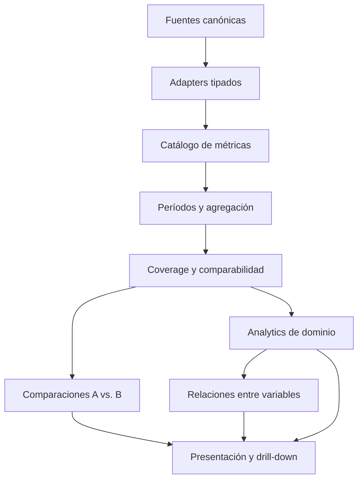

# OWNLEVEL — Progress V2

Documento técnico canónico de arquitectura, producto y semántica analítica.

**Estado inspeccionado:** implementado y mergeado en `origin/main` hasta Progress V2 Integración/QA final (PR #116), commit `aaff9ad2691a59aab51f4be417ece72099d9e830`, al 13 de septiembre de 2026.

## Propósito y alcance

OWNLEVEL no sólo registra lo que la persona hizo: Progress V2 muestra cómo está cambiando y qué variables registradas parecen acompañar ese cambio. El flujo de preguntas es progresivo:

1. ¿Estoy mejorando?
2. ¿Dónde estoy mejorando?
3. ¿Qué parece relacionado con esa mejora?

Este documento describe la implementación vigente de Foundation, Comparaciones, Entrenamiento, Nutrición, Cuerpo, Actividad y hábitos, Historial diario, Relaciones y la Home de Progreso. Es la referencia inicial al modificar esos módulos, pero no reemplaza el código ni los tests.

Orden de autoridad ante una contradicción:

1. código y tests actuales;
2. migraciones y esquema vigente;
3. este documento y el resto de `docs/architecture`;
4. documentación histórica y especificaciones de producto.

Las etiquetas siguientes distinguen el estado de las afirmaciones:

- **IMPLEMENTADO:** existe en el código de la revisión indicada.
- **CONTRATO VIGENTE:** invariante que una modificación debe preservar.
- **LIMITACIÓN CONOCIDA:** el sistema actual no modela todavía esa semántica.
- **FUTURO:** dirección posible, no comportamiento disponible.

No se debe implementar una idea marcada como FUTURO sin una decisión de producto y arquitectura nueva.

## Índice

1. [Arquitectura general](#arquitectura-general)
2. [Fuentes canónicas](#fuentes-canónicas)
3. [Foundation y catálogo universal](#foundation-y-catálogo-universal)
4. [Motor de períodos](#motor-de-períodos)
5. [Missing, zero y coverage](#missing-zero-y-coverage)
6. [Comparaciones V2](#comparaciones-v2)
7. [Entrenamiento](#entrenamiento)
8. [Nutrición](#nutrición)
9. [Cuerpo](#cuerpo)
10. [Actividad y hábitos](#actividad-y-hábitos)
11. [Historial diario](#historial-diario)
12. [Relaciones V2](#relaciones-v2)
13. [Home de Progreso](#home-de-progreso)
14. [Reglas de insights](#reglas-de-insights)
15. [Acceso a datos y performance](#acceso-a-datos-y-performance)
16. [Extensibilidad](#extensibilidad)
17. [Antipatrones](#antipatrones)
18. [Code map](#code-map)
19. [Decisiones arquitectónicas clave](#decisiones-arquitectónicas-clave)

# Arquitectura general

## Separación de responsabilidades

**CONTRATO VIGENTE:** registro, normalización, análisis, comparación, relación y presentación son capas distintas.



- Las tablas operacionales conservan los hechos y snapshots necesarios.
- Los adapters convierten fuentes distintas en `ProgressMetricSample` sin borrar su semántica.
- El catálogo declara identidad, unidad, grain, agregación, missing y elegibilidad.
- Foundation resuelve período, buckets, coverage, agregación y comparabilidad básica.
- Cada dominio conserva reglas que no pueden generalizarse con seguridad.
- Comparaciones analiza una misma métrica entre referencias.
- Relaciones alinea dos variables compatibles y estima una asociación observacional.
- Las páginas componen view models; no deben convertirse en motores estadísticos alternativos.

**CONTRATO VIGENTE:** no materializar tablas `progress_*`, snapshots de reportes o resultados de relaciones para duplicar datos derivables. La implementación actual calcula analytics desde fuentes reales.

# Fuentes canónicas

| Dominio | Fuente | Responsabilidad real |
| --- | --- | --- |
| Nutrición | `day_logs` | Ancla lógica del día, agregados persistidos, objetivos/gasto efectivos y snapshots históricos. Un row por sí solo no demuestra que hubo nutrición registrada. |
| Nutrición | `meal_entries` | Entradas activas de comida y resúmenes históricos. Determinan si calorías y cada macro son conocidos; `deleted_at` excluye soft deletes. |
| Nutrición | `nutrition_plan_periods`, `nutrition_goal_periods` | Configuración versionada que originó snapshots diarios; el reporte las usa para contexto/nombre, no para reescribir el pasado. |
| Métricas personales | `user_metrics` | Definición canónica: UUID, `system_key`, nombre, unidad, tipo, objetivo, orden y estado active/archived. |
| Métricas personales | `daily_metric_values` | Un valor numérico por `user_id + metric_date + metric_id`. La existencia del row representa registro, incluso si el valor es cero. |
| Cuerpo — peso | `day_logs.weight_kg` | Observación histórica de peso en `log_date`. |
| Cuerpo — medidas | `body_measurements` | Mediciones en `measured_on`, lados independientes, provenance y estado de calidad. |
| Cuerpo — estado de perfil | `profiles.current_weight_kg` | Proyección actual y fallback de estado cuando no existe historial; no es una serie histórica. |
| Entrenamiento | `workout_sessions` | Sesión y lifecycle; Progress usa sesiones `completed`. Conserva nombre de rutina/sesión y sensaciones. |
| Entrenamiento | `workout_session_exercises` | Ejercicio realizado y snapshots históricos de nombre, grupo, detalle anatómico, implemento, `weight_mode` y objetivos. |
| Entrenamiento | `workout_sets` | Repeticiones, carga y estado real de cada serie. Analytics usa sets completados. |
| Entrenamiento | `exercises`, `routines` | Definiciones actuales. Los snapshots de sesión preservan historia cuando una definición cambia, se archiva o desaparece. |

`day_logs` es un ancla transversal, no una tabla universal de hechos. Por ejemplo, la fecha semántica de una medida es `body_measurements.measured_on`; la de un valor personal es `daily_metric_values.metric_date`; y la de una sesión se obtiene mediante su `day_log_id`.

Algunas métricas del sistema (`steps`, `water`, `mate`) se proyectan desde `daily_metric_values` hacia columnas legacy de `day_logs` mediante trigger. **CONTRATO VIGENTE:** `user_metrics` + `daily_metric_values` siguen siendo la fuente canónica para el producto dinámico de métricas personales.

# Foundation y catálogo universal

## Contratos principales

Foundation vive en `src/lib/progress/analytics/`. Sus tipos centrales son:

- `ProgressMetricDefinition`: contrato semántico de una métrica.
- `ProgressMetricSample`: `{ date, value, entityId?, context? }`; `null` expresa ausencia.
- `ProgressPeriodRange` y `ProgressResolvedPeriod`: límites y período previo equivalente.
- `ProgressMetricAnalysis`: valor agregado, series y coverage.
- `ProgressComparisonEligibility`: resultado explícito de comparabilidad.

Una definición declara:

| Campo | Semántica |
| --- | --- |
| `key` | Identidad estable usada por analytics y URL. |
| `domain`, `category` | Dominio y familia funcional. |
| `label`, `unit`, `format` | Presentación, sin participar de la identidad. |
| `source` | Adapter, tablas canónicas y campo. |
| `temporalOrigin` | Grain de origen: `day`, `measurement`, `session` o `set`. |
| `aggregation` | `average`, `sum`, `latest`, `change`, `max` o `best`. |
| `missingData` | `exclude` o `zero_when_no_event`. |
| `coverageMode` | `eligible_days`, `samples_only` o `event_stream`. |
| `minimumSamples` | Mínimo para que el valor/comparación sea defendible. |
| `comparisonScope` | `same_metric` o `same_exercise_and_weight_mode`. |
| `comparison`, `goal`, `relation` | Reglas opcionales para delta, objetivo y relaciones. |
| `metadata` | Identidad contextual o metadata dinámica no universal. |

## Catálogo estático y dinámico

`buildProgressMetricCatalog()` combina:

- métricas estáticas de Nutrición;
- definiciones dinámicas adaptadas desde `user_metrics`;
- métricas de Cuerpo;
- carga y performance de Entrenamiento.

La carga server-side ejecuta `ensure_user_metrics`, lee las definiciones de una vez y construye el catálogo. No consulta una tabla por métrica.

### Identidad de una métrica dinámica

**CONTRATO VIGENTE:** identidad de métrica != nombre visible.

Una definición personal con UUID `6f…` produce una key equivalente a `activity.daily.6f…`. Cambiar “Concentración” por otro label conserva su identidad. Ninguna regla analítica debe hacer `if name includes ...` para decidir agregación, objetivo o lag.

Los built-ins actuales se identifican además por `system_key`: `steps`, `water`, `mate`, `sleep`. Ese identificador canónico puede habilitar semántica explícita; el label no.

### Limitaciones actuales del catálogo dinámico

- **LIMITACIÓN CONOCIDA:** `user_metrics` no almacena agregación. El adapter actual usa `average` para todas las métricas personales.
- **LIMITACIÓN CONOCIDA:** `target_value` no declara mínimo, máximo, rango ni exactitud. Se expone como `current_reference`; no existe cumplimiento calculable.
- **LIMITACIÓN CONOCIDA:** no hay metadata temporal estructurada por custom metric. Relaciones usa same-day conservador para custom metrics compatibles.
- **LIMITACIÓN CONOCIDA:** el esquema no guarda snapshots históricos de nombre/objetivo de una métrica personal. El historial muestra la definición actual.

# Motor de períodos

## Presets implementados

`PROGRESS_PERIOD_PRESETS` contiene:

| Key | Etiqueta | Resolución |
| --- | --- | --- |
| `1w` | 1 semana | 7 días inclusivos |
| `2w` | 2 semanas | 14 días inclusivos |
| `3w` | 3 semanas | 21 días inclusivos |
| `4w` | 4 semanas | 28 días inclusivos |
| `30d` | 30 días | 30 días inclusivos |
| `8w` | 8 semanas | 56 días inclusivos |
| `3m` | 3 meses | resta de meses calendario + extremo inclusivo |
| `6m` | 6 meses | idem |
| `1y` | 1 año | 12 meses calendario |
| `custom` | Personalizado | `from` y `to`, máximo 366 días |

Los rangos son inclusivos. `progressRangeDays({start,end})` suma uno. El período anterior termina el día previo al inicio actual y tiene exactamente la misma cantidad de días.

Para presets mensuales, la resta se ajusta al último día válido del mes de destino. Un custom range:

- exige fechas ISO reales;
- rechaza `from > to` y rangos completamente futuros;
- recorta `to` a hoy;
- admite hasta 366 días;
- cae de forma segura a 1 semana con mensaje de error si es inválido.

El “hoy” que recibe el motor es la fecha lógica de `America/Argentina/Cordoba`, producida por `todayInCordoba()`. Los helpers realizan aritmética ISO en UTC para evitar desplazar el día lógico.

## Bucketing y alineación

- hasta 21 días: bucket diario;
- de 22 a 183 días: semanal;
- más de 183 días: mensual.

Los buckets cubren el rango sin huecos. Las semanas son bloques consecutivos de siete días desde el inicio solicitado; no semanas ISO. Los meses terminan en el fin de mes calendario o en `range.end`.

Las series comparativas se alinean por posición de bucket (`actual[0]` con `anterior[0]`), conservando las fechas reales de ambos lados. No se alinean por igualdad de fecha.

## Compatibilidad de rutas

Nutrición y Actividad conservan aliases históricos `7`, `14`, `30` para `1w`, `2w`, `30d`. La Home usa `progressHomePeriodQuery()`:

- conserva un preset si el destino lo entiende;
- si no, pasa el rango exacto como `period=custom&from=...&to=...`.

**CONTRATO VIGENTE:** un dominio no debe reimplementar la matemática de períodos. Puede adaptar nombres legacy, pero debe delegar la resolución a Foundation.

Defaults de entrada actuales: Home y Body usan `4w`; Training y Relationships usan `8w`; Nutrition y Activity usan su alias de 7 días. Cuando se navega desde Home, el período heredado reemplaza esos defaults.

# Missing, zero y coverage

## Regla central

**CONTRATO VIGENTE: `missing != 0`.**

- `value: null` o ausencia de row significa desconocido/no registrado.
- `value: 0` finito es una observación real.
- Los promedios excluyen missing; no lo imputan como cero.
- Un baseline ausente no se convierte en cero.
- Un baseline realmente igual a cero conserva delta absoluto pero no produce delta porcentual infinito.

La única excepción declarativa es `missingData: zero_when_no_event` para métricas de eventos donde la ausencia del evento dentro de un bucket significa cero actividad (por ejemplo, sesiones o sets). Esa regla no convierte un período de referencia enteramente vacío en un baseline comparable.

## Modos de coverage

| Modo | Uso | Denominador |
| --- | --- | --- |
| `eligible_days` | Nutrición y métricas diarias | días elegibles del rango, excluyendo el día en curso cuando se pasa `inProgressDate` |
| `samples_only` | Cuerpo y performance contextual | sólo observaciones reales; no promete cobertura diaria |
| `event_stream` | carga de entrenamiento | eventos/buckets; no representa hábito diario y su ratio puede ser `null` |

`Coverage` conserva `registeredCount`, `eligibleCount`, `coverageRatio` y `sampleSize`. El día actual puede mostrarse en superficies factuales, pero los reportes de Nutrición/Actividad lo excluyen de promedios y coverage cuando todavía está en curso.

### Lifecycle de métricas personales

- Archivar pone `is_active=false` y `archived_at`; no borra valores.
- Una definición con historial no puede cambiar unidad o tipo.
- Una custom metric sin historial puede eliminarse; las métricas del sistema no.
- Historial diario muestra una métrica archivada si ese día tenía un row y permite corregir ese row, pero no crearle uno nuevo.

**LIMITACIÓN CONOCIDA:** el cálculo actual de Activity usa todos los días del rango (menos hoy en curso) como elegibles. No recorta el denominador por `created_at` ni `archived_at`; el esquema tampoco tiene `active_from`. No documentar un lifecycle-aware denominator como si ya existiera.

### Grain por dominio

- Nutrición: grain diario, pero sólo un día con `meal_entries` activas y nutrientes conocidos aporta esos nutrientes.
- Actividad: grain diario; row ausente y row con cero son estados distintos.
- Cuerpo: muestras irregulares; no hay “28 días de cintura” por seleccionar cuatro semanas.
- Entrenamiento: sesiones, ejercicios y sets completados; la ausencia puede significar cero carga sólo donde el catálogo lo declara.

# Comparaciones V2

## Qué compara

Una comparación responde “¿qué cambió en esta misma métrica entre A y B?”. No estima relaciones entre variables distintas.

Referencias implementadas:

- `previous_period`: período inmediatamente anterior equivalente;
- `other_period`: otro preset o custom range reproducible;
- `goal`: target histórico o referencia actual cuando la métrica lo permite.

El estado se serializa con query params canónicos: `compare`, `refPeriod`, `refFrom`, `refTo`, `metrics`, `chartMetric` y `view`. Las vistas son `insights`, `summary` y `evolution`. La selección se deduplica y limita a 24 métricas.

## Resultado y comparabilidad

Cada resultado conserva:

- análisis primario y referencia;
- `valueA`, `valueB`;
- delta absoluto;
- delta porcentual o `null`;
- eligibility y razón;
- coverage de ambos lados;
- series alineadas;
- elegibilidad de insight, omisión y relevancia.

Estados de eligibility: `comparable`, `not_comparable`, `insufficient_data`.

**CONTRATOS VIGENTES:**

- A y B deben ser la misma métrica.
- Performance exige mismo `exercise_id` y `weight_mode` normalizado.
- Ausencia de A o B, pocas muestras o contexto incompatible produce insuficiencia, no cero.
- Baseline cero: `deltaAbsolute` válido y `deltaPercent=null`.
- La clasificación `increased`, `decreased` o `stable` es descriptiva, no bueno/malo.
- Balance energético también distingue transición déficit/superávit sin atribuir juicio.

## Coverage e insights

Comparisons usa 50% como coverage mínimo default para promover un cambio a insight. Una comparación detallada puede seguir visible aunque coverage bajo suprima el insight. Los insights se ordenan de forma determinística por relevancia y se limitan a tres.

Los thresholds de estabilidad pertenecen a la definición de métrica: pueden ser porcentuales, absolutos o ambos. No repartir thresholds visuales en componentes.

## Objetivos

Un objetivo puede tener regla `minimum`, `maximum` o `reference`, y fuente `historical_snapshot` o `current_reference`.

- Nutrición alinea snapshots históricos por fecha.
- Una referencia actual puede repetirse para presentar contexto, pero no se presenta como historia pasada.
- `reference` nunca calcula días cumplidos.
- Las comparaciones contra objetivo no muestran delta porcentual.
- Sin observaciones/target alineados se devuelve un estado explícito no disponible.

# Entrenamiento

## Rendimiento vs. carga

**CONTRATO VIGENTE:** rendimiento y carga son familias diferentes.

- **Rendimiento:** evidencia comparable dentro del mismo ejercicio y modo de carga.
- **Carga de entrenamiento:** sesiones, sets, duración, volumen y sets por sesión.

`volumen = reps × actual_weight_kg` sumado sobre sets completados. Sirve para describir trabajo/carga; no es una medida global de fuerza, no se compara como kg de performance entre ejercicios y no demuestra crecimiento muscular.

## Comparator canónico

`buildTrainingPerformanceComparison()` conserva como identidad:

```text
exercise_id + normalized weight_mode + scope opcional
```

Modos soportados y semántica:

| `weight_mode` normalizado | Comparación |
| --- | --- |
| `Peso total` | carga + repeticiones |
| `Por mancuerna` | carga + repeticiones, sin convertir a peso total |
| `Por brazo` | carga + repeticiones, sin mezclar con otros modos |
| `Total con barra` | carga + repeticiones |
| `Peso corporal` | repeticiones; carga ausente/cero |
| `Lingotes (no kg)` | unidades/lingotes + repeticiones; no kg |
| `Tiempo (segundos)` | duración almacenada en el campo de reps |

Un modo desconocido, sets incompletos, mezcla de modos dentro de un período o cambio entre A y B produce `insufficient_data`. No hay conversión implícita.

Estados por ejercicio: `improved`, `stable`, `declined`, `insufficient_data`. Las señales concretas incluyen mayor carga a iguales reps, más reps a igual carga, récord real, descenso comparable, estabilidad y variantes específicas de peso corporal/tiempo.

El comparator prioriza evidencia directa compartida:

1. diferencia de reps en la mayor carga común;
2. diferencia de carga en las mayores reps comunes;
3. mismo mejor par como estabilidad;
4. si las señales se cruzan, evidencia ambigua en vez de fabricar un resultado.

Los PRs se calculan contra historia previa del mismo ejercicio y modo, no sólo contra el período B. No existe e1RM canónico y no se debe inferir.

## General

El resumen cuenta ejercicios `improved/stable/declined` sólo dentro del denominador comparable y puede expresar “X de Y ejercicios mejoraron”. No existe un score global 0–100 ni un porcentaje ficticio de “fuerza”.

La carga A/B usa Foundation/Comparisons. Las sensaciones de sesión (energía, rendimiento percibido, dolor) requieren al menos dos observaciones reales y reportan coverage.

## Rutinas

- La identidad es `routine_id`, no el nombre.
- La lista se deriva de sesiones históricas con datos; active/archived es estado separado.
- Los snapshots preservan nombre/contexto cuando una rutina ya no está activa.
- Performance reutiliza el comparator, opcionalmente scoped por rutina.
- Las comparaciones entre rutinas se limitan a carga y composición (`sessions`, `sets`, `minutes`, `volume`), no a un score de progreso.
- La distribución muscular asigna cada set completado una vez al músculo primario snapshot.
- Pocas sesiones o referencia vacía generan una nota de confianza/insuficiencia.

## Músculos y subzonas

Los grupos amplios provienen de `MUSCLE_GROUP_OPTIONS`; Progress excluye `cardio` de la exploración muscular. No se crea anatomía nueva.

Las subzonas sólo existen cuando `muscle_group_label_snapshot` contiene un detalle histórico real distinto del grupo amplio. Se normaliza la key para navegación, pero se conserva el label. Un set pertenece como máximo a una subzona bajo su grupo primario; no se duplica por músculos secundarios.

El detalle de grupo/subzona combina performance comparable por ejercicios y carga scoped. Sets por grupo describen distribución/carga, no crecimiento.

## Ejercicios

- La exploración incluye IDs de ejercicios históricamente completados, aunque ya no estén en el catálogo actual.
- Lista y detalle consumen la misma señal canónica.
- El detalle puede scoped por rutina sin cambiar la identidad del ejercicio.
- Las marcas respetan el modo: carga, reps de peso corporal, tiempo, lingotes y volumen de sesión como carga secundaria.
- Historial y contexto conservan implemento, modo, notas y decisiones reales.
- No se inventa e1RM ni se agrega kg entre ejercicios.

# Nutrición

## Semántica energética

**CONTRATO VIGENTE:** estos conceptos no son intercambiables.

| Concepto | Significado |
| --- | --- |
| Consumo | calorías ingeridas conocidas |
| Objetivo | referencia nutricional efectiva del día |
| Gasto estimado | energía gastada estimada efectiva del día |
| Balance energético | `consumo - gasto estimado` |
| Diferencia vs. objetivo | `consumo - objetivo` |

Por ejemplo, consumir 2100 kcal, tener objetivo 2000 y gasto 2350 produce balance `-250 kcal` y diferencia vs. objetivo `+100 kcal`. La UI y los adapters conservan ambos campos separados.

## Construcción del día

`getNutritionReport()` lee `day_logs` del rango y, en paralelo, meals, sesiones completadas y nombres de planes/etapas. `buildNutritionReportDays()` produce un día por fecha del rango.

Un día tiene nutrición sólo si existe al menos un `meal_entry` activo de kind `meal` o `legacy_daily_summary` con algún nutriente finito. Un agregado cero de `day_logs` sin entrada no se trata como día comido en cero. Cada nutriente puede ser `null` independientemente: conocer calorías no inventa proteína, carbohidratos o grasas.

Los soft deletes se excluyen. La procedencia importada se conserva.

## Targets, snapshots y gasto

`day_logs` conserva snapshots como:

- `nutrition_target_kcal_snapshot`;
- `protein_target_g_snapshot`;
- `water_target_l_snapshot`;
- `estimated_expenditure_kcal_snapshot`;
- IDs y tipo/nombre de etapa.

Los overrides diarios efectivos forman parte del read model. Los reportes usan los snapshots históricos; no aplican el target actual a todo el pasado. Si un día no tiene referencia histórica fiable, el target queda ausente.

`energy_balance_kcal` persistido se usa cuando existe; de lo contrario sólo puede derivarse si consumo y gasto son ambos conocidos. Nunca se deriva desde el objetivo.

## Agregación y cobertura

La completitud del día se aplica antes de resumir. Para calorías, macros y energía se usan días completos con nutrición real; los submodelos legacy de hidratación/actividad sólo usan días completos que tengan su propio valor explícito, aunque no haya comida:

- promedio de calorías y macros sobre observaciones conocidas;
- promedio de gasto sobre días con gasto;
- balance acumulado como suma de balances calculables;
- balance promedio sobre esos mismos días;
- días de déficit/neutro/superávit descriptivos;
- hits de proteína únicamente con consumo y target histórico comparables.

Hoy puede aparecer en el detalle, pero si el rango termina hoy se marca `isComplete=false` y se excluye de promedios, coverage, balance acumulado y días destacados.

Las comparaciones usan los adapters Foundation y el período anterior equivalente. `nutrition.energy_balance` agrega con `sum`, no permite delta porcentual y tiene semántica de signo propia. El resto usa la agregación declarada en catálogo.

Los días destacados son determinísticos y factuales: cercanía al objetivo, mayor balance absoluto y mayor proteína, sin duplicar el mismo día ni incluir hoy en curso.

# Cuerpo

## Grain de muestras reales

Cuerpo no usa promedios diarios ni coverage diario. Peso y medidas son observaciones irregulares:

- peso: `day_logs.log_date`;
- medidas: `body_measurements.measured_on`.

**CONTRATOS VIGENTES:** no forward-fill, no interpolación como dato real, no ceros artificiales y no división por días del período.

## Estado, cambio y tendencia

- **Estado actual:** última observación válida conocida de cada métrica en todo el historial.
- **Cambio del período:** último menos primero, sólo con dos o más observaciones del período.
- **Tendencia:** unavailable con una muestra, limited con dos, supported con tres o más.

Con tres o más puntos, la dirección requiere que al menos dos tercios de los pasos apoyen el signo neto; de lo contrario es `variable`. Los estados de tendencia son `increased`, `decreased`, `stable`, `variable` o `unavailable`. No califican bueno/malo.

## Bilateralidad, calidad y provenance

Brazo, muslo y pantorrilla izquierda/derecha son series distintas. Los campos legacy sin lado también siguen siendo métricas independientes. No se promedian lados.

`quality_status=suspect` excluye una observación de estado, cambio, tendencia, Comparisons y Relationships por default. El row se conserva y Historial diario puede mostrarlo para auditoría junto con `quality_note`.

Provenance normalizado: `manual`, `imported` o `profile`. `import_run_id`/`legacy_import_source` identifican importados y sus notas se conservan.

## Fallback de peso

Si no existe ninguna observación histórica de peso pero `profiles.current_weight_kg` tiene valor, Body puede mostrar una observación sintética de estado `profile-current-weight`, sin fecha histórica y con provenance `profile`. Ese fallback:

- no crea un punto de serie;
- no crea cambio;
- no crea tendencia;
- no se usa como baseline histórico.

**LIMITACIÓN CONOCIDA:** Progress Body usa unidades canónicas kg/cm; no hay conversión analítica implementada a lb/in.

# Actividad y hábitos

## Producto dinámico

**IMPLEMENTADO:** `/progress/metrics` se construye desde `user_metrics` + `daily_metric_values`. Las métricas custom aparecen sin código por nombre.

La definición contiene:

- UUID estable;
- `system_key` opcional;
- `name`, `unit`;
- `value_type`: `integer`, `decimal` o `duration` (minutos);
- `target_value` opcional;
- `sort_order`, `is_active`, `archived_at`.

La tabla de valores exige uno por fecha/métrica/usuario, valores no negativos y enteros para `integer`/`duration`. Guardar input vacío elimina el row; guardar `0` hace upsert de cero.

## Analytics implementado

- agregación: promedio de valores presentes;
- mediana, mínimo, máximo y cambio primero/último como contexto de reporte;
- período actual vs. anterior equivalente mediante Comparisons;
- coverage = rows reales / días elegibles;
- hoy en curso excluido del promedio y coverage;
- objetivo actual mostrado sólo como referencia;
- gráfico de una métrica por eje, con huecos reales;
- selector local sobre definitions + values cargados en grupo;
- resumen general, cambios determinísticos, consistencia, objetivos descriptivos y detalle de métrica.

La consistencia describe registro, no cumplimiento. “26 de 28 días” significa rows existentes. Un cero cuenta dentro de los 26.

Activas se priorizan; archivadas conservan historial y siguen disponibles en análisis/detalle cuando se seleccionan. Home sólo promueve métricas activas.

## Límites semánticos

Las cuatro limitaciones del catálogo dinámico descritas antes son especialmente importantes aquí: promedio único, objetivo sin dirección, denominador no recortado por lifecycle y ausencia de metadata temporal custom. No deben ocultarse mediante heurísticas por label/unidad.

# Historial diario

## Rol

**IMPLEMENTADO:** `/history` es reconstrucción factual y auditoría de una fecha, no analytics. No presenta tendencias, comparaciones ni relaciones.

El orden principal del detalle es:

1. fecha;
2. resumen del día;
3. métricas;
4. entrenamiento;
5. nutrición;
6. comidas;
7. cuerpo/contexto cuando existen;
8. navegación anterior/siguiente.

El resumen sólo incluye hechos existentes. Un día completamente vacío dice “No hay registros para este día”; no fabrica cero calorías, pasos o entrenamientos.

## Composición de datos

`getDailyHistoryDetail()` carga en paralelo:

- `getNutritionDay(date, { createIfMissing: false })`;
- sesiones completadas y luego sus ejercicios/sets agrupados;
- medida corporal de `measured_on=date`;
- eventos nutricionales de la fecha;
- definiciones y valores personales del día.

Métricas archivadas aparecen si tenían valor. Las activas sin valor se ofrecen sólo en el editor. Un row con cero aparece como dato real.

La sesión resume nombre snapshot, hora, duración, ejercicios, sets, volumen y sensaciones; el drill-down abre la sesión real. Comidas normales abren el flujo existente; `legacy_daily_summary` es histórico de sólo lectura. El bloque nutricional mantiene separadas calorías, objetivo, gasto, balance y diferencia vs. objetivo.

El editor de métricas usa labels integrados en el borde, unidades visibles y el mismo parser/tipo canónico. Puede corregir un valor archivado preexistente, no crear historia nueva para una archivada.

La navegación usa fecha ISO y un vocabulario cerrado de origen (`history` o `calendar + month`). No acepta return URLs arbitrarias, preserva el origen y bloquea días futuros. Hoy se marca “en curso” y muestra lo registrado hasta ese momento.

# Relaciones V2

## Diferencia frente a Comparaciones

| Motor | Pregunta | Variables |
| --- | --- | --- |
| Comparaciones | ¿Qué cambió entre A y B? | la misma métrica, dos referencias |
| Relaciones | ¿Dos variables parecen acompañarse? | exposición A y outcome B compatibles |

Una flecha `A → B` expresa dirección analítica/temporal, no causalidad.

## Arquitectura del motor

`src/lib/progress/relationships/` separa:

1. tipos y thresholds;
2. catálogo de variables y compatibilidad explícita;
3. alineación temporal;
4. asociación y quality;
5. outcome de performance canónico;
6. ranking de highlights;
7. loader/read model y UI.

No persiste resultados. Mismos datos + período + variables producen el mismo resultado.

## Catálogo y compatibilidad

El catálogo parte de métricas Foundation, excluye targets/variables sin semántica segura y agrega `training.performance.comparable` como outcome especializado.

Roles actuales:

- Body: outcome;
- Training: outcome;
- Nutrition: exposure;
- Activity: exposure y outcome.

`relationshipPairFor()` construye pares aprobados por identidad y dominio. No ejecuta la matriz completa numérica. Ejemplos implementados:

- Activity ↔ Activity: same-day, simétrico;
- Nutrition → Activity: same-day;
- carbohidratos → performance/carga de sesión próxima;
- built-ins `sleep`/`water` → sesión próxima, usando `system_key`;
- proteína o balance → performance semanal con ventana previa;
- calorías/built-ins compatibles → sesiones semanales;
- Nutrition → Body mediante exposición previa y cambio entre mediciones reales.

Custom metrics compatibles entran en análisis genérico same-day. “Sueño”, “Agua” o “Dolor” escritos como label custom no obtienen semántica especial.

Algunas métricas se excluyen expresamente: objetivo/gasto como variables de relación, sets por sesión, volumen y escalares de performance que podrían confundirse con performance contextual. Balance energético sí es elegible y mantiene `consumo - gasto`.

## Temporalidad

Perfiles tipados implementados:

- acute `same_day`;
- acute `previous_day` (soportado por el alineador; no es seleccionado actualmente por el catálogo de pares);
- acute `same_day_or_next_session`, máximo un día;
- chronic `trailing_window` de 7, 14 o 28 días, con unidad semanal o medición.

Reglas de alineación:

- same-day usa medianas si hay múltiples muestras de una variable en la fecha;
- previous-day no cruza el inicio del período;
- next-session asocia una exposición diaria a lo sumo a una sesión; una fecha usada no se duplica arbitrariamente;
- Body calcula exposición previa a la fecha real y outcome como cambio contra la medición previa; no hace forward-fill;
- las ventanas de training producen observaciones semanales, no días pseudorreplicados;
- no se leen ventanas anteriores al rango seleccionado para fabricar el primer punto;
- se requiere cobertura de al menos 50% de días dentro de una ventana crónica;
- `inProgressDate` se excluye.

## Performance como outcome

Cada sesión completada puede producir un outcome: porcentaje de comparaciones de ejercicio que mejoraron contra los 28 días previos. La fuente sigue siendo el comparator canónico y conserva `exercise_id + weight_mode`.

Sesiones sin ejercicios comparables se excluyen. No se suman kg entre ejercicios, no se convierte volumen en performance y no se crea un score de fuerza.

## Método de asociación

Para pares numéricos:

- Spearman por rangos con ranks promedio en empates;
- sólo pares reales, sin imputación;
- mediana como tendencia central;
- split temporal en dos mitades para estabilidad cuando hay al menos 8 muestras;
- grupos lower/higher sólo si existe un corte por valores distintos y al menos 4 observaciones por grupo;
- efecto de grupos escalado por IQR (o rango si IQR=0).

El coeficiente técnico aparece sólo en metodología; la UI prioriza conclusión, muestra, coverage y comparación de medianas.

## Thresholds y quality

`RELATIONSHIP_THRESHOLDS` centraliza:

- coverage mínimo: 0,5;
- valores distintos mínimos por variable: 3;
- grupo mínimo: 4;
- muestra mínima: 12 días, 8 sesiones, 6 semanas o 4 mediciones;
- clear: `|rho| >= 0.6`, 20 muestras, coverage 0,7, estabilidad 0,35 y efecto/grupos suficientes;
- moderate: `|rho| >= 0.4`, 12 muestras, coverage 0,55, estabilidad 0,2 y efecto/grupos suficientes;
- weak: `|rho| >= 0.2` una vez superados los requisitos básicos.

Estados exactos:

- `Señal clara`;
- `Tendencia moderada`;
- `Tendencia débil`;
- `Sin relación clara`;
- `Datos insuficientes`.

`Datos insuficientes` significa que no pudo evaluarse con honestidad (poca muestra/intersección/variación). `Sin relación clara` significa que sí pudo analizarse y la señal fue baja. Dirección positiva/negativa es independiente de quality y de cualquier juicio bueno/malo.

## Highlights

`getHighlightedRelationships()`:

1. recibe sólo pares compatibles;
2. ordena por relevancia semántica;
3. descarta variables con menos de dos muestras;
4. deduplica pares simétricos;
5. limita a 4 candidatos custom↔custom y 12 candidatos totales;
6. ejecuta el análisis;
7. conserva sólo `clear` o `moderate`;
8. ordena por quality, coverage, magnitud y relevancia;
9. limita diversidad a dos por par de dominios;
10. devuelve como máximo tres.

No rellena el resultado con señales débiles. La Home consume el helper server-side; no replica matching, estadística ni ranking.

## Lenguaje y metodología

La conclusión y el insight se generan con templates determinísticos. Se permiten “se asocia”, “tendió a acompañar”, “coincidió” y “en tus registros”. Se prohíbe convertir una asociación observacional en “causó”, “provocó” o “hizo que”.

El resultado presenta período, variables, ventana, unidad observacional, muestra, coverage, missing handling, Spearman, mediana y notas específicas (Body real, performance contextual, semanas). No declara significancia estadística ni p-values.

# Home de Progreso

## Función y jerarquía

**IMPLEMENTADO:** `/progress` sintetiza y navega; no duplica reportes ni muestra grandes gráficos.

Orden contractual (`PROGRESS_HOME_SECTION_ORDER`):

1. Tu evolución;
2. Qué cambió;
3. Relaciones;
4. Tus hábitos;
5. Explorar tu progreso;
6. Revisar datos.

“Tu evolución” prioriza performance comparable y hasta dos cambios corporales materiales válidos. “Qué cambió” selecciona hasta tres candidatos ya calculados con prioridad Training > Body > Activity > Nutrition, evita repetir la señal protagonista y limita dos por dominio. “Relaciones” consume hasta tres highlights. “Tus hábitos” resume Nutrición y hasta tres métricas personales activas con datos.

No se crean filas vacías para completar una grilla. Un usuario con poca data conserva navegación y empty states compactos. Highlights vacíos mantienen el CTA sin inventar asociación.

## Carga e aislamiento

`getProgressHomeData()` resuelve un período compartido y lanza en `Promise.all` loaders aislados de Training, Nutrition, Activity, Body y Relationships. Cada fallo se registra y se convierte en `null`, de modo que los otros dominios pueden renderizarse.

La Home consume:

- `getTrainingGeneralAnalysis()`;
- `getNutritionReportWithProgressComparison()`;
- `getDailyMetricsReport()`;
- `buildBodyProgressReport()` sobre fuentes agrupadas;
- `getHighlightedRelationshipsForUser()`.

No recalcula comparators, promedios o Spearman.

## Navegación y herencia de período

Destinos canónicos:

| Dominio | Ruta |
| --- | --- |
| Entrenamiento | `/train/progress?view=general` |
| Nutrición | `/today/reports` |
| Cuerpo | `/train/body` |
| Actividad y hábitos | `/progress/metrics` |
| Relaciones | `/progress/relationships` |
| Calendario | `/calendar` |
| Historial diario | `/history` |

Los destinos analíticos heredan preset o rango custom exacto. `progressHomeHref()` normaliza aliases al volver. Calendario e Historial son herramientas factuales y no reciben artificialmente una comparación A/B.

## Inventario de rutas y drill-downs

| Superficie | Estado reproducible |
| --- | --- |
| `/progress` | `period`; `from/to` para custom |
| `/train/progress` | `view=general|routines|muscles|exercises`, período, `routine`, `muscle`, `zone`, filtros y estado de comparación |
| `/train/history/[exerciseId]` | ejercicio por ID y contexto de retorno a Progress, incluido custom range |
| `/today/reports` | período y query de Comparisons |
| `/train/body` | período y selección de métricas/comparación |
| `/progress/metrics` | período, `metric` y query de Comparisons |
| `/progress/relationships` | período, `a`, `b`, `analyze=1` |
| `/calendar` | `month`; cada fecha enlaza a Historial con origen cerrado |
| `/history` | lista o `date`; conserva origen History/Calendar |
| `/train/session/[id]` | sesión real y `return` validado hacia Historial cuando corresponde |

Los drill-downs deben reconstruirse desde una URL directa; no pueden depender de estado efímero de la Home.

# Reglas de insights

Una frase analítica sólo debe emitirse si la capa que la origina confirma:

- métrica y contexto correctos;
- muestra mínima;
- coverage suficiente para ese tipo de insight;
- baseline/target realmente disponible;
- comparabilidad de unidad, modo y scope;
- magnitud/threshold material;
- período en curso tratado según el dominio;
- ausencia de señales mixtas que invaliden la simplificación.

**CONTRATO VIGENTE:** “Datos insuficientes” es un resultado válido y preferible a una conclusión fabricada.

Los insights son descriptivos:

- no infieren causalidad;
- no prescriben una conducta;
- no equiparan aumento con mejora;
- no usan verde/rojo como bueno/malo universal;
- no esconden muestra o coverage cuando afectan interpretación.

Training puede decir que ejercicios comparables mejoraron, no que el volumen probó mayor fuerza. Body puede describir cambio, no afirmar que bajar peso sea positivo. Nutrition separa objetivo y balance. Activity separa consistencia y cumplimiento. Relationships separa dirección y calidad.

# Acceso a datos y performance

## Patrones vigentes

- Adquirir autenticación una vez mediante `AuthenticatedRequestContext` y reutilizarla en loaders compuestos.
- Leer definiciones y valores en grupo, no una query por métrica/día.
- Cargar sesiones, ejercicios y sets por colecciones de IDs, no un request por ejercicio.
- Calcular buckets, agregados, comparisons y selector de gráfico en memoria una vez disponibles los facts.
- Usar `Promise.all` para dominios o facts independientes.
- Mantener analytics en server modules cuando necesitan datos; enviar al client sólo view models y controles interactivos.
- Cambiar métrica/vista en componentes de evolución no debe refetchear facts ya cargados.

Casos concretos:

- Nutrición: una lectura de `day_logs`; luego meals/sessions/planes en paralelo.
- Activity: una lectura de definitions + una lectura agrupada de values para A/B.
- Relationships: carga una vez cada dominio del período, adapta en memoria y analiza un par; highlights prefiltra antes del cómputo.
- Home: loaders de dominios en paralelo y fallos aislados.
- Historial diario: una fecha; no prefetch de meses para presentar el detalle.

**CONTRATO VIGENTE:** evitar N+1 por día, métrica, comida, ejercicio, set o relación candidata. No crear cache persistente de analytics derivados sin una decisión nueva.

**LIMITACIÓN CONOCIDA:** el loader de configuración `getUserMetrics()` comprueba hoy `has_history` con un count por definición. Los reportes analíticos no usan ese camino y sí cargan definitions/values agrupados. Esta excepción de gestión no debe copiarse a nuevos analytics.

# Extensibilidad

## Cómo agregar una nueva métrica estática

1. Confirmar una fuente canónica y su fecha semántica.
2. Añadir `ProgressMetricDefinition` en `src/lib/progress/analytics/catalog.ts` con key estable, source, grain, agregación, missing, coverage, mínimos y comparación.
3. Añadir/adaptar samples en `src/lib/progress/analytics/adapters.ts`; conservar `null`, cero y contexto.
4. Incluir la fuente en el loader del dominio, preferentemente agrupada.
5. Añadir tests de catálogo, adapter, agregación, coverage, baseline vacío/cero y período en curso.
6. Consumir el resultado en el analytics de dominio; no recalcular en UI/Home.

## Cómo agregar una métrica personal

Si la semántica actual es suficiente, crear un row de `user_metrics`; `adaptDailyMetricDefinition()` la incorpora por UUID y `dailyMetricSamples()` lee sus values. No agregar branches por nombre.

Si necesita suma/latest, dirección de objetivo, rango, valores negativos o lag especial, **no alcanza** con la definición actual: primero se requiere extender explícitamente esquema, tipos, adapter y tests. Hasta entonces debe conservarse el comportamiento conservador.

## Cómo agregar un nuevo período

1. Añadir el preset en `PROGRESS_PERIOD_PRESETS` y resolverlo en `periods.ts`.
2. Definir aritmética inclusiva y período anterior equivalente.
3. Actualizar selectores y mappings legacy/Home sólo donde el destino use otro vocabulario.
4. Testear fin de mes/bisiesto, custom, future clamp, buckets, URL y herencia.

No introducir cálculo de fechas dentro de un componente.

## Cómo integrar un dominio nuevo

1. Identificar tablas canónicas y grain real.
2. Crear adapter(s) hacia `ProgressMetricSample`.
3. Declarar métricas en el catálogo con coverage y comparability correctos.
4. Resolver analytics específicos fuera de React.
5. Conectar Comparisons sólo para la misma métrica/contexto.
6. Conectar Relationships sólo mediante pares/ventanas explícitos.
7. Exponer un resultado reusable para Home, sin `home-*-engine` paralelo.
8. Añadir drill-down hacia datos reales y tests contractuales.

## Cómo participar en Comparisons

- `supportsTemporalComparison=true`;
- `comparisonScope` correcto;
- aggregation/missing/coverage/minimumSamples definidos;
- goal sólo si hay regla y fuente reales;
- `samplesByMetric` indexado por la misma key;
- estado de URL mediante helpers de `src/lib/progress/comparisons/navigation.ts`.

Una métrica contextual debe aportar `entityId`/`context` y comparabilidad específica; no degradarla a `same_metric` si eso mezcla entidades.

## Cómo participar en Relationships

1. Evaluar si la variable puede ser exposure, outcome o ambas.
2. Incorporarla al catálogo universal si corresponde.
3. Añadir un par explícito en `relationshipPairFor()`; no habilitar “todo contra todo”.
4. Elegir un `RelationshipTemporalProfile` justificable.
5. Si necesita outcome especial, construirlo desde el comparator canónico.
6. Testear temporal leakage, double counting, pseudorreplicación, missing/zero, sample unit y lenguaje causal.
7. Ajustar thresholds únicamente en `thresholds.ts` y por decisión metodológica, no para hacer aparecer una señal.

## Cómo agregar una visualización

La visualización recibe un analysis/view model existente. Puede elegir formato y escala, pero no debe:

- volver a agregar raw data;
- decidir eligibility;
- inventar ceros o interpolaciones;
- redefinir balance, performance o quality;
- hacer refetch por cambiar selección si el dataset ya está disponible.

# Antipatrones

No hacer:

- tablas paralelas de progreso para hechos ya canónicos;
- un segundo motor de períodos, coverage, comparisons o relationships;
- convertir missing en cero o baseline ausente en baseline cero;
- emitir `Infinity` cuando el baseline real es cero;
- usar una métrica con grain corporal como promedio diario;
- copiar `samples_only` de Body a hábitos diarios;
- forward-fill o interpolar medidas corporales como observaciones;
- promediar lados corporales automáticamente;
- incluir medidas sospechosas en analytics normales;
- usar `profiles.current_weight_kg` como serie histórica;
- comparar ejercicios o `weight_mode` incompatibles;
- sumar kg de ejercicios distintos como fuerza o convertir volumen en performance;
- inventar e1RM;
- inventar subzonas musculares o duplicar sets entre ellas;
- aplicar el target nutricional actual al pasado sin snapshot;
- confundir `consumo - objetivo` con balance energético;
- hardcodear métricas personales por label/unidad;
- tratar objetivo dinámico numérico como “mínimo cumplido” sin dirección;
- afirmar causalidad desde Relationships;
- analizar una matriz N² y elegir correlaciones extremas;
- inflar la muestra con ventanas superpuestas o duplicar una exposición sobre sesiones;
- generar insights con muestra/coverage/comparabilidad insuficientes;
- ejecutar una query por día, métrica, ejercicio, set o candidato.

# Code map

| Responsabilidad | Archivo(s) | Qué contiene |
| --- | --- | --- |
| Tipos Foundation | `src/lib/progress/analytics/types.ts` | métricas, samples, grain, coverage, períodos y eligibility |
| Catálogo universal | `src/lib/progress/analytics/catalog.ts` | Nutrición, Body, Training y adapter dinámico de `user_metrics` |
| Períodos | `src/lib/progress/analytics/periods.ts` | presets, custom, anterior equivalente, buckets inclusivos |
| Agregación/coverage | `src/lib/progress/analytics/engine.ts` | análisis de métrica, series y comparabilidad base |
| Adapters | `src/lib/progress/analytics/adapters.ts` | fuentes canónicas → `ProgressMetricSample` |
| Catálogo server | `src/lib/progress/analytics/server.ts` | lectura agrupada de `user_metrics` |
| Tests Foundation | `src/lib/progress/analytics/foundation.test.ts` | contratos de períodos, missing, coverage, adapters y contexto |
| Comparisons | `src/lib/progress/comparisons/types.ts`, `src/lib/progress/comparisons/engine.ts`, `src/lib/progress/comparisons/navigation.ts` | referencias A/B/goal, deltas, insights, series y URL |
| UI Comparisons | `src/components/progress/comparison-configurator.tsx`, `src/components/progress/comparison-workspace.tsx`, `src/components/progress/comparison-summary.tsx`, `src/components/progress/comparison-insights.tsx`, `src/components/progress/comparison-evolution.tsx` | configuración y presentación reusable |
| Tests Comparisons | `src/lib/progress/comparisons/comparisons.test.ts`, `src/lib/progress/comparisons/components.test.ts` | baseline cero/ausente, goals, coverage y UI |
| Source Training | `src/lib/phase2/training-analysis.ts`, `src/lib/phase2/training-robust.ts` | read model histórico y loaders agrupados |
| Navegación Training | `src/lib/phase2/training-analysis-navigation.ts` | serialización de vistas, filtros, comparación y exercise drill-down |
| Comparator Training | `src/lib/progress/training-performance.ts` | performance contextual, load y sensaciones |
| Rutinas | `src/lib/progress/training-routines.ts` | identidad histórica, performance, carga y composición |
| Músculos | `src/lib/progress/training-muscles.ts` | grupos reales, subzonas y scopes |
| Ejercicios | `src/lib/progress/training-exercises.ts`, `src/lib/phase2/exercise-insights.ts` | exploración, marcas, evolución e historial |
| UI Training | `src/app/(app)/train/progress/page.tsx`, `src/components/progress/training-*.tsx` | General/Rutinas/Músculos/Ejercicios y drill-downs |
| Detalle de ejercicio/sesión | `src/app/(app)/train/history/[exerciseId]/page.tsx`, `src/app/(app)/train/session/[id]/page.tsx` | reporte por ejercicio y sesión factual |
| Tests Training | `src/lib/progress/training-*.test.ts` | comparator, rutinas, músculos y ejercicios |
| Facts Nutrición | `src/lib/nutrition/reports-core.ts`, `reports.ts` | read model diario, carga agrupada, resúmenes y A/B |
| Analytics/UI Nutrición | `src/lib/nutrition/report-v2.ts`, `src/components/nutrition/nutrition-report-*.tsx` | días destacados, energía, macros, evolución y detalle |
| Ruta Nutrición | `src/app/(app)/today/reports/page.tsx` | composición del reporte |
| Tests Nutrición | `src/lib/nutrition/reports.test.ts`, `src/lib/nutrition/report-v2.test.ts`, `src/lib/nutrition/report-ui.test.ts` | facts, targets, balance, día en curso y UI |
| Analytics Body | `src/lib/progress/body.ts` | estado, cambio, tendencia, bilateralidad, quality y provenance |
| Fuente Body | `src/lib/body-measurements.ts`, `src/lib/body-measurement-types.ts`, `src/lib/phase1/day-log.ts` | CRUD de medidas y peso histórico |
| Ruta Body | `src/app/(app)/train/body/page.tsx` | resumen, medida, historial y edición |
| Tests Body | `src/lib/progress/body.test.ts` | muestras irregulares, sospechosos, lados y fallback |
| Definiciones personales | `src/lib/daily-metrics/core.ts`, `src/lib/daily-metrics/server.ts` | tipos, lifecycle, CRUD y values diarios |
| Analytics Activity | `src/lib/daily-metrics/reports-core.ts`, `src/lib/daily-metrics/reports.ts` | resumen, coverage, A/B y carga agrupada |
| UI Activity | `src/app/(app)/progress/metrics/page.tsx`, `src/components/daily-metrics/daily-metric-report.tsx` | overview, detalle, selector, consistencia y objetivos |
| Tests Activity | `src/lib/daily-metrics/reports-core.test.ts`, `src/lib/daily-metrics/reports-ui.test.ts`, `src/lib/daily-metrics/server.test.ts` | custom, zero/missing, coverage y archive |
| Historial diario | `src/lib/history/daily-history.ts`, `src/lib/history/daily-history-core.ts`, `src/lib/history/daily-history-navigation.ts` | composición factual, sesiones y navegación segura |
| UI Historial/Calendario | `src/app/(app)/history/page.tsx`, `src/app/(app)/calendar/page.tsx` | lista/detalle diario y calendario global |
| Tests Historial | `src/lib/history/daily-history-*.test.ts`, `src/lib/history/pr75-history.test.ts` | orden, día vacío, origen, zero y editor |
| Tipos/thresholds Relaciones | `src/lib/progress/relationships/types.ts`, `src/lib/progress/relationships/thresholds.ts` | contratos temporales, quality y mínimos |
| Catálogo Relaciones | `src/lib/progress/relationships/catalog.ts` | variables, roles y pares compatibles explícitos |
| Temporalidad Relaciones | `src/lib/progress/relationships/temporal.ts` | same-day, previous-day, next-session y ventanas |
| Estadística/engine | `src/lib/progress/relationships/association.ts`, `src/lib/progress/relationships/engine.ts` | Spearman, grupos, quality y highlights |
| Performance en relaciones | `src/lib/progress/relationships/training.ts` | outcome por sesión desde comparator canónico |
| Loader/UI Relaciones | `src/lib/progress/relationships/server.ts`, `src/app/(app)/progress/relationships/page.tsx`, `src/components/progress/relationship-*.tsx` | workspace, explorador, resultado y metodología |
| Tests Relaciones | `src/lib/progress/relationships/*.test.ts` | asociación, temporalidad, training, catálogo, highlights y UI |
| Home model | `src/lib/progress/home.ts` | ranking, deduplicación, enlaces y period inheritance |
| Home loader | `src/lib/progress/home-server.ts` | cargas paralelas aisladas y composición |
| Home UI | `src/app/(app)/progress/page.tsx` | jerarquía final y navegación |
| Tests Home/integración | `src/lib/progress/home.test.ts`, `src/lib/progress/integration-navigation.test.ts` | composición, custom range, rutas y mobile contracts |

# Decisiones arquitectónicas clave

1. **Fuentes canónicas antes que snapshots de progreso.** Los reportes se derivan de hechos existentes para evitar una segunda verdad y drift.
2. **Catálogo tipado universal.** La semántica viaja con la métrica; UI y nombre visible no deciden el cálculo.
3. **Motor temporal compartido.** Rangos inclusivos, anterior equivalente y buckets deben coincidir entre dominios.
4. **Missing no es zero.** Evita promedios, deltas, coverage y relaciones falsos; cero sólo existe si el dato o la semántica de evento lo sostienen.
5. **Grain específico por dominio.** Días, muestras corporales, sesiones y sets no comparten denominador automáticamente.
6. **Comparaciones separadas de Relaciones.** La primera compara una métrica entre referencias; la segunda alinea dos variables compatibles.
7. **Performance separada de training load.** Fuerza/rendimiento requiere ejercicio y `weight_mode`; volumen/sesiones describen trabajo.
8. **Historia preservada mediante IDs y snapshots.** Renombrar/archivar una definición no debe romper la lectura de sesiones o valores existentes.
9. **Métricas personales dinámicas por UUID.** Nuevos nombres compatibles aparecen sin branches; la falta de metadata se trata de forma conservadora.
10. **Body usa observaciones reales.** No forward-fill, promedio diario ni mezcla bilateral.
11. **Targets nutricionales históricos.** La referencia efectiva se snapshottea por día; balance siempre usa gasto, no objetivo.
12. **Relaciones observacionales y acotadas.** Pares explícitos, ventanas declaradas, thresholds centralizados, muestra honesta y copy no causal.
13. **Home sintetiza; dominios profundizan.** Consume resultados públicos y preserva período, sin crear analytics paralelos.
14. **Historial audita; no interpreta.** Una fecha muestra hechos editables/navegables sin comparaciones ni insights.

## Futuro no implementado

No falta ningún dominio de Progress V2 previsto en la secuencia Foundation → Comparisons → dominios → Historial → Relationships → Home → integración. Las extensiones siguientes están deliberadamente fuera de la implementación actual:

- metadata de agregación, dirección/rango de objetivo y temporalidad por `user_metrics`;
- denominadores de Activity recortados por lifecycle histórico;
- snapshots históricos de definiciones personales;
- conversiones Body kg/lb y cm/in;
- nuevas familias de relaciones o inferencia estadística formal (p-values/causalidad);
- persistencia/cache de resultados analíticos derivados.

Son oportunidades futuras, no contratos que el código cumpla hoy.
